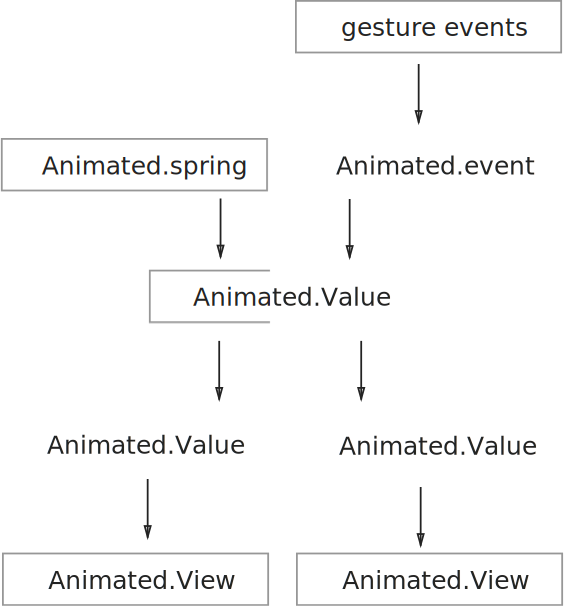
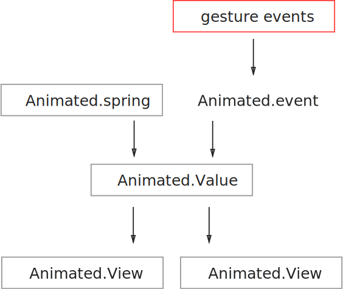

# Animated.Value

We've seen that `setNativeProps` is a backdoor for updating native views directly without triggering React update cycles. However, `setNativeProps` is dangerous, because

Unless you are implementing your own animation library, you should avoid `setNativeProps`.

 because the component tree is no longer describes the state of the UI.

Unless you are implementing an animation library yourself,  is

The Animated library is implemented with `setNativeProps`, but its API hides

+ awkward tension between static and dynamic.
+ The symbol `Animated.View` is a nice way to indicate that a view may change animated.
+ Animated library is like a compromise between change and permenance. The structure of the UI stays the same, but the precise values of properties and styles may vary.


# Immutable And Change

Animation exists in React with an uneasy tension.

platonic ideal.

essence is change.

+ React describes the state of the UI. static.
+ Animation is dynamic.

uneasy tension.

Animated.Value exists in a weird middle ground between static and dynamic.

As far as `render` is concerned, an `Animated.View` is static.

We can change

The UI is static, in the sense that an `Animated.View` always use same value. But it is dynamic, in the sense that the the actual number in `Animated.Value` can change.


# Animated.Value

+ Can eventually migrate entirely to the native side.
+ the key is to avoid rendering cycle.


hmm... what's a good strategy? i think hooking everything together is a bit too mysterious.

```js
let top = new Animated.Value(0);

this._animated = {
  top,
};


const { top } = this._animated;
<Animated.View style={[jss.box, { top: top }]}/>
```

+ JavaScript driven.
+ Must avoid React rendering.

Basically a way to change the value of a property without triggering a React update cycle.

+ the key concept to understand is that attaching Animated.Value to an Animated.View is a static structure. Driving animation with easing functions does not cause re-render.
  + In other words, don't create new Animated.Value.


+ spring + value
+ addEventListener
+ setNativeProps

+ visualize curve
+ high cpu scenario

# Animated.View

+ layout vs non-layout

## Animated.Image

+ image resize

# Coordinating Different Effects



+ instead of using parallel, use interpolation. 1->0
+ you'll see why this is important when we consider gesture.

# Gesture Driven Animation

To allow gesture, we can use `Animated.event` to change `Animated.Value`, and keep everything else the same:


