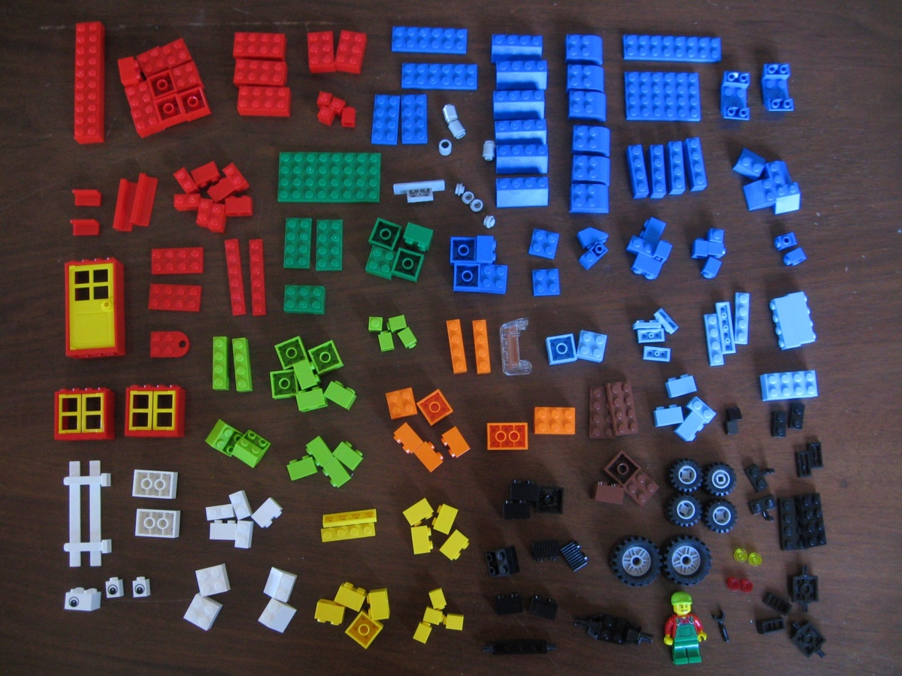
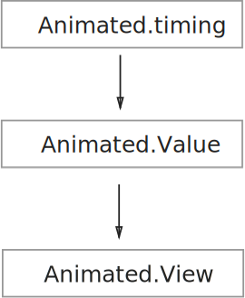
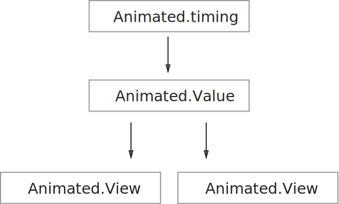
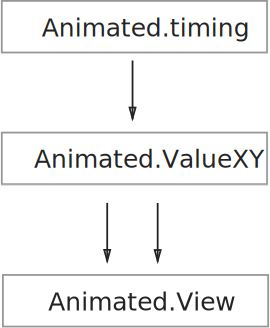

# ReactNative Animated

<Cover>

</Cover>

The `Animated` library is like lego. There are different kinds of pieces, and you need know the different ways of connecting them together.

We'll first give you a quick overview of what the pieces are, and then in subsequent demos play around with ways to use them.

1. `Animated.Value` - A number that can change.

2. `Animated.View` - A view, whose style (or property) can change if `Animated.Value` changes.

3. `Animated.timing` - An animation object that causes `Animated.Value` to change.

<Cn>

# React Native 的 Animated 库

<Cover>

</Cover>

`Animated` 库就像是乐高玩具。它有几种不同的部件，而你需要知道各种把他们连接起来的方式。

我们会先快速地过一下这些不同的部件，然后在接下来的 demo 里学习使用它们的方式。

1. `Animated.Value` - 一个可以改变的数值；

2. `Animated.View` - 一个视图对象，它的样式 （或者属性）会随着 `Animated.Value` 改变而改变；

3. `Animated.timing` - 一个动效对象，它会触发 `Animated.Value` 发生改变。


</Cn>

## The Animated Object Graph

These animated objects are connected together like this:



1. `Animated.timing` causes `Animated.Value` to change.
2. `Animated.Value` causes `Animated.View` to change.

We'll add more details to this image as we see more complicated demos.

<Cn>

## Animated 库的对象关系

这些 `Animated` 的对象会像这样连接在一起：


1. `Animated.timing` 会改变 `Animated.Value` ；
2. `Animated.Value` 会改变 `Animated.View` 。

在我们接触更多复杂例子之后，再来对这幅图进行补充。

</Cn>

# Making Animation Fast

React's programming model presents a special performance obstacle to creating a fast animation library. We could animate a view by calling `setState` repeatedly with a timer, but in doing so we would incur the costs of rerendering and view reconciliation for every frame.

Doing all that for 60 frames per second would burn a lot of CPU time.

What we need for fast animation is a shortcut to modify a view, yet avoiding the costs of calling `render` repeatedly. The shortcut is [setNativeProps](https://facebook.github.io/react-native/docs/direct-manipulation.html#content).

In the following two demos we'll see that:

1. The cost of `render()` can slow down animation, and
2. How we can use `setNativeProps` to speed up animation.

<Cn>

# 让动画效果飞起来

React 的编程模型对我们实现一个快速的动效库有一个特殊的限制。我们可以通过不停调用 `setState` 来让一个视图动起来，但这样做会导致每一帧都需要重新渲染和重新布局，成本非常高。

要在 60 帧/秒的情况下完成这些事情会占用掉大量的 CPU 时间。

所以在实现快速动效时，我们需要一个更加快捷的方式来修改一个视图，同时避免重复地调用 `render` 方法。而这个方式就是 [setNativeProps](https://facebook.github.io/react-native/docs/direct-manipulation.html#content).

在下面两个 demo 里我们会看到：

1. `render()` 会拖慢动效；
2. 如何使用 `setNativeProps` 来加速动效。


</Cn>

### Exercise: SetState Animation

Let's animate the position of a 100x100 box by calling `setState` for every frame:

```js
animateLeft = () => {
  // stop animation loop after 300px
  if (this.state.left >= 300) {
    return;
  }

  const dx = 16;

  this.setState(state => {
    return { left: state.left + dx };
  }, () => {
    // Schedule the next animation frame
    requestAnimationFrame(this.animateLeft);
  });
}
```

<Cn>


### 练习: SetState 动效

下面我们通过在每一帧调用 `setState` 来实现一个 100x100 的盒子的动效：

```js
animateLeft = () => {
  // 在 300px 后暂停动效循环
  if (this.state.left >= 300) {
    return;
  }

  const dx = 16;

  this.setState(state => {
    return { left: state.left + dx };
  }, () => {
    // 安排下一帧的动效
    requestAnimationFrame(this.animateLeft);
  });
}
```

</Cn>


+ `requestAnimationFrame` is used to keep the animation loop in sync with screen refresh rate.
+ `state.left` determines the position of the 100x100 box.

<Cn>

+ `requestAnimationFrame` 是用来让动效循环和屏幕刷新率保持同步；
+ `state.left` 决定了 100x100 盒子的位置。

</Cn>

The `render` method updates the box with its new position. To pretend that `render` is expensive, we add a busy-loop:

```js
render() {
  console.log("render");

  // Fake expensive work
  let n = 100000000;
  while(n > 0) {
    n--;
  }

  const { left } = this.state;
  return (
    <View style={jss.container}>
      <View ref="box" style={[jss.box, {left}]}/>
    </View>
  );
}
```

<Cn>

`render` 方法会更新盒子的新位置。为了达到 `render` 的计算成本很高的效果，我们添加了一个很长的循环：

```js
render() {
  console.log("render");

  // Fake expensive work
  let n = 100000000;
  while(n > 0) {
    n--;
  }

  const { left } = this.state;
  return (
    <View style={jss.container}>
      <View ref="box" style={[jss.box, {left}]}/>
    </View>
  );
}
```

</Cn>


Full code: [animated/animation-setState.js](https://github.com/hayeah/react-native-experiments/blob/master/animated/animation-setState.js)

<Cn>

完整代码：[animated/animation-setState.js](https://github.com/hayeah/react-native-experiments/blob/master/animated/animation-setState.js)

</Cn>

You should see that the animated movement is very jaggy:

<video src="animation-setState.mp4" controls/>

The problem, of course, is `render()` taking a long time to complete per frame.

<Cn>

你应该能看到动画效果非常地卡顿：

<video src="animation-setState.mp4" controls/>

这里的问题就在于，`render()` 在每一帧都花费了大量的时间在计算上。


</Cn>

### Exercise: setNativeProps Animation

To avoid the cost of `render()`, we need to avoid using `setState`. Instead of manipulating `this.state`, let's add our own `animated` property the the `App` component:

```js
export class App extends React.Component {
  constructor(props) {
    super(props);

    this.animated = {
      left: 0,
    };
  }

  // ...
}
```

+ `animated` is just a plain object. You can use whatever property name you want.

<Cn>

### 练习：setNativeProps 动效

为了避免 `render()` 的成本，我们应该避免使用  `setState`。 所以，与其去操纵 `this.state`，让我们给 `App` 部件添加一个自己的 `animated` 属性：

```js
export class App extends React.Component {
  constructor(props) {
    super(props);

    this.animated = {
      left: 0,
    };
  }

  // ...
}
```

+ `animated` is just a plain object. You can use whatever property name you want.

</Cn>

We can directly modify the value in the `animated` object directly:

```js
animateLeft = () => {
  if (this.animated.left >= 300) {
    return;
  }

  const dx = 16;
  this.animated.left += dx;
  requestAnimationFrame(this.animateLeft);

  this.fastUpdateView();
}
```

<Cn>

我们可以直接在 `animated` 对象里面修改值：

```js
animateLeft = () => {
  if (this.animated.left >= 300) {
    return;
  }

  const dx = 16;
  this.animated.left += dx;
  requestAnimationFrame(this.animateLeft);

  this.fastUpdateView();
}
```

</Cn>

Everytime we change `animated.left`, we also need to use `setNativeProps` to directly update the view (instead of going through `render`):

```js
fastUpdateView() {
  this.refs.box.setNativeProps({
    style: {left: this.animated.left }
  });
}
```

<Cn>

每一次改变 `animated.left`，我们也需要使用 `setNativeProps` 来直接更新视图（而不是通过 `render`）：

```js
fastUpdateView() {
  this.refs.box.setNativeProps({
    style: {left: this.animated.left }
  });
}
```

</Cn>

Full code: [animated/animation-setNativeProps.js](https://github.com/hayeah/react-native-experiments/blob/master/animated/animation-setNativeProps.js)

The animation should now be smooth:

<video src="animation-setNativeProps.mp4" controls/>

<Cn>

完整代码： [animated/animation-setNativeProps.js](https://github.com/hayeah/react-native-experiments/blob/master/animated/animation-setNativeProps.js)

现在，动画效果应该变得比较流畅了：

<video src="animation-setNativeProps.mp4" controls/>

</Cn>


Side-by-side diff from the `setState` example:

```sh
diff -y animated/animation-setState.js animated/animation-setNativeProps.js | colordiff
```

<Cn>

让我们用 `diff` 命令来看一下这段代码与 `setState` 例子的区别：

```sh
diff -y animated/animation-setState.js animated/animation-setNativeProps.js | colordiff
```

</Cn>

# Introducing "Animated"

Like the `setNativeProps` demo we've seen above, ReactNative's builtin `Animated` library also updates views directly, and avoid incurring `render()` costs.

Let's see the Animated API in action.

<Cn>

# 初识 "Animated"

就像我们之前看到的 `setNativeProps` 例子一样，React Native 自带的 `Animated` 库也会直接更新视图，避免调用 `render()` 的开销。

让我们在练习中看一下 `Animated` 的 API。

</Cn>

### Exercise: Using Animated.Value

Instead of using a normal number `0`, we create a special `Value` object to hold a number:

```js
export class App extends React.Component {
  constructor(props) {
    super(props);

    this.animated = {
      left: new Animated.Value(0)
    }
  }

  // ...
}
```

<Cn>

### 练习：使用 Animated.Value

我们创建一个特殊的 `Value` 对象来储存一个数值，而不是一个普通的数值变量：

```js
export class App extends React.Component {
  constructor(props) {
    super(props);

    this.animated = {
      left: new Animated.Value(0)
    }
  }

  // ...
}
```

</Cn>

We can use Animated.Value **as though it's a normal number**.

```js
render() {
  const { left } = this.animated;

  <Animated.View style={[jss.box, {left}]}/>
}
```

<Cn>

但我们可以**像使用普通数值一样**地使用 Animated.Value。

```js
render() {
  const { left } = this.animated;

  <Animated.View style={[jss.box, {left}]}/>
}
```

</Cn>

+ `Animated.View` is exactly the same as `View`, except that it accepts `Animated.Value` as property or style values.
  + Try changing `Animated.View` to `View` and see what error you'd get.

The component should render just once with the initial value of `animated.left`.

<Cn>

+ 除了接受 `Animated.Value` 作为属性或者样式的值以外，`Animated.View` 和 `View` 一摸一样；
  + 尝试把 `Animated.View` 改成 `View`，看看会得到什么异常。

组件应该只会用 `animated.left` 的初始数值渲染一次。

</Cn>


Then we can use `setValue` to change `animated.left`:

```js
animateLeft = () => {
  const currentLeft = this.animated.left._value;

  if (currentLeft >= 300) {
    return;
  }

  const dx = 16;
  this.animated.left.setValue(currentLeft + dx);
  requestAnimationFrame(this.animateLeft);
}
```

<Cn>

然后我们可以使用 `setValue` 来改变 `animated.left`：

```js
animateLeft = () => {
  const currentLeft = this.animated.left._value;

  if (currentLeft >= 300) {
    return;
  }

  const dx = 16;
  this.animated.left.setValue(currentLeft + dx);
  requestAnimationFrame(this.animateLeft);
}
```

</Cn>

Full code: [animated/animation-setValue.js](https://github.com/hayeah/react-native-experiments/blob/master/animated/animation-setValue.js)

You should see the same result as before:

<Cn>

完整代码： [animated/animation-setValue.js](https://github.com/hayeah/react-native-experiments/blob/master/animated/animation-setValue.js)

你应该能看到跟之前一样的效果：

</Cn>

<video src="animation-setNativeProps.mp4" controls/>

The main difference is that we no longer need to explicitly call `setNativeProps` in our own code. Whenever `Animated.Value` changes, the view also changes.

Side-by-side diff from the `setNativeProps` example:

```sh
diff -y animated/animation-setNativeProps.js animated/animation-setValue.js | colordiff
```

<Cn>

<video src="animation-setNativeProps.mp4" controls/>

主要的区别在于，我们不再需要显示地在自己的代码里 `setNativeProps`。每当 `Animated.Value` 发生改变，视图也会跟着改变。

用 `diff` 命令对比一下 `setNativeProps` 的例子：

```sh
diff -y animated/animation-setNativeProps.js animated/animation-setValue.js | colordiff
```

</Cn>

### Exercise: Animated.timing

Finally we can get rid of `requestAnimationFrame` by using `Animated.timing` to change `animated.left` over time:

```js
animateLeft = () => {
  const { left } = this.animated;

  Animated.timing(left, {
    toValue: 300,
    duration: 300,
    easing: Easing.linear,
  }).start();
}
```

<Cn>

### 练习：Animated.timing

最后我们可以使用 `Animated.timing` 来替代 `requestAnimationFrame`，用来改变 `animation.left`：

```js
animateLeft = () => {
  const { left } = this.animated;

  Animated.timing(left, {
    toValue: 300,
    duration: 300,
    easing: Easing.linear,
  }).start();
}
```

</Cn>

Full code: [animated/animation-Easing.js](https://github.com/hayeah/react-native-experiments/blob/master/animated/animation-Easing.js
)

+ Remember to call `start()`, otherwise nothing happens.

You should see the same result as before:

<video src="animation-setNativeProps.mp4" controls/>

<Cn>

完整代码：[animated/animation-Easing.js](https://github.com/hayeah/react-native-experiments/blob/master/animated/animation-Easing.js
)

+ 记得要调用 `start()`，不然什么都不会发生。

你应该能看到与之前一样的效果：

<video src="animation-setNativeProps.mp4" controls/>


</Cn>

Compare this demo to the previous example, where we explicitly modify the `Value` object with `setValue`.

```sh
diff -y animated/animation-setValue.js animated/animation-Easing.js | colordiff
```

<Cn>

对比一下在之前的例子中，我们用 `setValue` 来修改 `Value` 对象。

```sh
diff -y animated/animation-setValue.js animated/animation-Easing.js | colordiff
```

</Cn>

### Exercise: Reusing Animated.Value

A single `Animated.Value` can animate multiple properties simultaneously.



For this exercise, you'll have to:

+ Add additional `Animated.View`s.
+ Use the same `Animated.Value` to animate multiple properties.

<Cn>

### 练习：复用 Animated.Value

一个单一的 `Animated.Value` 可以用来同时处理多个属性的动效。


在这个练习里，你需要：

+ 添加更多的 `Animated.View`；
+ 使用同一个 `Animated.Value` 来处理多个属性的动效。

</Cn>

Your result:

<video src="reusing-animated-value.mp4" controls/>

<Cn>

效果应该像这样：

<video src="reusing-animated-value.mp4" controls/>

</Cn>

# Avoiding Layout

ReactNative is like a mini-browser, and animating certain properties could cause the CSS engine to recalculate the layout, and potentially causing framerate to drop.

Let's add an `onLayout` callback to the red box we are animating:

```js
<Animated.View style={[jss.box, {left}]}
  onLayout={this.onBoxLayout}
  />
```

And we can see that the CSS layout is triggered multiple times, because we are animating the `left` property:

<Cn>

# 避免布局重排

React Native 就像是一个迷你浏览器，所以某些属性的动效会引起 CSS 引擎对布局进行重新计算，这又有可能会导致帧率的下降。

让我们添加 `onLayout` 回调函数：

```js
<Animated.View style={[jss.box, {left}]}
  onLayout={this.onBoxLayout}
  />
```

正如我们所看到的，CSS 布局被多次触发，因为我们改变了 `left` 属性：

</Cn>

<video src="animation-triggering-layout.mp4" controls/>

Full code: [animated/animation-trigger-layout.js](https://github.com/hayeah/react-native-experiments/blob/master/animated/animation-trigger-layout.js)

+ Any CSS property that affects a view's position or size would cause relayout inside the view, as well as the view's parent containers.
+ `opacity` doesn't affect the view's position or size, so it shouldn't cause relayout. ()
+ The [transform style properties](https://facebook.github.io/react-native/docs/transforms.html#content) are analogous to CSS transforms, and don't trigger layout either.

<Cn>

<video src="animation-triggering-layout.mp4" controls/>

完整代码：[animated/animation-trigger-layout.js](https://github.com/hayeah/react-native-experiments/blob/master/animated/animation-trigger-layout.js)

+ 任何改变一个视图位置或者大小的 CSS 属性都会引起视图内部以及它的父容器的布局重排；
+ `opacity` 不会影响视图的位置或者大小，所以它应该不会导致重排；
+ [transform 样式属性](https://facebook.github.io/react-native/docs/transforms.html#content) 与 CSS transforms 类似，也不会导致布局重排。

</Cn>

### Exercise: Animate With The Transform Property

Please use the `translateX` transform to animate the red box. You should check that relayout no longer happens:

<video src="animate-with-transform.mp4" controls/>

<Cn>

### 练习：用 transform 属性实现动效

请使用 `translateX` 来实现红色盒子的动效。你需要检查一下看布局重排是否还有发生：

<video src="animate-with-transform.mp4" controls/>

</Cn>

# Parallel Animations

The `Animated` library makes it easy to build complicated effects by combining simple building blocks together.

We are going to run two animations in parallel:

1. Move the box 300px to the right.
2. Move the box 500px down.

<Cn>

# 平行动效

`Animated` 库让我们可以通过组合简单的部件，来构建复杂的效果。

我们会同时运行两个动效：

1. 将盒子向右移动 300px；
2. 将盒子向下移动 500px。

</Cn>

### Exercise: Parallel Animation

We'll use `Animated.parallel` to group multiple animations together:


<Cn>

### 练习：平行动效

我们将会使用 `Animated.parallel` 来将多个动效组合到一起：


</Cn>

The animation code:

```js
animatePosition = () => {
  const { left, top } = this.animated;

  const animateLeft = Animated.timing(left, {
    toValue: 300,
    duration: 300,
  });

  const animateTop = Animated.timing(top, {
    toValue: 500,
    duration: 300,
  });

  Animated.parallel([animateLeft, animateTop]).start();
}
```

<Cn>

动效代码：

```js
animatePosition = () => {
  const { left, top } = this.animated;

  const animateLeft = Animated.timing(left, {
    toValue: 300,
    duration: 300,
  });

  const animateTop = Animated.timing(top, {
    toValue: 500,
    duration: 300,
  });

  Animated.parallel([animateLeft, animateTop]).start();
}
```

</Cn>

+ `start()` is called only once for the parallel animation group.

<Cn>

+ 对于整个动效组，`start()` 只被调用一次。

</Cn>


The `Animated.View` makes use of two instances of `Animated.Value`:

```js
const { position } = this.animated;

<Animated.View style={[
  jss.box,
  {
    transform: [
      {translateX: left},
      {translateY: top},
    ]
  }
]}
/>
```

<Cn>

`Animated.View` 利用了两个 `Animated.Value` 的实例：

```js
const { position } = this.animated;

<Animated.View style={[
  jss.box,
  {
    transform: [
      {translateX: left},
      {translateY: top},
    ]
  }
]}
/>
```

</Cn>


Full code: [animated/parallel.js](https://github.com/hayeah/react-native-experiments/blob/master/animated/parallel.js)

+ Call `start()` just once.

<Cn>

完整代码：[animated/parallel.js](https://github.com/hayeah/react-native-experiments/blob/master/animated/parallel.js)

+ 只调用一次 `start()`。

</Cn>

### Exercise: Parallel Animation With ValueXY

The `Animated.ValueXY` class provides a more convenient API for animating the position of an element.



<Cn>

### 练习：用 ValueXY 来实现平行动效

`Animated.ValueXY` 累提供了一个更加简便的 API 来实现一个元素的位置动效。


</Cn>

Create a new `ValueXY`:

```js
this.animated = {
  position: new Animated.ValueXY({x: 0, y: 0}),
};
```

<Cn>

创建一个新的 `ValueXY` 对象：

```js
this.animated = {
  position: new Animated.ValueXY({x: 0, y: 0}),
};
```

</Cn>

`Animated.timing` knows how to animate `ValueXY`:

```js
animatePosition = () => {
  const { position } = this.animated;

  const animateLeft = Animated.timing(position, {
    toValue: {
      x: 300,
      y: 500,
    },
    duration: 300,
  }).start();
}
```

<Cn>

`Animated.timing` 知道如何根据 `ValueXY` 实现动效：

```js
animatePosition = () => {
  const { position } = this.animated;

  const animateLeft = Animated.timing(position, {
    toValue: {
      x: 300,
      y: 500,
    },
    duration: 300,
  }).start();
}
```

</Cn>

Finally, connect the `ValueXY` to an `AnimatedView`:

```js
<Animated.View style={[
  jss.box,
  {
    transform: position.getTranslateTransform()
  }
]}
/>
```

<Cn>

最终，将 `ValueXY` 连接到 `AnimatedView`：

```js
<Animated.View style={[
  jss.box,
  {
    transform: position.getTranslateTransform()
  }
]}
/>
```

</Cn>

Full code: [animated/valueXY.js](https://github.com/hayeah/react-native-experiments/blob/master/animated/valueXY.js).

Compare this example with `Animated.parallel`:

```sh
diff -y animated/parallel.js animated/valueXY.js | colordiff
```

<Cn>

完整代码：[animated/valueXY.js](https://github.com/hayeah/react-native-experiments/blob/master/animated/valueXY.js).

将这个例子跟 `Animated.parallel` 对比一下：

```sh
diff -y animated/parallel.js animated/valueXY.js | colordiff
```


</Cn>


# Reading Source Code

The Animated API is starting to look complicated, and you may want more detailed information about how to use it. However, ReactNative is changing so fast, documentation and tutorials you find online is often insufficient or out of date.

If documentation and tutorials still leave you confused, it's probably a good time to start digging into the source code.

<Cn>

# 阅读源代码

Animated 的 API 逐渐变得复杂，而你可能想了解更多的信息如何去使用它。不过，React Native 本身也在非常快速地迭代，文档和你在网上找到的教程有时会不太够用或者过时。

所以，如果文档和教程让你依然很困惑的话，这时候你应该开始去看源代码了。

</Cn>

### Exercise: Reading Type Annotations

The Animated library has type annotations, and is currently the best API documentation available.

Let's look at [Animated.timing](https://github.com/facebook/react-native/blob/df40f482b02b57bb8c8314ef31da2a70e30f7612/Libraries/Animated/src/AnimatedImplementation.js#L1584-L1587):

```js
var timing = function(
  value: AnimatedValue | AnimatedValueXY,
  config: TimingAnimationConfig,
): CompositeAnimation {
```

<Cn>

### 练习：阅读类型注解

Animated 库有类型注解，它是现有可得的最好的 API 文档。

让我们看一下 [Animated.timing](https://github.com/facebook/react-native/blob/df40f482b02b57bb8c8314ef31da2a70e30f7612/Libraries/Animated/src/AnimatedImplementation.js#L1584-L1587)：

```js
var timing = function(
  value: AnimatedValue | AnimatedValueXY,
  config: TimingAnimationConfig,
): CompositeAnimation {
```

</Cn>

+ `value: AnimatedValue | AnimatedValueXY`
  + This function is overloaded to accept both `Value` and `ValueXY`.

<Cn>

+ `value: AnimatedValue | AnimatedValueXY`；
  + 这个函数是被重载的，可以接受 `Value` 或 `ValueXY`。

</Cn>


We'll need to dig into [TimingAnimationConfig](https://github.com/facebook/react-native/blob/df40f482b02b57bb8c8314ef31da2a70e30f7612/Libraries/Animated/src/AnimatedImplementation.js#L209-L214) to learn about the second argument:

```js
type TimingAnimationConfig =  AnimationConfig & {
  toValue: number | AnimatedValue | {x: number, y: number} | AnimatedValueXY;
  easing?: (value: number) => number;
  duration?: number;
  delay?: number;
};
```

<Cn>

我们会需要看一下 [TimingAnimationConfig](https://github.com/facebook/react-native/blob/df40f482b02b57bb8c8314ef31da2a70e30f7612/Libraries/Animated/src/AnimatedImplementation.js#L209-L214) 的代码，来研究一下第二个参数：

```js
type TimingAnimationConfig =  AnimationConfig & {
  toValue: number | AnimatedValue | {x: number, y: number} | AnimatedValueXY;
  easing?: (value: number) => number;
  duration?: number;
  delay?: number;
};
```

</Cn>

+ `{x: number, y: number}`
  + This is the format we've used to specify the end position.

`Animated.ValueXY` is defined by the class [AnimatedValueXY](https://github.com/facebook/react-native/blob/df40f482b02b57bb8c8314ef31da2a70e30f7612/Libraries/Animated/src/AnimatedImplementation.js#L829). It has two convenience methods [getLayout](https://github.com/facebook/react-native/blob/master/Libraries/Animated/src/AnimatedImplementation.js#L901) and [getTranslateTransform](https://github.com/facebook/react-native/blob/master/Libraries/Animated/src/AnimatedImplementation.js#L917).

> Question: How are `getLayout` and `getTranslateTransform` different?

<Cn>

+ `{x: number, y: number}`
  + 这是我们用来指定结束位置的格式。

`Animated.ValueXY` 是由 [AnimatedValueXY](https://github.com/facebook/react-native/blob/df40f482b02b57bb8c8314ef31da2a70e30f7612/Libraries/Animated/src/AnimatedImplementation.js#L829) 类来定义的。它有两个非常简便的方法 [getLayout](https://github.com/facebook/react-native/blob/master/Libraries/Animated/src/AnimatedImplementation.js#L901) 和 [getTranslateTransform](https://github.com/facebook/react-native/blob/master/Libraries/Animated/src/AnimatedImplementation.js#L917)。

> 问题：`getLayout` 和 `getTranslateTransform` 的不同之处在哪？

</Cn>

### Exercise: Tracing Source Code

A useful technique for understanding source code is to get a simple demo working, then starting tracing the hell out of it. The hardest part is guessing where to start tracing.

<Cn>

### 练习：追踪源代码

一个非常有用的理解源代码的技巧就是先找到一个简单的可用的 demo，然后尝试追踪每一行代码。这其中最难的部分是找到从哪里开始追踪。

</Cn>

Suppose that you want to understand how `timing` manipulates `ValueXY`:

```js
Animated.timing(position, {
  toValue: {
    x: 300,
    y: 500,
  },
  duration: 300,
}).start();
```

<Cn>

假设你希望了解 `timing` 是怎么操作 `ValueXY` 的：

```js
Animated.timing(position, {
  toValue: {
    x: 300,
    y: 500,
  },
  duration: 300,
}).start();
```

</Cn>

Open Chrome debugger, and try to find out where `Animated.timing` is defined and set a breakpoint there:

<video src="animated-timing-breakpoint.mp4" controls/>

1. Use `cmd-p` to search files by name.
2. Start with finding `Animated.js`, and see that it's implemented by `AnimatedImplementation.js`
3. Go into `AnimatedImplementation.js`. Because it's a big file, use `cmd-f` to search for `Animated.timing`.

<Cn>

打开 Chrome 调试器，然后尝试找到 `Animated.timing` 的定义然后在那里设置一个断点：

<video src="animated-timing-breakpoint.mp4" controls/>

1. 用 `cmd-p` 来按名字搜索文件；
2. 从查找 `Animated.js` 开始，然后发现具体实现是在 `AnimatedImplementation.js`；
3. 打开 `AnimatedImplementation.js`。因为这个文件非常大，所以用 `cmd-f` 来查找 `Animated.timing`。

</Cn>

Once the breakpoint is set, trigger the animation to start tracing.

Question: What does [maybeVectorAnim](https://github.com/facebook/react-native/blob/df40f482b02b57bb8c8314ef31da2a70e30f7612/Libraries/Animated/src/AnimatedImplementation.js#L1532) do? Pay particular attention to [Line 1551](https://github.com/facebook/react-native/blob/df40f482b02b57bb8c8314ef31da2a70e30f7612/Libraries/Animated/src/AnimatedImplementation.js#L1551).

<Cn>

设置了断点之后，触发动效开始追踪。

问题：[maybeVectorAnim](https://github.com/facebook/react-native/blob/df40f482b02b57bb8c8314ef31da2a70e30f7612/Libraries/Animated/src/AnimatedImplementation.js#L1532) 做了什么？特别留意 [第 1551 行](https://github.com/facebook/react-native/blob/df40f482b02b57bb8c8314ef31da2a70e30f7612/Libraries/Animated/src/AnimatedImplementation.js#L1551)。

</Cn>

These two lines of type casting code is a bit confusing:

```js
var aX = anim((value: AnimatedValueXY).x, configX);
var aY = anim((value: AnimatedValueXY).y, configY);
```

<Cn>

这两行类型转换的代码有一点令人费解：

```js
var aX = anim((value: AnimatedValueXY).x, configX);
var aY = anim((value: AnimatedValueXY).y, configY);
```

</Cn>

The same two lines stripped of type cast:

```js
var aX = anim(value.x, configX);
var aY = anim(value.y, configY);
```

<Cn>

同样的两行，去掉类型转换：

```js
var aX = anim(value.x, configX);
var aY = anim(value.y, configY);
```

</Cn>

# Animated.Image

+ show image resize event

<Cn>

# Animated.Image

+ 显示图片的 resize 事件

</Cn>


# Call Me "Maybe"


React's programming model is like server-side rendering: take some data, and compute the whole page. But doing animation following the same philosophy is like asking a PHP server to render pages at 60 requests per second, each page only slightly different from the last. It's possible, but awkward.

<Cn>

# Call Me "Maybe"


React 的编程模型更像是服务器端渲染：得到数据，然后计算出整个页面。但如果用同样的思路来制作动效，就会像是让一个 PHP 服务器以 60 请求/秒的速度来渲染只有稍许差别的页面。你的确可以这样做，但会比较笨拙。

</Cn>

For a concrete example of this awkwardness, let's consider the problem of fading out a box:

<video src="fadeout.mp4" controls/>

<Cn>

如果要举一个具体一点的例子，我们可以设想一下，现在要让一个盒子淡出：

<video src="fadeout.mp4" controls/>

</Cn>

Without animation, hiding the box is simple. Just use setState to hide the box:

```js
this.setState({isBoxHidden: true});
```

<Cn>

没有动效的话，将盒子隐藏起来是一件很简单的事情。只需要用到 `setState`：

```js
this.setState({isBoxHidden: true});
```


</Cn>

The render method uses `isBoxHidden` to hide or show the box:

```js
render() {
  const { isBoxHidden } = this.state;

  { !isBoxHidden &&
    <View style={jss.box}/>
  }
}
```

<Cn>

`render` 方法使用 `isBoxHidden` 来隐藏或者显示盒子：

```js
render() {
  const { isBoxHidden } = this.state;

  { !isBoxHidden &&
    <View style={jss.box}/>
  }
}
```

</Cn>

Once the state changes, the UI updates instantaneously. The box is either hidden or not hidden, but never in between.

With animation though, hiding the box is not instantaneous. Like M.C Escher's print "Night And Day", there is an ambiguous gray zone between the ends of two transition states. The box can exist in an ambiguous "maybe" state.

<Cn>

一旦状态发生改变，用户界面会马上更新。盒子会处在隐藏或者显示状态，但永远不会处于两者之间。

如果使用了动效，那么隐藏一个盒子就不是即时的。就好像 M.C Escher 的 "Night And Day"，在两个状态之间会有一个模糊的灰色区域。盒子能够以一种模糊的“可能”状态而存在。

</Cn>

So there are really two different ideas of change:

+ Change is instanteneous (setState, no animation).
+ Change is smooth (with animation).

The `Animated` library needs to somehow bridge the gap between these two "realities". It needs to be both instanteneous and smooth.

<Cn>

所以“改变”这个概念其实有两种形态：

+ 即时的（`setState`，没有动效）；
+ 平滑的（有动效）。

`Animated` 某种程度上需要填补这两种不同的“改变”之间的缝隙。它需要既能是即时的，也能是平滑的。

</Cn>

## White Lie

We've made animation sounds like an impossible philosophical conundrum, but in practice it's pretty easy. Resolving the impossible requires just one lie:

> While animation is changing the UI, let's pretend that the UI is not changing.

<Cn>

## 善意的谎言

我们把动效说得像一个不可能存在的哲学问题，但实际应用中其实是很简单的。要解决这个问题只需要让下面的这个把戏成真：

> 当动效在改变 UI 时，让它看起来好像并没有改变一样

</Cn>

### Exercise: Fade Out Transition

Fading out is an example of a "smooth state transition". On the one hand `setState` is instantaneous, and on the other the animation is smooth.

<Cn>

### 练习：淡出转换

淡出是一个“平滑的状态变换“的例子。一方面 `setState` 是即时的，而另一方面动效却需要是平滑的。

</Cn>

We initialize the component with both an animated value and a state:

```js
this.animated = {
  opacity: new Animated.Value(1)
};

this.state = {
  isBoxHidden: false,
};
```

<Cn>

我们先用 `Animated.Value` 对象和一个状态来初始化部件：

```js
this.animated = {
  opacity: new Animated.Value(1)
};

this.state = {
  isBoxHidden: false,
};
```

</Cn>


+ `opacity` - Animate this, to create the illusion of smooth transition.
+ `isBoxHidden` - Use `setState` to instantaneously change the UI.

<Cn>

+ `opacity` - 将这个值动效化，用来产生平滑转换的错觉。
+ `isBoxHidden` - 用 `setState` 来即时地改变 UI。

</Cn>

We'll use `Animated.spring` to fade the red box:

```js
animateFadeout = () => {
  const { opacity } = this.animated;

  Animated.spring(opacity, {
    toValue: 0,
  }).start(() => {
    this.setState({isBoxHidden: true});
  });
}
```

+ `spring` - This is a physics based animation. Unlike, `timing` that we don't need to specify a `duration`.

<Cn>

我们会使用 `Animated.spring` 来让红色盒子淡出：

```js
animateFadeout = () => {
  const { opacity } = this.animated;

  Animated.spring(opacity, {
    toValue: 0,
  }).start(() => {
    this.setState({isBoxHidden: true});
  });
}
```

+ `spring` - 这是一个基于物理学的动效。不像 `timing`，我们在这里不需要输入 `duration`。


</Cn>

The `start` method accepts a callback, which is invoked when the animation is complet2ed. We call `setState` to update the UI at the end of the animation.

Let's look at how the render method is both instantaneous and smooth:

```js
render() {
  const { opacity } = this.animated;
  const { isBoxHidden } = this.state;

  { !isBoxHidden &&

    <Animated.View style={[
        jss.box,
        { opacity }
      ]}/>
  }
}
```

+ While `Animated.timing` is animating the opacity value, the box fades out smoothly.
+ At the very end, the box "instantaneously" disappears.

<Cn>

`start` 方法需要接受一个回调，这个回调会在动效结束时被调用。我们调用 `setState` 来在动效的最后更新 UI。

让我们来看一下 `render` 方法是如何做到既即时又平滑的：

```js
render() {
  const { opacity } = this.animated;
  const { isBoxHidden } = this.state;

  { !isBoxHidden &&

    <Animated.View style={[
        jss.box,
        { opacity }
      ]}/>
  }
}
```

+ 当 `Animated.timing` 在动效化 `opcaity` 时，box 平滑地淡出；
+ 在动效的最后，the box 即时地消失。


</Cn>

Full code: [animated/fadeout.js](https://github.com/hayeah/react-native-experiments/blob/master/animated/fadeout.js).

<Cn>

完整代码： [animated/fadeout.js](https://github.com/hayeah/react-native-experiments/blob/master/animated/fadeout.js).

</Cn>

# Interruptible Animations

Traditional timing animation forces the user to wait for the animation to finish before another animation could occur.

Our goal is to show/hide a box by moving it in and out of the screen. But at the same time, we'd want to allow the user to reverse direction at any time:

<video src="reversible-animation.mp4" controls/>

<Cn>

# 可中断的动效

传统的计时的动效会强迫用户等待一个动效完成。

我们的目标是通过将一个盒子移入或者移出屏幕来显示/隐藏这个盒子。但同时，我们希望让用户可以随时反转方向：

<video src="reversible-animation.mp4" controls/>

</Cn>

Desktop applications seldom requires interactive responsiveness taken to this extreme (except for games). iOS, however, raised the responsivness standard much higher. Today's mobile apps users are used to a higher degree of responsiveness than desktop apps.

Without interruptible animations, your app would feel sluggish in comparison to other apps on the market.

<Cn>

桌面应用很少会需要将这种交互的反应性做到如此极致（游戏除外）。但是 iOS 将反应性的标准提到很高。如今，移动端的用户会比桌面端的用户要习惯更高的反应性。

如果没有可中断的动效，你的 app 跟市面上其它的 app 相比，就会显得更加迟缓。

</Cn>

We'll use `Animated.spring`, a physics based animation. `Animated.spring` makes it easy to smoothly transition between different animations at any time.

Let's implement this demo in two steps:

1. Make interruptible `spring` animations to works.
2. Add `setState` to actually hide the box if `spring` animation is allowed to complete.

<Cn>

我们会使用一个基于物理学的动效 `Animated.spring`。`Animated.spring` 会让不同动效之间的平滑切换变得更加简单。

让我们通过两个步骤来实现这个 demo：

1. 先搞定可中断的 `spring` 动效；
2. 如果 `spring` 动效能够完成，使用 `setState` 来隐藏 the box。

</Cn>

### Exercise: Switching Between Spring Animations

If an animation is still ongoing, starting a new animation will cancel the old animation. `Animated.spring` makes sure the transition from the old animation to the new animation is smooth.

<Cn>

### 练习：在不同的 Spring 动效之间切换

如果一个动效正在进行，开始一个新的动效会终止掉旧的动效。`Animated.srping` 保证了从旧动效到新动效的切换时平滑的。


</Cn>

We don't need to configure `Animated.spring` in any special way. Just use them the obvious way:

```js
animateFadeout = () => {
  const { top } = this.animated;

  Animated.spring(top, {
    toValue: 500,
  }).start();
}

animateFadein = () => {
  const { top } = this.animated;

  Animated.spring(top, {
    toValue: 0,
  }).start();
}
```

Please write your own code.

<Cn>

我们不需要以任何特殊的方式来配置 `Animated.spring`。只要以最显而易见的方式去使用就好：

```js
animateFadeout = () => {
  const { top } = this.animated;

  Animated.spring(top, {
    toValue: 500,
  }).start();
}

animateFadein = () => {
  const { top } = this.animated;

  Animated.spring(top, {
    toValue: 0,
  }).start();
}
```

请自行完成代码。

</Cn>

Your result:

<video src="transition-between-spring-animations.mp4" controls>

<Cn>

效果应该像这样：

<video src="transition-between-spring-animations.mp4" controls>

</Cn>

### Exercise: Changing UI State

Let use `state.isBoxHidden` to mount and unmount the red box.

<Cn>

### 练习：改变 UI 状态

让我们使用 `state.isBoxHidden` 来显示和隐藏红色盒子。

</Cn>

The component's constructor should initialize these propeties:

```js
this.animated = {
  top: new Animated.Value(0)
};

this.state = {
  isBoxHidden: false,
};

this.animating = {
  hidingBox: false,
};
```

<Cn>

部件的构造函数应该初始化这些属性：

```js
this.animated = {
  top: new Animated.Value(0)
};

this.state = {
  isBoxHidden: false,
};

this.animating = {
  hidingBox: false,
};
```

</Cn>

+ Use `animating.hidingBox` to determine which animation to activate.
+ You'll need to use the animation callback to tell whether an animation was completed or interrupted.
  + See: [EndCallback](https://github.com/facebook/react-native/blob/5047f6f54c5db262509c87cef35c507f424361eb/Libraries/Animated/src/AnimatedImplementation.js#L30-L31)
+ Views counter in the performance monitor should increase or decrease by 1.

Please write your own code.

Your result:

<video src="interruptible-animation-unmount-box.mp4" controls/>

<Cn>

+ 使用 `animating.hidingBox` 来决定激活哪一个动效；
+ 你将需要通过动效的回调来决定一个动效是完成了还是中断了；
  + 详看：[EndCallback](https://github.com/facebook/react-native/blob/5047f6f54c5db262509c87cef35c507f424361eb/Libraries/Animated/src/AnimatedImplementation.js#L30-L31)
+ 在性能监视器中的视图计数应该增加1或者减少1。

请自行完成代码。

效果应该像这样：

<video src="interruptible-animation-unmount-box.mp4" controls/>

</Cn>

# Summary

The `Animated` library bypasses the normal React update cycle. We've explored this design choice from two different perspectives:

+ Performance - The update cycle is too expensive. Use `setNativeProps` to avoid `render()` cost.
+ Philosophical - Animation is an "illusion" of change. The real instantaneous change occurs at the end of an animation.

<Cn>

# 总结

`Animated` 库绕过了 React 的正常更新循环。我们从两个方面讨论了为什么要这样设计：

+ 性能 - 更新循环的开销很大。使用 `setNativeProps` 来避免 `render()` 的开销。
+ 哲学 - 动效是一种改变的错觉。真正的即时的改变发生在动效的结尾。


</Cn>

This introduction to the `Animated` library should give you a basic mental model of how it works. In another lesson we'll learn more advanced features of the Animated library:

1. Coordinating different animations by building a graph of `Animated.Value` instances.
2. Driving animations with touch gestures.
3. Integrating touch gestures with physics based animation.

<Cn>

这个关于 `Animated` 库的介绍应该会让你对它的工作原理有一个基本的了解。在另一节课中，我们会学习到 `Animated` 库的更多高级特性：

1. 通过构建 `Animated.Value` 的实例图来协调不同的动效；
2. 用触摸手势来驱动动效；
3. 将触摸手势和基于物理学的动效结合到一起。

</Cn>
