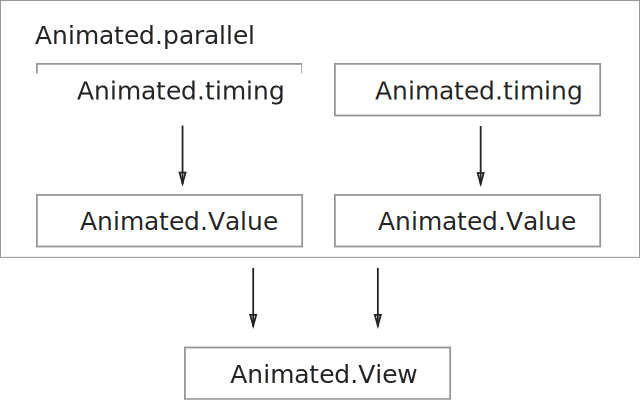

# ReactNative Animated

<Cover>

</Cover>

The `Animated` library is like lego. There are different kinds of pieces, and you need know the different ways of connecting them together.

We'll first give you a quick overview of what the pieces are, and then in subsequent demos play around with ways to use them.

1. `Animated.Value` - A number that can change.

2. `Animated.View` - A view, whose style (or property) can change if `Animated.Value` changes.

2. `Animated.timing` - An animation object that causes `Animated.Value` to change.

## The Animated Object Graph

These animated objects are connected together like this:


1. `Animated.timing` causes `Animated.Value` to change.
2. `Animated.Value` causes `Animated.View` to change.

We'll add more details to this image as we see more complicated demos.


# Making Animation Fast

React's programming model presents a special performance obstacle to creating a fast animation library. We could animate a view by calling `setState` repeatedly with a timer, but in doing so we would incur the costs of rerendering and view reconciliation for every frame.

Doing all that for 60 frames per second would burn a lot of CPU time.

What we need for fast animation is a shortcut to modify a view, yet avoiding the costs of calling `render` repeatedly. The shortcut is [setNativeProps](https://facebook.github.io/react-native/docs/direct-manipulation.html#content).

In the following two demos we'll see that:

1. The cost of `render()` can slow down animation, and
2. How we can use `setNativeProps` to speed up animation.

### Exercise: SetState Animation

Let's animate the position of a 100x100 box by calling `setState` for every frame:

```js
animateLeft = () => {
  // stop animation loop after 300px
  if (this.state.left >= 300) {
    return;
  }

  const dx = 16;

  this.setState(state => {
    return { left: state.left + dx };
  }, () => {
    // Schedule the next animation frame
    requestAnimationFrame(this.animateLeft);
  });
}
```

+ `requestAnimationFrame` is used to keep the animation loop in sync with screen refresh rate.
+ `state.left` determines the position of the 100x100 box.

The `render` method updates the box with its new position. To pretend that `render` is expensive, we add a busy-loop:

```js
render() {
  console.log("render");

  // Fake expensive work
  let n = 100000000;
  while(n > 0) {
    n--;
  }

  const { left } = this.state;
  return (
    <View style={jss.container}>
      <View ref="box" style={[jss.box, {left}]}/>
    </View>
  );
}
```

Full code: [animated/animation-setState.js](https://github.com/hayeah/react-native-experiments/blob/master/animated/animation-setState.js)

You should see that the animated movement is very jaggy:

<video src="animation-setState.mp4" controls/>

The problem, of course, is `render()` taking a long time to complete per frame.

### Exercise: setNativeProps Animation

To avoid the cost of `render()`, we need to avoid using `setState`. Instead of manipulating `this.state`, let's add our own `animated` property the the `App` component:

```js
export class App extends React.Component {
  constructor(props) {
    super(props);

    this.animated = {
      left: 0,
    };
  }

  // ...
}
```

+ `animated` is just a plain object. You can use whatever property name you want.

We can directly modify the value in the `animated` object directly:

```js
animateLeft = () => {
  if (this.animated.left >= 300) {
    return;
  }

  const dx = 16;
  this.animated.left += dx;
  requestAnimationFrame(this.animateLeft);

  this.fastUpdateView();
}
```

Everytime we change `animated.left`, we also need to use `setNativeProps` to directly update the view (instead of going through `render`):

```js
fastUpdateView() {
  this.refs.box.setNativeProps({
    style: {left: this.animated.left }
  });
}
```

Full code: [animated/animation-setNativeProps.js](https://github.com/hayeah/react-native-experiments/blob/master/animated/animation-setNativeProps.js)

The animation should now be smooth:

<video src="animation-setNativeProps.mp4" controls/>

Side-by-side diff from the `setState` example:

```sh
diff -y animated/animation-setState.js animated/animation-setNativeProps.js | colordiff
```

# Introducing "Animated"

Like the `setNativeProps` demo we've seen above, ReactNative's builtin `Animated` library also updates views directly, and avoid incurring `render()` costs.

Let's see the Animated API in action.

### Exercise: Using Animated.Value

Instead of using a normal number `0`, we create a special `Value` object to hold a number:

```js
export class App extends React.Component {
  constructor(props) {
    super(props);

    this.animated = {
      left: new Animated.Value(0)
    }
  }

  // ...
}
```

We can use Animated.Value **as though it's a normal number**.

```js
render() {
  const { left } = this.animated;

  <Animated.View style={[jss.box, {left}]}/>
}
```

+ `Animated.View` is exactly the same as `View`, except that it accepts `Animated.Value` as property or style values.
  + Try changing `Animated.View` to `View` and see what error you'd get.

The component should render just once with the initial value of `animated.left`.


Then we can use `setValue` to change `animated.left`:

```js
animateLeft = () => {
  const currentLeft = this.animated.left._value;

  if (currentLeft >= 300) {
    return;
  }

  const dx = 16;
  this.animated.left.setValue(currentLeft + dx);
  requestAnimationFrame(this.animateLeft);
}
```

Full code: [animated/animation-setValue.js](https://github.com/hayeah/react-native-experiments/blob/master/animated/animation-setValue.js)

You should see the same result as before:

<video src="animation-setNativeProps.mp4" controls/>

The main difference is that we no longer need to explicitly call `setNativeProps` in our own code. Whenever `Animated.Value` changes, the view also changes.

Side-by-side diff from the `setNativeProps` example:

```sh
diff -y animated/animation-setNativeProps.js animated/animation-setValue.js | colordiff
```

### Exercise: Animated.timing

Finally we can get rid of `requestAnimationFrame` by using `Animated.timing` to change `animated.left` over time:

```js
animateLeft = () => {
  const { left } = this.animated;

  Animated.timing(left, {
    toValue: 300,
    duration: 300,
    easing: Easing.linear,
  }).start();
}
```

Full code: [animated/animation-Easing.js](https://github.com/hayeah/react-native-experiments/blob/master/animated/animation-Easing.js
)

+ Remember to call `start()`, otherwise nothing happens.

You should see the same result as before:

<video src="animation-setNativeProps.mp4" controls/>

Compare this demo to the previous example, where we explicitly modify the `Value` object with `setValue`.

```sh
diff -y animated/animation-setValue.js animated/animation-Easing.js | colordiff
```

### Exercise: Reusing Animated.Value

A single `Animated.Value` can animate multiple properties simultaneously.


For this exercise, you'll have to:

+ Add additional `Animated.View`s.
+ Use the same `Animated.Value` to animate multiple properties.

Your result:

<video src="reusing-animated-value.mp4" controls/>

# Avoiding Layout

ReactNative is like a mini-browser, and animating certain properties could cause the CSS engine to recalculate the layout, and potentially causing framerate to drop.

Let's add an `onLayout` callback to the red box we are animating:

```js
<Animated.View style={[jss.box, {left}]}
  onLayout={this.onBoxLayout}
  />
```

And we can see that the CSS layout is triggered multiple times, because we are animating the `left` property:

<video src="animation-triggering-layout.mp4" controls/>

Full code: [animated/animation-trigger-layout.js](https://github.com/hayeah/react-native-experiments/blob/master/animated/animation-trigger-layout.js)

+ Any CSS property that affects a view's position or size would cause relayout inside the view, as well as the view's parent containers.
+ `opacity` doesn't affect the view's position or size, so it shouldn't cause relayout. ()
+ The [transform style properties](https://facebook.github.io/react-native/docs/transforms.html#content) are analogous to CSS transforms, and don't trigger layout either.

### Exercise: Animate With The Transform Property

Please use the `translateX` transform to animate the red box. You should check that relayout no longer happens:

<video src="animate-with-transform.mp4" controls/>

# Parallel Animations

The `Animated` library makes it easy to build complicated effects by combining simple building blocks together.

We are going to run two animations in parallel:

1. Move the box 300px to the right.
2. Move the box 500px down.

### Exercise: Parallel Animation

We'll use `Animated.parallel` to group multiple animations together:



The animation code:

```js
animatePosition = () => {
  const { left, top } = this.animated;

  const animateLeft = Animated.timing(left, {
    toValue: 300,
    duration: 300,
  });

  const animateTop = Animated.timing(top, {
    toValue: 500,
    duration: 300,
  });

  Animated.parallel([animateLeft, animateTop]).start();
}
```

+ `start()` is called only once for the parallel animation group.

The `Animated.View` makes use of two instances of `Animated.Value`:

```js
const { position } = this.animated;

<Animated.View style={[
  jss.box,
  {
    transform: [
      {translateX: left},
      {translateY: top},
    ]
  }
]}
/>
```

Full code: [animated/parallel.js](https://github.com/hayeah/react-native-experiments/blob/master/animated/parallel.js)

+ Call `start()` just once.

### Exercise: Parallel Animation With ValueXY

The `Animated.ValueXY` class provides a more convenient API for animating the position of an element.


Create a new `ValueXY`:

```js
this.animated = {
  position: new Animated.ValueXY({x: 0, y: 0}),
};
```

`Animated.timing` knows how to animate `ValueXY`:

```js
animatePosition = () => {
  const { position } = this.animated;

  const animateLeft = Animated.timing(position, {
    toValue: {
      x: 300,
      y: 500,
    },
    duration: 300,
  }).start();
}
```

Finally, connect the `ValueXY` to an `AnimatedView`:

```js
<Animated.View style={[
  jss.box,
  {
    transform: position.getTranslateTransform()
  }
]}
/>
```

Full code: [animated/valueXY.js](https://github.com/hayeah/react-native-experiments/blob/master/animated/valueXY.js).

Compare this example with `Animated.parallel`:

```sh
diff -y animated/parallel.js animated/valueXY.js | colordiff
```

# Reading Source Code

The Animated API is starting to look complicated, and you may want more detailed information about how to use it. However, ReactNative is changing so fast, documentation and tutorials you find online is often insufficient or out of date.

If documentation and tutorials still leave you confused, it's probably a good time to start digging into the source code.

### Exercise: Reading Type Annotations

The Animated library has type annotations, and is currently the best API documentation available.

Let's look at [Animated.timing](https://github.com/facebook/react-native/blob/df40f482b02b57bb8c8314ef31da2a70e30f7612/Libraries/Animated/src/AnimatedImplementation.js#L1584-L1587):

```js
var timing = function(
  value: AnimatedValue | AnimatedValueXY,
  config: TimingAnimationConfig,
): CompositeAnimation {
```

+ `value: AnimatedValue | AnimatedValueXY`
  + This function is overloaded to accept both `Value` and `ValueXY`.

We'll need to dig into [TimingAnimationConfig](https://github.com/facebook/react-native/blob/df40f482b02b57bb8c8314ef31da2a70e30f7612/Libraries/Animated/src/AnimatedImplementation.js#L209-L214) to learn about the second argument:

```js
type TimingAnimationConfig =  AnimationConfig & {
  toValue: number | AnimatedValue | {x: number, y: number} | AnimatedValueXY;
  easing?: (value: number) => number;
  duration?: number;
  delay?: number;
};
```

+ `{x: number, y: number}`
  + This is the format we've used to specify the end position.

`Animated.ValueXY` is defined by the class [AnimatedValueXY](https://github.com/facebook/react-native/blob/df40f482b02b57bb8c8314ef31da2a70e30f7612/Libraries/Animated/src/AnimatedImplementation.js#L829). It has two convenience methods [getLayout](https://github.com/facebook/react-native/blob/master/Libraries/Animated/src/AnimatedImplementation.js#L901) and [getTranslateTransform](https://github.com/facebook/react-native/blob/master/Libraries/Animated/src/AnimatedImplementation.js#L917).

> Question: How are `getLayout` and `getTranslateTransform` different?

### Exercise: Tracing Source Code

A useful technique for understanding source code is to get a simple demo working, then starting tracing the hell out of it. The hardest part is guessing where to start tracing.

Suppose that you want to understand how `timing` manipulates `ValueXY`:

```js
Animated.timing(position, {
  toValue: {
    x: 300,
    y: 500,
  },
  duration: 300,
}).start();
```

Open Chrome debugger, and try to find out where `Animated.timing` is defined and set a breakpoint there:

<video src="animated-timing-breakpoint.mp4" controls/>

1. Use `cmd-p` to search files by name.
2. Start with finding `Animated.js`, and see that it's implemented by `AnimatedImplementation.js`
3. Go into `AnimatedImplementation.js`. Because it's a big file, use `cmd-f` to search for `Animated.timing`.

Once the breakpoint is set, trigger the animation to start tracing.

Question: What does [maybeVectorAnim](https://github.com/facebook/react-native/blob/df40f482b02b57bb8c8314ef31da2a70e30f7612/Libraries/Animated/src/AnimatedImplementation.js#L1532) do? Pay particular attention to [Line 1551](https://github.com/facebook/react-native/blob/df40f482b02b57bb8c8314ef31da2a70e30f7612/Libraries/Animated/src/AnimatedImplementation.js#L1551).

These two lines of type casting code is a bit confusing:

```js
var aX = anim((value: AnimatedValueXY).x, configX);
var aY = anim((value: AnimatedValueXY).y, configY);
```

The same two lines stripped of type cast:

```js
var aX = anim(value.x, configX);
var aY = anim(value.y, configY);
```

# Animated.Image

+ show image resize event


# Call Me "Maybe"


React's programming model is like server-side rendering: take some data, and compute the whole page. But doing animation following the same philosophy is like asking a PHP server to render pages at 60 requests per second, each page only slightly different from the last. It's possible, but awkward.

For a concrete example of this awkwardness, let's consider the problem of fading out a box:

<video src="fadeout.mp4" controls/>

Without animation, hiding the box is simple. Just use setState to hide the box:

```js
this.setState({isBoxHidden: true});
```

The render method uses `isBoxHidden` to hide or show the box:

```js
render() {
  const { isBoxHidden } = this.state;

  { !isBoxHidden &&
    <View style={jss.box}/>
  }
}
```

Once the state changes, the UI updates instantaneously. The box is either hidden or not hidden, but never in between.

With animation though, hiding the box is not instantaneous. Like M.C Escher's print "Night And Day", there is an ambiguous gray zone between the ends of two transition states. The box can exist in an ambiguous "maybe" state.

So there are really two different ideas of change:

+ Change is instanteneous (setState, no animation).
+ Change is smooth (with animation).

The `Animated` library needs to somehow bridge the gap between these two "realities". It needs to be both instanteneous and smooth.

## White Lie

We've made animation sounds like an impossible philosophical conundrum, but in practice it's pretty easy. Resolving the impossible requires just one lie:

> While animation is changing the UI, let's pretend that the UI is not changing.

### Exercise: Fade Out Transition

Fading out is an example of a "smooth state transition". On the one hand `setState` is instantaneous, and on the other the animation is smooth.

We initialize the component with both an animated value and a state:

```js
this.animated = {
  opacity: new Animated.Value(1)
};

this.state = {
  isBoxHidden: false,
};
```

+ `opacity` - Animate this, to create the illusion of smooth transition.
+ `isBoxHidden` - Use `setState` to instantaneously change the UI.

We'll use `Animated.spring` to fade the red box:

```js
animateFadeout = () => {
  const { opacity } = this.animated;

  Animated.spring(opacity, {
    toValue: 0,
  }).start(() => {
    this.setState({isBoxHidden: true});
  });
}
```

+ `spring` - This is a physics based animation. Unlike, `timing` that we don't need to specify a `duration`.

The `start` method accepts a callback, which is invoked when the animation is complet2ed. We call `setState` to update the UI at the end of the animation.

Let's look at how the render method is both instantaneous and smooth:

```js
render() {
  const { opacity } = this.animated;
  const { isBoxHidden } = this.state;

  { !isBoxHidden &&

    <Animated.View style={[
        jss.box,
        { opacity }
      ]}/>
  }
}
```

+ While `Animated.timing` is animating the opacity value, the box fades out smoothly.
+ At the very end, the box "instantaneously" disappears.

Full code: [animated/fadeout.js](https://github.com/hayeah/react-native-experiments/blob/master/animated/fadeout.js).

# Interruptible Animations

Traditional timing animation forces the user to wait for the animation to finish before another animation could occur.

Our goal is to show/hide a box by moving it in and out of the screen. But at the same time, we'd want to allow the user to reverse direction at any time:

<video src="reversible-animation.mp4" controls/>

Desktop applications seldom requires interactive responsiveness taken to this extreme (except for games). iOS, however, raised the responsivness standard much higher. Today's mobile apps users are used to a higher degree of responsiveness than desktop apps.

Without interruptible animations, your app would feel sluggish in comparison to other apps on the market.

We'll use `Animated.spring`, a physics based animation. `Animated.spring` makes it easy to smoothly transition between different animations at any time.

Let's implement this demo in two steps:

1. Make interruptible `spring` animations to works.
2. Add `setState` to actually hide the box if `spring` animation is allowed to complete.

### Exercise: Switching Between Spring Animations

If an animation is still ongoing, starting a new animation will cancel the old animation. `Animated.spring` makes sure the transition from the old animation to the new animation is smooth.

We don't need to configure `Animated.spring` in any special way. Just use them the obvious way:

```js
animateFadeout = () => {
  const { top } = this.animated;

  Animated.spring(top, {
    toValue: 500,
  }).start();
}

animateFadein = () => {
  const { top } = this.animated;

  Animated.spring(top, {
    toValue: 0,
  }).start();
}
```

Please write your own code.

Your result:

<video src="transition-between-spring-animations.mp4" controls>

### Exercise: Changing UI State

Let use `state.isBoxHidden` to mount and unmount the red box.

The component's constructor should initialize these propeties:

```js
this.animated = {
  top: new Animated.Value(0)
};

this.state = {
  isBoxHidden: false,
};

this.animating = {
  hidingBox: false,
};
```

+ Use `animating.hidingBox` to determine which animation to activate.
+ You'll need to use the animation callback to tell whether an animation was completed or interrupted.
  + See: [EndCallback](https://github.com/facebook/react-native/blob/5047f6f54c5db262509c87cef35c507f424361eb/Libraries/Animated/src/AnimatedImplementation.js#L30-L31)
+ Views counter in the performance monitor should increase or decrease by 1.

Please write your own code.

Your result:

<video src="interruptible-animation-unmount-box.mp4" controls/>

# Summary

The `Animated` library bypasses the normal React update cycle. We've explored this design choice from two different perspectives:

+ Performance - The update cycle is too expensive. Use `setNativeProps` to avoid `render()` cost.
+ Philosophical - Animation is an "illusion" of change. The real instantaneous change occurs at the end of an animation.

This introduction to the `Animated` library should give you a basic mental model of how it works. In another lesson we'll learn more advanced features of the Animated library:

1. Coordinating different animations by building a graph of `Animated.Value` instances.
2. Driving animations with touch gestures.
3. Integrating touch gestures with physics based animation.
