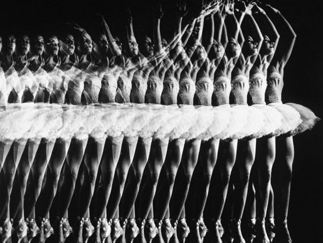

<Cover>


Photo by [Gjon Mili](https://www.google.ca/search?q=google+image+cartoon&source=lnms&tbm=isch&sa=X&ved=0ahUKEwjA1NuH-s_MAhUB_2MKHZcZDfEQ_AUIBygB&biw=840&bih=952#tbs=isz:l&tbm=isch&q=Gjon+Mili)
</Cover>

# Animated.spring

Most traditional animation API are timing based. You tell the animation engine to animate properties according to a mathematical function, for a given amount of time (say 300ms).

Timing-based API works very well for the desktop paradigm. Click something, and something happens. The experience if "clicking" is virtual and ghostly. The `pointer` is like a laser pointer, and I don't expect to "feel" the objects I am clicking.

Touching is a much more visceral experience. The finger as the "pointer device" *feels* the screen. The objects I am touching should give me the sense that they are physical things, responding to my physical finger.

This paradigm-shift suggests that a physics based animation system would serve the needs of touchscreen UI beter.

`Animated.timing` animates objects by time.

+ non-interactive.
+ physics based animation vs timing based animation
+ interruptible

+ show source code for anim config type.
+ show animation curve
+ show high cpu scenario

# combinators

+ parallel
+ sequence
+ stagger

Animation is basically a sequence of static images that changes fast enough so the brain thinks that the picture is moving. If animation is only about moving pixels around, it is in fact quite easy, and modern GPU can do it extremely well.

The API for animating the properties of a view can be very simple. In JQuery, fading out a view by animating its opacity to 0 is as easy as setting a property:

```js
// Fadeout
view.animate({
  opacity: 0,
});
```

However, animation is a more complicated problem for touch-driven UI like iOS and Android. The objects on screen need to respond to touches as though they are "real world" objects.

+ If my finger is moving faster, the object should move faster.
+ If my finger suddenly stops, the object should stop suddenly.
+ If my finger reverses direction, the object should reverse.
+ The object should move smoothly. It shouldn't teleport from A to B, or change its velocity suddenly without acceleration.

Designing an API for animation yet making it "feel natural" to interact with is a much harder problem. And because the problem is harder, ReactNative's [Animated](https://facebook.github.io/react-native/docs/animated.html#content) library is rather complicated.

For simple effects the `Animated` library can seem rather verbose. But its power and simplicity really shines when you need to coordinate between multiple effects and multiple views. It's also easy to make your (complex) animation design responsive to gesture. For its intended purpose, the `Animated` library is in fact remarkably succinct.

Through a sequence of demos, we'll build this:

+ make a gesture-driven animated "swipe to delete".
+ TODO: show the final demo