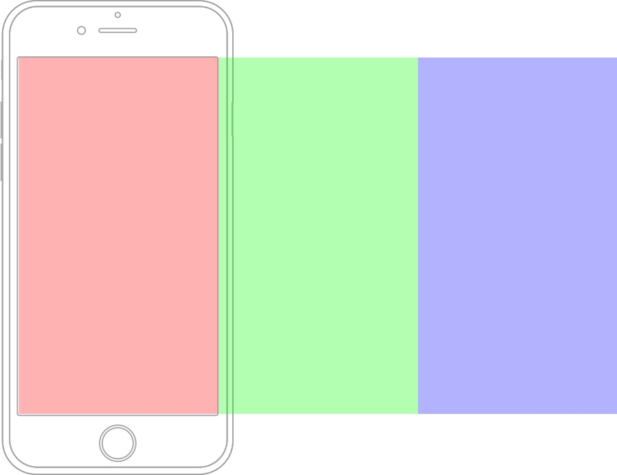
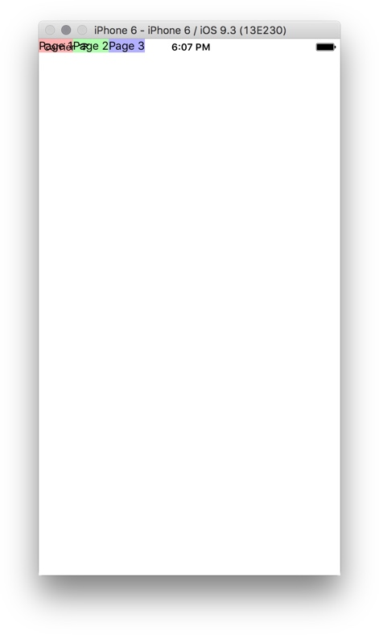
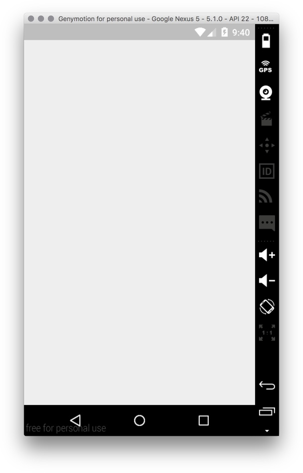
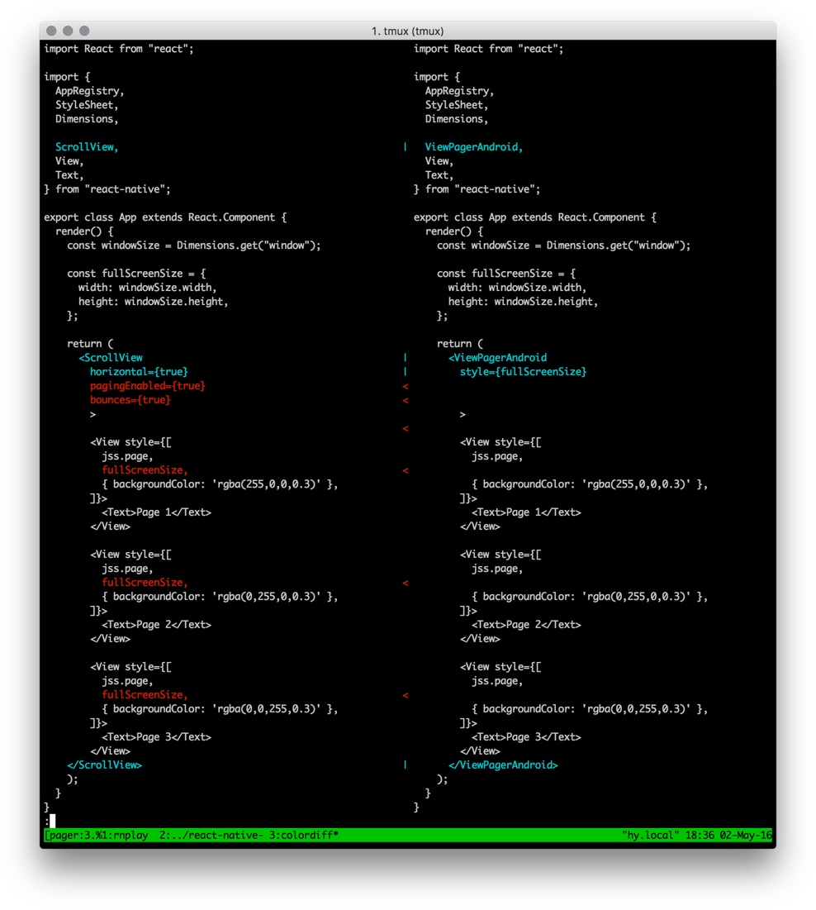

# View Pager

The view pager is a common UI pattern that allows the user to flip left and right through pages of data.

<video src="ios-pager.mp4" controls/>

Unfortunately iOS and Android have different native components for view pager. ReactNative (v0.24) does not have a builtin cross-platform component for paging. We'll have to build our own.

<Cn>

# 视图分页器

视图分页器是一个很常用的 UI pattern，它让用户可以向左和向右翻页来查看信息。

<video src="ios-pager.mp4" controls/>

很不幸的是，iOS 和 Android 对视图分页器有不同的原生组件。Readt Native（v0.24）并没有自带跨平台的分页组件。所以我们需要自己来构造一个。


</Cn>

+ In iOS, we can use [ScrollView](https://facebook.github.io/react-native/docs/scrollview.html#content) as the view pager.
+ In Android, we can use [ViewPagerAndroid](https://facebook.github.io/react-native/docs/viewpagerandroid.html#content).

<Cn>

+ 在 iOS 里，我们可以使用 [ScrollView](https://facebook.github.io/react-native/docs/scrollview.html#content) 作为视图分页器；
+ 在 Android 里，我们可以使用 [ViewPagerAndroid](https://facebook.github.io/react-native/docs/viewpagerandroid.html#content)。


</Cn>

You'd often need to plaster over small annoying differences between iOS and Android. This tutorial will show you how by building a simple cross-platform View Pager component.

<Cn>

为了克服 iOS 和 Android 之间的差异，你通常需要修修补补。在这一课中我们会想你展示如何去构建一个简单的跨平台视图分页器部件。


</Cn>

# iOS View Pager

In iOS, The `ScrollView` component is based on the ridiculously over-featured [UIScrollView](https://developer.apple.com/library/ios/documentation/UIKit/Reference/UIScrollView_Class/#//apple_ref/occ/instp/UIScrollView/pagingEnabled) native view. Setting the [pagingEnabled](https://developer.apple.com/library/ios/documentation/UIKit/Reference/UIScrollView_Class/#//apple_ref/occ/instp/UIScrollView/pagingEnabled) property to true turns `UIScrollView` into a pager.

<Cn>

# iOS 视图分页器

在 iOS 中，`ScrollView` 部件是基于 [UIScrollView](https://developer.apple.com/library/ios/documentation/UIKit/Reference/UIScrollView_Class/#//apple_ref/occ/instp/UIScrollView/pagingEnabled) 这个原生视图，而这个视图实现的功能已经多到一个荒谬的地步。将 [pagingEnabled](https://developer.apple.com/library/ios/documentation/UIKit/Reference/UIScrollView_Class/#//apple_ref/occ/instp/UIScrollView/pagingEnabled) 属性设为 true 会将 `UIScrollView` 变成一个分页器。


</Cn>

The ScrollView component uses the iOS specific `pagingEnabled` property:

```js
<ScrollView
  horizontal={true}
  pagingEnabled={true}
  >

  <View/>
  <View/>
  <View/>

</ScrollView>
```

<Cn>

ScrollView 部件使用了 iOS 特有的  `pagingEnabled` 属性：

```js
<ScrollView
  horizontal={true}
  pagingEnabled={true}
  >

  <View/>
  <View/>
  <View/>

</ScrollView>
```

</Cn>

> [ios] [pagingEnabled](https://facebook.github.io/react-native/docs/scrollview.html#pagingenabled) bool
>
> When true, the scroll view stops on multiples of the scroll view's size when scrolling. This can be used for horizontal pagination. The default value is false.

Lastly, each of the page need to have explicit layout to cover the whole screen, and laid side-by-side:



<Cn>

> [ios] [pagingEnabled](https://facebook.github.io/react-native/docs/scrollview.html#pagingenabled) bool
>
> 当为 true 时，scrollView 会在滚动到视图尺寸的倍数时停下来。这可以用作竖直方向的分页。默认的这个值是 `false`。

最后，每一个页面都需要有一个显示的布局来让它覆盖整个屏幕，而且要把它们肩并肩地放到一起：


</Cn>


We can use the `Dimensions` to get the screen size:

```js
const windowSize = Dimensions.get("window");

const fullScreenSize = {
  width: windowSize.width,
  height: windowSize.height,
};

<ScrollView
  horizontal={true}
  pagingEnabled={true}
  >

  <View style={[
    jss.page,
    fullScreenSize,
    { backgroundColor: 'rgba(255,0,0,0.3)' },
  ]}>
    <Text>Page 1</Text>
  </View>

  ...
</ScrollView>

```

See: [pager-ios.js](https://github.com/hayeah/react-native-scrollview-experiments/blob/master/pager-ios.js).

<Cn>

我们可以用 `Dimensions` 来得到屏幕尺寸：

```js
const windowSize = Dimensions.get("window");

const fullScreenSize = {
  width: windowSize.width,
  height: windowSize.height,
};

<ScrollView
  horizontal={true}
  pagingEnabled={true}
  >

  <View style={[
    jss.page,
    fullScreenSize,
    { backgroundColor: 'rgba(255,0,0,0.3)' },
  ]}>
    <Text>Page 1</Text>
  </View>

  ...
</ScrollView>

```

详看：[pager-ios.js](https://github.com/hayeah/react-native-scrollview-experiments/blob/master/pager-ios.js)。

</Cn>

The result:

<video src="ios-pager.mp4" controls/>

<Cn>

效果应该像这样：

<video src="ios-pager.mp4" controls/>


</Cn>

### Exercise: Remove Children Layout

Try removing `fullScreenSize` from children's style.

You should see:



<Cn>

### 练习：移除子布局

尝试将 `fullScreenSize` 从子元素的样式中移除。

你应该能看到：


</Cn>

# Android View Pager

ViewPagerAndroid is built on Android's native [ViewPager](http://developer.android.com/reference/android/support/v4/view/ViewPager.html).

Unlike ScrollView, ViewPagerAndroid doesn't automatically fill its container. So we'll need to give it the fullscreen layout:

```js
<ViewPagerAndroid
  style={fullScreenSize}
  >
```

<Cn>

# Android 视图分页器

ViewPagerAndroid 是基于 Android 原生的 [ViewPager](http://developer.android.com/reference/android/support/v4/view/ViewPager.html)。

不像 ScrollView，ViewPagerAndroid 不会自动填充它的容器。所以我们需要给它一个全屏布局：

```js
<ViewPagerAndroid
  style={fullScreenSize}
  >
```

</Cn>

Another difference is that the child views the pages are automatically stretched to fill the view pager. The doc says:

> ViewPagerAndroid  allows to flip left and right between child views. **Each child view** of the ViewPagerAndroid will be treated as a separate page and **will be stretched to fill the ViewPagerAndroid**.
>
> ReactNative [ViewPagerAndroid](https://facebook.github.io/react-native/docs/viewpagerandroid.html#content)

So we don't need to give the child views layout.

See: [pager-android.js](https://github.com/hayeah/react-native-scrollview-experiments/blob/master/pager-android.js).

The result:

<video src="android-pager.mp4" controls/>

<Cn>

另一个不同之处在于，子视图会被拉伸来填满整个视图分页器。文档里是这么说的：

> ViewPagerAndroid 让你能够在子视图中向左或向右翻页。**每一个** ViewPageAndroid 的子视图都会被当成一个独立的页面，而且会被**拉伸以填充整个 ViewPagerAndroid**。
>
> ReactNative [ViewPagerAndroid](https://facebook.github.io/react-native/docs/viewpagerandroid.html#content)

所以我们不需要给子视图一个布局。

详看 [pager-android.js](https://github.com/hayeah/react-native-scrollview-experiments/blob/master/pager-android.js)。

效果应该像这样：

<video src="android-pager.mp4" controls/>

</Cn>

### Exercise: Remove ViewPagerAndroid Layout

Try removing `fullScreenSize`.

You should see an empty screen:



So it seems that ViewPagerAndroid defaults to 0x0.

Ya... ok... why not...

<Cn>

### 练习：移除 ViewPagerAndroid 布局

尝试移除 `fullScreenSize`。

你应该能看到一个空白的屏幕：


看起来 ViewPagerAndroid 默认的尺寸是 0x0。

好咯。。。

</Cn>

### Exercise: Diff The Pagers

Try diffing the two demos to see exactly how they are different.

```sh
diff -y  pager-ios.js pager-android.js | colordiff | less
```

<Cover>

</Cover>

<Cn>

### 练习：不同分页器的差别

尝试用 `diff` 命令来看看这两个分页器到底有什么不一样。

```sh
diff -y  pager-ios.js pager-android.js | colordiff | less
```

<Cover>

</Cover>

</Cn>

# Unified Pager

With a little effort we can abstract away the difference between iOS and Android. Let's create a minimal cross-platform Pager component.

The Pager API is like this:

```js
const fullScreenSize = {
  width: windowSize.width,
  height: windowSize.height,
};

<Pager size={fullScreenSize}>
  <View>
    <Text>Page 1</Text>
  </View>

  <View>
    <Text>Page 2</Text>
  </View>

  <View>
    <Text>Page 3</Text>
  </View>
</Pager>
```

<Cn>

# 统一的分页器

我们可以稍微花一点精力，把 iOS 和 Android 之间的差异提取出来。让我们创建一个最小的跨平台分页器组件。

分页器的 API 会像这样：

```js
const fullScreenSize = {
  width: windowSize.width,
  height: windowSize.height,
};

<Pager size={fullScreenSize}>
  <View>
    <Text>Page 1</Text>
  </View>

  <View>
    <Text>Page 2</Text>
  </View>

  <View>
    <Text>Page 3</Text>
  </View>
</Pager>
```

</Cn>

The cross-platform `Pager` is a simple shim that passes the props to a platform specific component:

```js
import { Platform } from "react-native";

function Pager(props) {
  const PagerClass = Platform.OS === "ios" ? PagerIOS : PagerAndroid;

  return <PagerClass {...props}/>
}

function PagerAndroid(props) {
  // ...
}

function PagerIOS(props) {
  // ...
}
```

<Cn>

跨平台的 `Pager` 其实是一个简单的 shim，它会将属性传递给一个平台特有的部件：

```js
import { Platform } from "react-native";

function Pager(props) {
  const PagerClass = Platform.OS === "ios" ? PagerIOS : PagerAndroid;

  return <PagerClass {...props}/>
}

function PagerAndroid(props) {
  // ...
}

function PagerIOS(props) {
  // ...
}
```

</Cn>

The `PagerAndroid` component is straightforward:

```js
function PagerAndroid(props) {
  const { size } = props;
  return (
    <ViewPagerAndroid
        style={size}>
      {props.children}
    </ViewPagerAndroid>
  );
}
```

<Cn>

`PagerAndroid` 部件比较直接：

```js
function PagerAndroid(props) {
  const { size } = props;
  return (
    <ViewPagerAndroid
        style={size}>
      {props.children}
    </ViewPagerAndroid>
  );
}
```

</Cn>

The `PagerIOS` is somewhat trickier. It needs to stretch each child to be as big as the container:

```js
function PagerIOS(props) {
  const stretchedChildren = React.Children.map(props.children, function(child) {
    // stretch the child view to fill the container
    // ...
  });

  return (
    <ScrollView
      horizontal={true}
      pagingEnabled={true}
      >
      {stretchedChildren}
    </ScrollView>
  );
}

```

See: [pager-cross-platform.js](https://github.com/hayeah/react-native-scrollview-experiments/blob/master/pager-cross-platform.js).

<Cn>

`PagerIOS` 就有一点麻烦了。它需要将每一个子视图拉伸到容器的大小：

```js
function PagerIOS(props) {
  const stretchedChildren = React.Children.map(props.children, function(child) {
    // stretch the child view to fill the container
    // ...
  });

  return (
    <ScrollView
      horizontal={true}
      pagingEnabled={true}
      >
      {stretchedChildren}
    </ScrollView>
  );
}

```

详看： [pager-cross-platform.js](https://github.com/hayeah/react-native-scrollview-experiments/blob/master/pager-cross-platform.js)。


</Cn>

# ReactNative Cross-Platform Development Tips

The most reliably cross-platform native components are `View` and `Text`. It's less likely (but hardly impossible) to run into inconsistencies.

Components implemented with pure JavaScript are also reliably cross-platform. These are components like `TouchableOpacity`, `Navigator` and the animation library `Animated`.

<Cn>

# React Native 的跨平台开发小提示

最可靠的跨平台部件是  `View` 和 `Text`。它们很少（几乎不可能）会出现不一致的地方。

用纯 JavaScript 实现的部件也是可以可靠地跨平台的，比如像 `TouchableOpacity`，`Navigator` 还有动效库 `Animated`。

</Cn>

On the other hand, complex native components like `Image`, `ScrollView`, and `ViewPagerAndroid` are always full of surprises. The problem with these components is that they behave strangely in layout. For example:

+ ScrollView are automatically stretched to fill its container.
+ ViewPagerAndroid doesn't have special layout properties, but its children are automatically stretched to fill the pager.
+ Image doesn't need explicit size if the loaded image is local, but it needs explicit size if the loaded image is remote.

A good strategy to deal with native component quirks is to implement a small standalone demo for the effect you want to build. This way you can ignore the complexity of your own app (and your own bugs), and focus on finding the exact incantation to make a component dance the way you want.


<Cn>

另一方面，复杂的原生组件像 `Image`，`ScrollView` 和 `ViewPagerAndroid` 就总是会给你一些小“惊喜”。这些部件的问题在于他们在布局中的表现很奇怪。例如：

+ ScrollView 会自动拉伸来填充它的容器；
+ ViewPagerAndroid 不会使用特殊的布局属性，但它的子视图会自动拉伸来填充整个分页器；
+ 如果加载的图片是本地图片，Image 不需要声明一个显式的尺寸。但如果加载的图片是远程图片，那就需要声明尺寸。

一个处理原生部件的坑的策略就是，为你想要实现的效果去做一个小的独立的原型。这样可以忽略你自己的 app（还有你自己的 bug）的复杂性，把注意力集中在这个部件上，实现你想要的效果。

</Cn>
