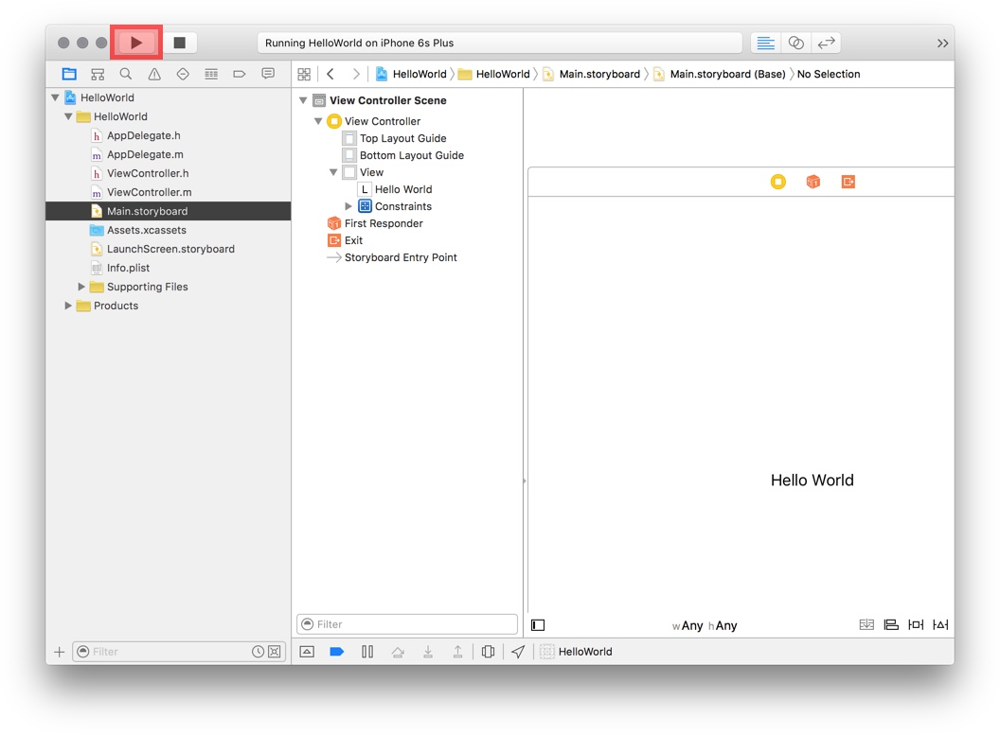
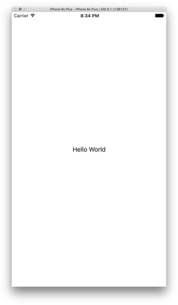
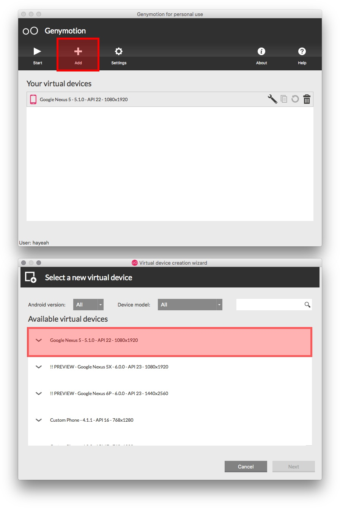
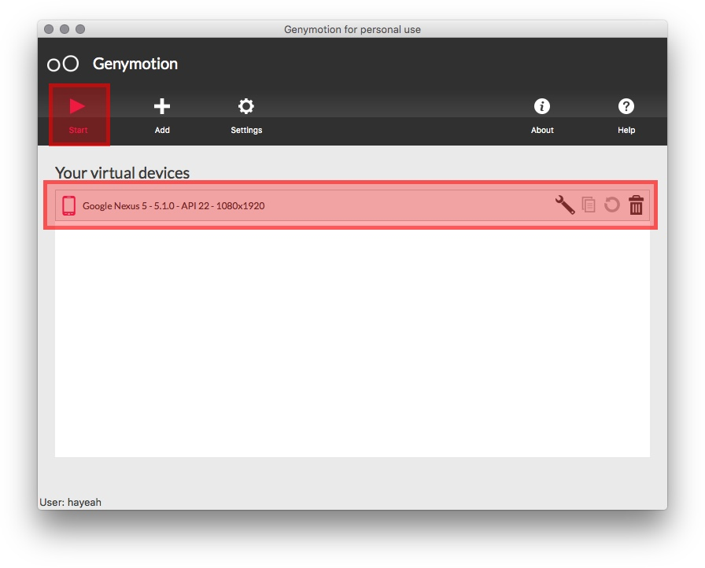
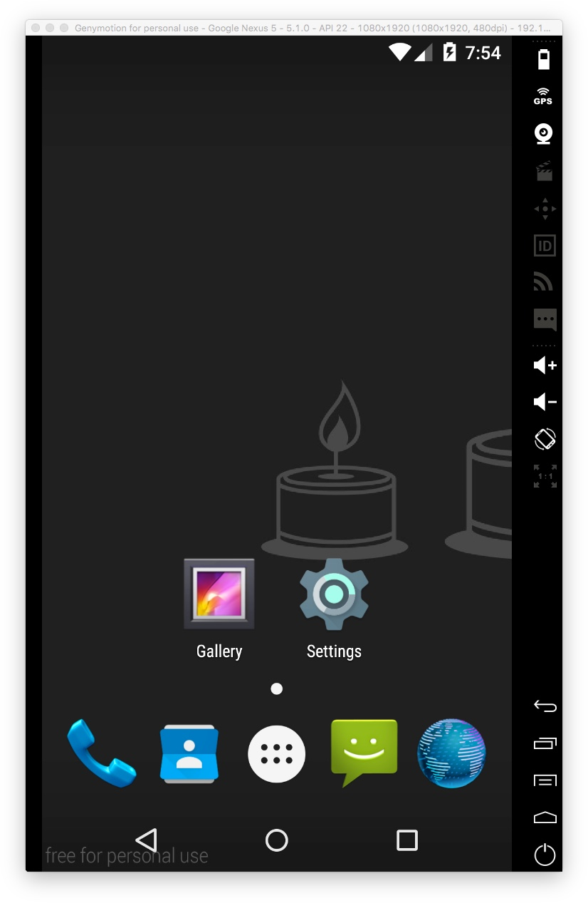
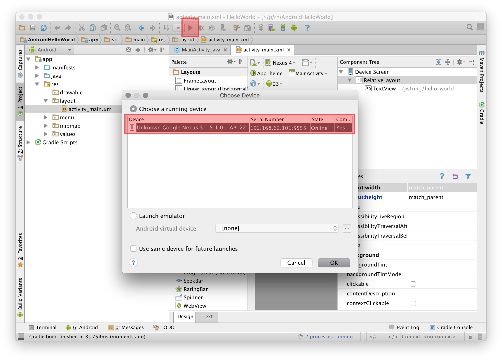
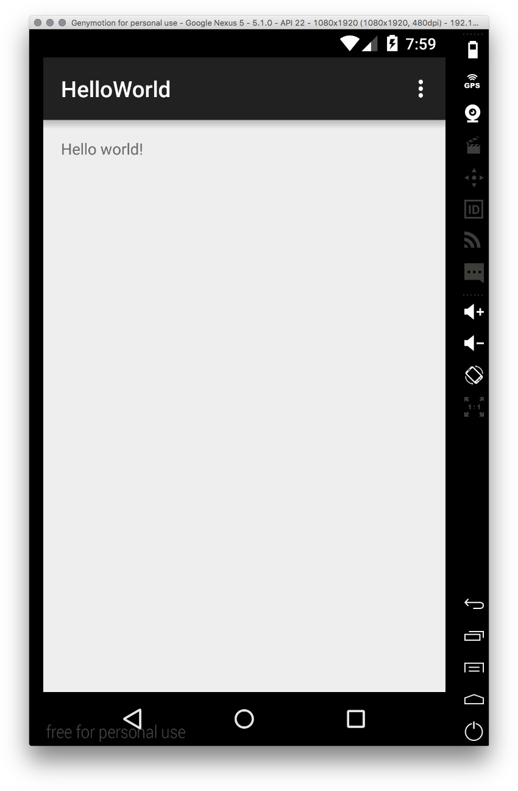

# Installing Xcode and Android SDK

Before attempting to use ReactNative, let's first make sure that iOS and Android SDKs are working. We'll attempt to build and run a simple "hello world" app in both Xcode and Android Studio.

# iOS Hello World

Clone the `HelloWorld` Xcode project:

```sh
git clone https://github.com/hayeah/ios-HelloWorld.git
```

## Install Xcode

[Download the latest Xcode](https://developer.apple.com/xcode/download/). You should use Xcode 7 or later.


Click `HelloWorld.xcodeproj` to open the project in Xcode. Then click the play button (or hot key `cmd-r`):



You should see:



# Android Hello World

Clone the Android HelloWorld Project:

```sh
git clone https://github.com/hayeah/android-HelloWorld.git
```

### Exercise: Install Android SDK

The Android SDK is more complicated to install. Follow the [Getting Started](http://facebook.github.io/react-native/docs/getting-started.html) instructions for Android.

### Exercise: Launch Android Emulator

First, install [GenyMotion](https://www.genymotion.com/), a fast Android emulator. Then add the Google Nexus 5 virtual device:



Before you can run the app, you need to run launch the virtual device:



The empty emulator looks like:



### Exercise: Launch HelloWorld App

Open the HelloWorld project with Android Sutdio. Run the app:



You should see:

