# Getting Started With React Native

In this lesson we are going to get React Native up and running. It's a tedious process to get everything installed.
Once you've got it all working, it's a fabulous development environment.

<Cn>

# 开始使用 React Native

在本课中，我们将配置并开始使用 React Native。安装的过程会有些繁琐，但只要把东西都配置好，那将会是一个非常棒的开发环境。

</Cn>

# Setup Xcode and Android SDK

+ [Installing Xcode and Android SDK](../install-xcode-and-android)

<Cn>

# 安装 Xcode 和 Android SDK

+ 请查看 [Installing Xcode and Android SDK](../install-xcode-and-android)

</Cn>

# Create React Native Project

```sh
$ react-native init HelloReact Native --verbose
```

<Cn>

# 创建一个 React Native 项目

```sh
$ react-native init HelloReact Native --verbose
```

</Cn>

The `init` command will install react-native and all its dependencies from npm. This will take a long time.

<Cn>

`init` 命令将会从 npm 安装 react-native 以及它的所有依赖库，这会花上不少时间。

</Cn>

# Running React Native Packager

Instead of using an existing tool like Webpack, React Native has its own project building tool. Thankfully you can use the tool right out of the box without having to configure anything.

<Cn>

# 运行 React Native packager（打包器）

React Native 有自己的项目构建工具 packager，所以我们不需要使用已有的工具如 Webpack。而且 packager 是开箱即用的，我们不需要做任何配置。

</Cn>

The React Native build tool is called the packager. It has some features that are the same as Webpack:

+ ES6 support.
+ Modules bundling.
+ Source map for debugging.

<Cn>

React Native 的构建工具叫 packager（打包器）。它有一些和 Webpack 类似的特性：

+ ES6 支持；
+ 模块打包；
+ 调试用的 source map。

</Cn>

And it has some features specifically built for React Native development:

+ Loading platform specific source files. (i.e. `foo.android.js` and `foo.ios.js`)
+ Static image assets for apps.
+ Live-reload.
+ Running React Native code in Chrome devtool.

<Cn>

它还有一些专为 React Native 开发所服务的特性：

+ 加载特定平台的源文件，比如 `foo.android.js` 和 `foo.ios.js`；
+ 应用的静态图片素材；
+ live-reload（实时重载）；
+ 在 Chrome 的 devtool （开发者工具）里运行 React Native 代码。

</Cn>

In development mode the packager is a web server, and your React Native app loads the bundled JavaScript project from the packager by making a web request:

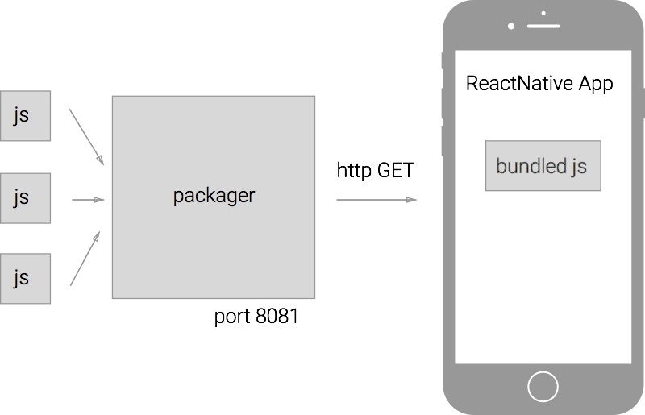

<Cn>

在开发模式中，packager 是一个 web 服务器，而你的 React Native 应用会通过 web 请求，从 packaer 那里加载打包好的 JavaScript 项目：


</Cn>

To start the packager, run the following command at the root of the project:

<Cn>

要启动 packager，需要在项目的根目录下运行以下命令：

</Cn>

```sh
$ react-native start
 ┌────────────────────────────────────────────────────────────────────────────┐
 │  Running packager on port 8081.                                            │
 │                                                                            │
 │  Keep this packager running while developing on any JS projects. Feel      │
 │  free to close this tab and run your own packager instance if you          │
 │  prefer.                                                                   │
 │                                                                            │
 │  https://github.com/facebook/react-native                                  │
 │                                                                            │
 └────────────────────────────────────────────────────────────────────────────┘
Looking for JS files in
   ~/projects/Timer

[9:49:16 PM] <START> Building Dependency Graph
[9:49:16 PM] <START> Crawling File System
[9:49:16 PM] <START> Loading bundles layout
[9:49:16 PM] <END>   Loading bundles layout (0ms)

React packager ready.

[9:49:20 PM] <END>   Crawling File System (3956ms)
[9:49:20 PM] <START> Building in-memory fs for JavaScript
[9:49:23 PM] <END>   Building in-memory fs for JavaScript (3026ms)
[9:49:23 PM] <START> Building in-memory fs for Assets
[9:49:27 PM] <END>   Building in-memory fs for Assets (3447ms)
[9:49:27 PM] <START> Building Haste Map
[9:49:29 PM] <START> Building (deprecated) Asset Map
[9:49:30 PM] <END>   Building (deprecated) Asset Map (1104ms)
[9:49:31 PM] <END>   Building Haste Map (4003ms)
[9:49:31 PM] <END>   Building Dependency Graph (14440ms)
```

<Cn>

```sh
$ react-native start
 ┌────────────────────────────────────────────────────────────────────────────┐
 │  Running packager on port 8081.                                            │
 │                                                                            │
 │  Keep this packager running while developing on any JS projects. Feel      │
 │  free to close this tab and run your own packager instance if you          │
 │  prefer.                                                                   │
 │                                                                            │
 │  https://github.com/facebook/react-native                                  │
 │                                                                            │
 └────────────────────────────────────────────────────────────────────────────┘
Looking for JS files in
   ~/projects/Timer

[9:49:16 PM] <START> Building Dependency Graph
[9:49:16 PM] <START> Crawling File System
[9:49:16 PM] <START> Loading bundles layout
[9:49:16 PM] <END>   Loading bundles layout (0ms)

React packager ready.

[9:49:20 PM] <END>   Crawling File System (3956ms)
[9:49:20 PM] <START> Building in-memory fs for JavaScript
[9:49:23 PM] <END>   Building in-memory fs for JavaScript (3026ms)
[9:49:23 PM] <START> Building in-memory fs for Assets
[9:49:27 PM] <END>   Building in-memory fs for Assets (3447ms)
[9:49:27 PM] <START> Building Haste Map
[9:49:29 PM] <START> Building (deprecated) Asset Map
[9:49:30 PM] <END>   Building (deprecated) Asset Map (1104ms)
[9:49:31 PM] <END>   Building Haste Map (4003ms)
[9:49:31 PM] <END>   Building Dependency Graph (14440ms)
```

</Cn>

+ By default the packager will listen on port 8081.

Test to see if you can get the bundled project from the packager:

<Cn>

+ packager 会默认监听 8081 端口。

试试看从 packager 获取打包好的项目：

</Cn>

```sh
# Download the iOS project for development mode
$ curl "http://localhost:8081/index.ios.bundle?platform=ios&dev=true"
if(componentOrElement==null){
return null;}

if(componentOrElement.nodeType===1){
return componentOrElement;}

if(ReactInstanceMap.has(componentOrElement)){
return ReactMount.getNodeFromInstance(componentOrElement);}

invariant(
componentOrElement.render==null||
typeof componentOrElement.render!=='function',
'findDOMNode was called on an unmounted component.');

invariant(
false,
'Element appears to be neither ReactComponent nor DOMNode (keys: %s)',
Object.keys(componentOrElement));}


module.exports=findDOMNode;
});
;require("InitializeJavaScriptAppEngine");
;require("App/index.ios.js");
...
```

<Cn>

```sh
# 为开发模式下载 iOS 项目
$ curl "http://localhost:8081/index.ios.bundle?platform=ios&dev=true"
if(componentOrElement==null){
return null;}

if(componentOrElement.nodeType===1){
return componentOrElement;}

if(ReactInstanceMap.has(componentOrElement)){
return ReactMount.getNodeFromInstance(componentOrElement);}

invariant(
componentOrElement.render==null||
typeof componentOrElement.render!=='function',
'findDOMNode was called on an unmounted component.');

invariant(
false,
'Element appears to be neither ReactComponent nor DOMNode (keys: %s)',
Object.keys(componentOrElement));}


module.exports=findDOMNode;
});
;require("InitializeJavaScriptAppEngine");
;require("App/index.ios.js");
...
```

</Cn>

You can change the URL query parameters to download a different version of the project. If you want the production build for iOS:

```sh
curl "http://localhost:8081/index.ios.bundle?platform=ios&dev=false"
```

If we want the Android project:

```sh
curl "http://localhost:8081/index.android.bundle?platform=android&dev=true"
```

<Cn>

你可以通过改变 URL 的查询参数来下载项目的不同版本。如果你想要 iOS 的生产版本：

```sh
curl "http://localhost:8081/index.ios.bundle?platform=ios&dev=false"
```

如果你想得到 Android 的开发版本：

```sh
curl "http://localhost:8081/index.android.bundle?platform=android&dev=true"
```

</Cn>

# Running React Native iOS

Open the Xcode project and run the app, you should see:

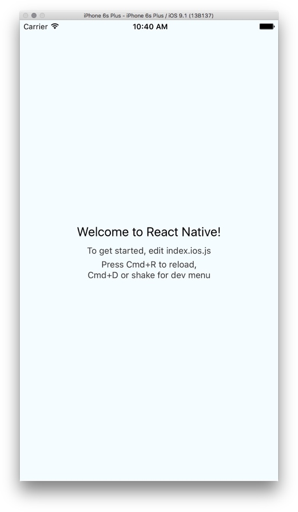

<Cn>

# 运行 React Native iOS

打开 Xcode 项目然后运行应用，你应该能看到：


</Cn>


In `AppDelegate.m` you'd see that the app is configured to load the project bundle from `localhost:8081`:

```objc
NSURL *jsCodeLocation;

jsCodeLocation =
  [NSURL URLWithString:@"http://localhost:8081/index.ios.bundle?platform=ios&dev=true"];

RCTRootView *rootView = [[RCTRootView alloc] initWithBundleURL:jsCodeLocation
                                                    moduleName:@"App"
                                             initialProperties:nil
                                                 launchOptions:launchOptions];
```

<Cn>

在 `AppDelegate.m` 里，你应该能看到应用被配置成从 `localhost:8081` 加载打包好的项目：

```objc
NSURL *jsCodeLocation;

jsCodeLocation =
  [NSURL URLWithString:@"http://localhost:8081/index.ios.bundle?platform=ios&dev=true"];

RCTRootView *rootView = [[RCTRootView alloc] initWithBundleURL:jsCodeLocation
                                                    moduleName:@"App"
                                             initialProperties:nil
                                                 launchOptions:launchOptions];
```

</Cn>

For production (later), we'll need to configure the app to load from static resource that's bundled with the app itself.

<Cn>

为了之后的生产环境需要，我们要配置应用，让它从打包到一起的静态资源中加载。

</Cn>

# Running React Native Android

You can run the Android app from Android Studio, or you can use the command line tool:

<Cn>

# 运行 React Native Android

你可以从 Android Studio 运行 Android 应用，或者使用命令行工具：

</Cn>

```sh
$ react-native run-android
JS server already running.
Building and installing the app on the device (cd android && ./gradlew installDebug)...
:app:preBuild
:app:preDebugBuild
:app:checkDebugManifest
:app:preReleaseBuild
...
:app:assembleDebug
:app:installDebug
Installing APK 'app-debug.apk' on 'Google Nexus 5 - 5.1.0 - API 22 - 1080x1920 - 5.1'
Installed on 1 device.

BUILD SUCCESSFUL

Total time: 2 mins 7.441 secs

Starting the app (/Users/howard/Library/Android/sdk/platform-tools/adb shell am start -n com.app/.MainActivity)...
Starting: Intent { cmp=com.app/.MainActivity }
```

The `run-android` command is essentially invoking "gradlew", the official Android build tool to compile and deploy the app.

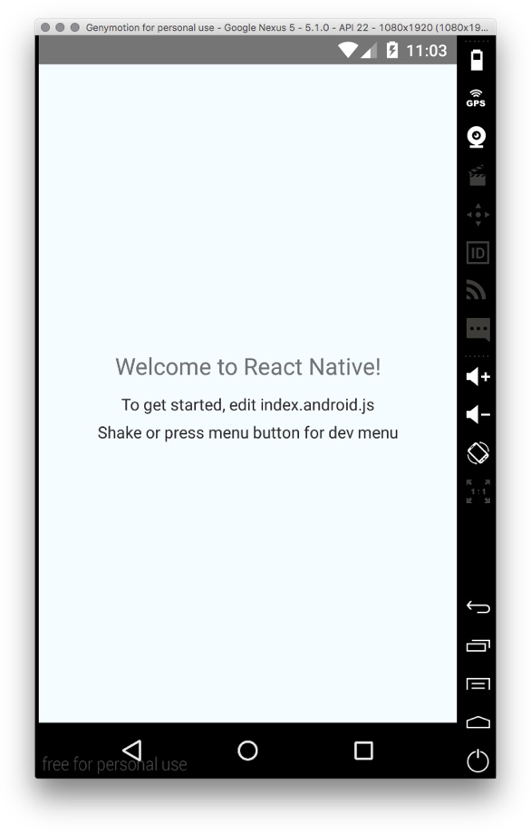

<Cn>

```sh
$ react-native run-android
JS server already running.
Building and installing the app on the device (cd android && ./gradlew installDebug)...
:app:preBuild
:app:preDebugBuild
:app:checkDebugManifest
:app:preReleaseBuild
...
:app:assembleDebug
:app:installDebug
Installing APK 'app-debug.apk' on 'Google Nexus 5 - 5.1.0 - API 22 - 1080x1920 - 5.1'
Installed on 1 device.

BUILD SUCCESSFUL

Total time: 2 mins 7.441 secs

Starting the app (/Users/howard/Library/Android/sdk/platform-tools/adb shell am start -n com.app/.MainActivity)...
Starting: Intent { cmp=com.app/.MainActivity }
```

`run-android` 命令实际上调用了 gradle。gradle 是 Android 的官方构建工具，用来编译和部署应用。


</Cn>

# React Native Development Tools

React Native has excellent development tools to make you more productive.

<Cn>

# React Native 开发工具

React Native 拥有优秀的开发工具以提升你的生产力。

</Cn>

## Live Reload

For even a small to medium sized project, it could take a painful 30~60 seconds to rebuild an app to test the changes you've made. React Native's packager is fast, so you can see the changes you've made instantaneously.

For iOS, Hit `cmd-d` to bring up the dev menu, and enable live reload.

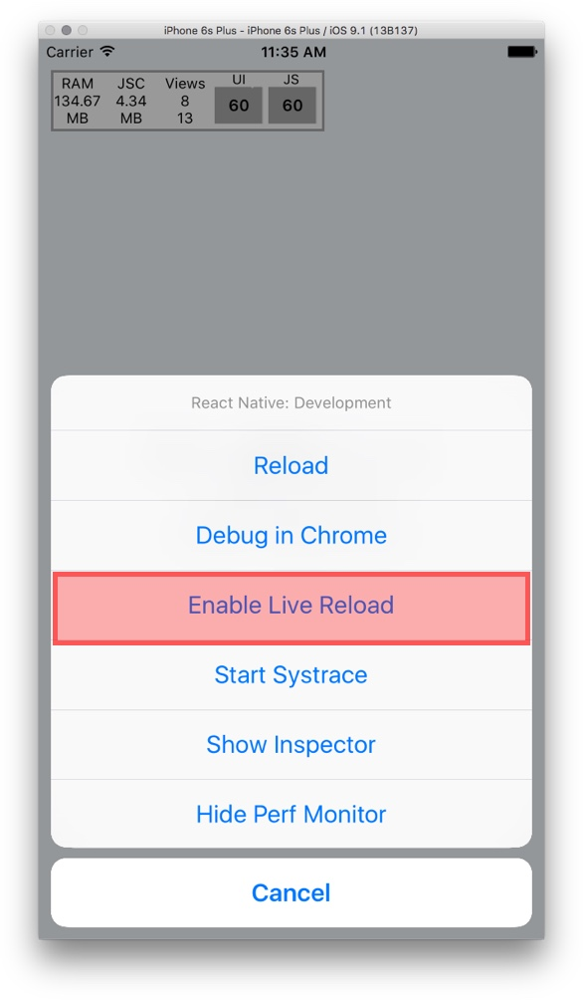

<Cn>

## Live-Reload（实时重载）

哪怕是对于中小型的项目，如果每次修改都要花30~60秒来重新构建应用来进行测试，会是个很痛苦的事情。但使用 React Native 就不用担心，它的 packager 速度很快，所以你可以立刻看到你的改动。

在 iOS 上，输入 `cmd-d` 来打开开发菜单，然后启用实时重载。


</Cn>

Try making changes to `index.ios.js`, you should see the new result immediately.

To enable live-reload for Android:

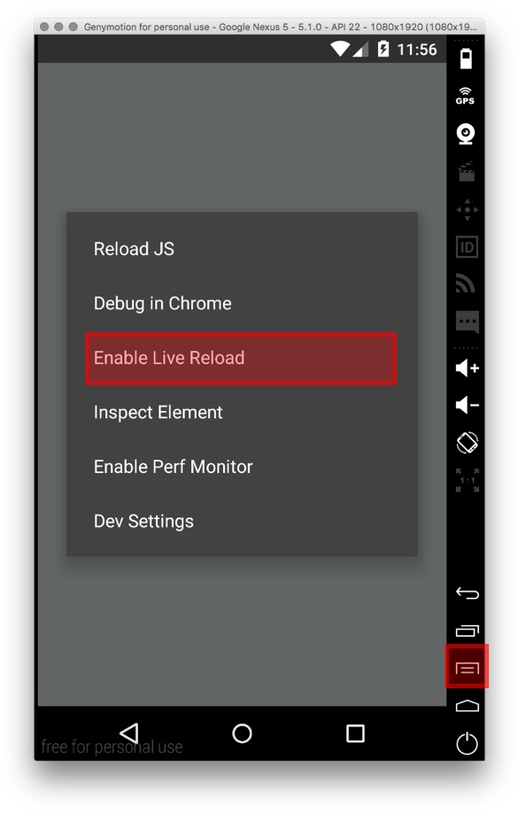

<Cn>

尝试对 `index.ios.js` 做出修改，你应该能立刻看到新的结果。

启用 Android 的 live-reload：


</Cn>

Try making changes to `index.android.js`, you should see the new result immediately.

<Cn>

尝试对 `index.android.js` 做出修改，你应该能立刻看到新的结果。

</Cn>

## console.log

Let's try to log "Hello React" once every second, and see where it goes. Add to both `index.ios.js` and `index.android.js`:

```js
setInterval(() => {
  console.log("Hello React:" + new Date());
},1000);
```

<Cn>

## console.log

让我们尝试每分钟打印一次 "Hello React"，然后看一下会怎么样。把下面的代码添加到 `index.ios.js` 和 `index.android.js`：

```js
setInterval(() => {
  console.log("Hello React:" + new Date());
},1000);
```

</Cn>

In Xcode you should see:

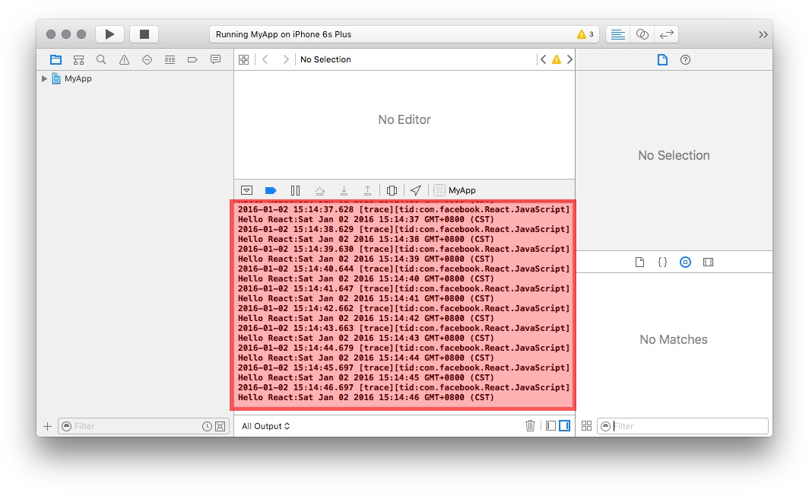

<Cn>

在 Xcode 里你应该能看到：


</Cn>

For Android, use the `adb logcat` command to dump logs from device.

+ The `-s` option is a filter to select only log entries emitted by React Native.
+ The adb command is at `$ANDROID_HOME/platform-tools`. You can add this directory to your `$PATH`.

```sh
$ adb logcat -s React NativeJS:V
I/React NativeJS( 1996): Hello React:Sat Jan 02 2016 02:34:13 GMT-0500 (EST)
I/React NativeJS( 1996): Hello React:Sat Jan 02 2016 02:34:14 GMT-0500 (EST)
I/React NativeJS( 1996): Hello React:Sat Jan 02 2016 02:34:15 GMT-0500 (EST)
I/React NativeJS( 1996): Hello React:Sat Jan 02 2016 02:34:16 GMT-0500 (EST)
I/React NativeJS( 1996): Hello React:Sat Jan 02 2016 02:34:17 GMT-0500 (EST)
I/React NativeJS( 1996): Hello React:Sat Jan 02 2016 02:34:18 GMT-0500 (EST)
...
```

<Cn>

对于 Android，使用 `adb logcat` 命令来从设备处导出日志。

+ `-s` 选项是一个过滤器，这里我们用来过滤掉不是由 React Native 输出的日志条目；
+ adb 命令位于 `$ANDROID_HOME/platform-tools` 目录下。你可以将这个目录添加到你的 `$PATH` 环境变量。

```sh
$ adb logcat -s React NativeJS:V
I/React NativeJS( 1996): Hello React:Sat Jan 02 2016 02:34:13 GMT-0500 (EST)
I/React NativeJS( 1996): Hello React:Sat Jan 02 2016 02:34:14 GMT-0500 (EST)
I/React NativeJS( 1996): Hello React:Sat Jan 02 2016 02:34:15 GMT-0500 (EST)
I/React NativeJS( 1996): Hello React:Sat Jan 02 2016 02:34:16 GMT-0500 (EST)
I/React NativeJS( 1996): Hello React:Sat Jan 02 2016 02:34:17 GMT-0500 (EST)
I/React NativeJS( 1996): Hello React:Sat Jan 02 2016 02:34:18 GMT-0500 (EST)
...
```

</Cn>

If you use Android Studio to run the project, you can find the log here:

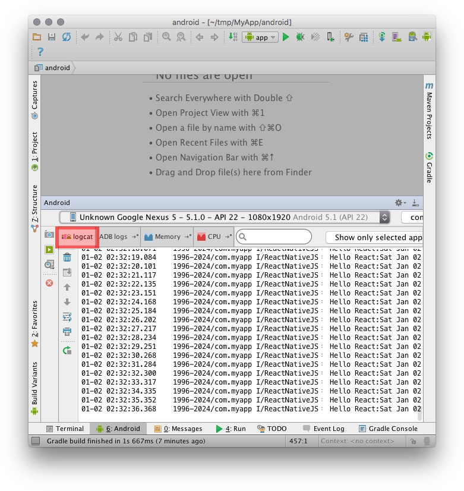

<Cn>

如果你使用 Android Studio 来运行项目，你会在这里找到日志：


</Cn>

## Error Screen

If your app throws an error, React Native shows you the famous "Red Screen of Death" (instead of crashing).

<Cn>

## 异常界面

如果你的应用抛出一个异常，React Native 会弹出著名的“死亡红屏”。

</Cn>

Try throwing an error in the render method:

```js
render: function() {
  throw new Error("boom!");
}
```

<Cn>

尝试在 `render` 方法里抛出一个异常：

```js
render: function() {
  throw new Error("boom!");
}
```

</Cn>

You should see the error stacktrace. It tells you the exact line and file where the error originated. This stacktrace is often enough to help you pinpoint the error.

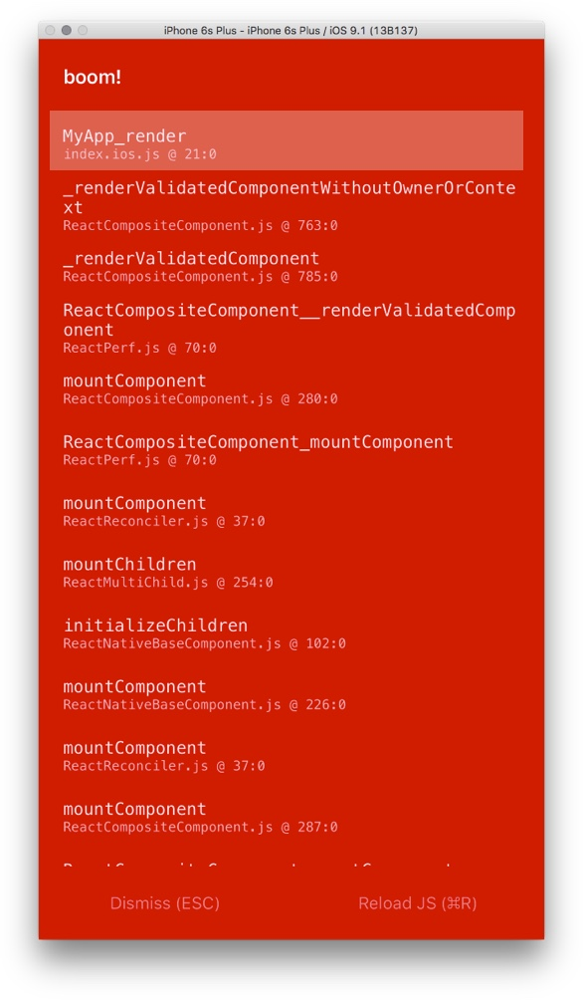

Try Android.

<Cn>

你应该能够看到异常的堆栈追踪信息（stacktrace）。它告诉你异常出自哪一个文件的哪一行。通常这个信息已经足够让你定位异常。


你可以在 Android 版本里尝试一下。

</Cn>

## Debugging

The debugger is not just useful for debugging.

Frequently the React Native documentation may not be detailed enough, and reading the source code may be the best way to understand how something works. The debugger can be a powerful aid, taking you step by step through the source code.

<Cn>

## 调试

调试器不只是对调试有用。

经常地，React Native 的文档会不够详尽，这时候阅读源代码可能是了解工作原理的最好方式。调试器是一个强大的帮手，帮助你一步一步地跟踪源代码。


</Cn>

(Enabling the debugger will make your app much slower, so remember to disable it when you are done.)

Enable the debugger from the development menu:

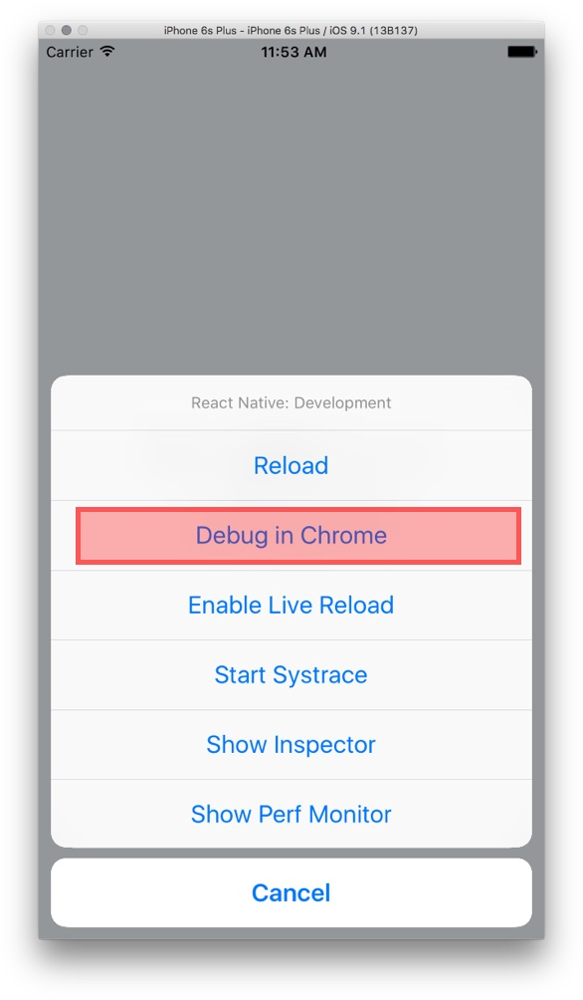

<Cn>

(启用调试器会大大降低你的应用的运行速度，所以记住当你完事儿之后把它禁用掉。)

在开发菜单里启用调试器：


</Cn>

A Chrome window will pop open. Next, open the Chrome debugger:

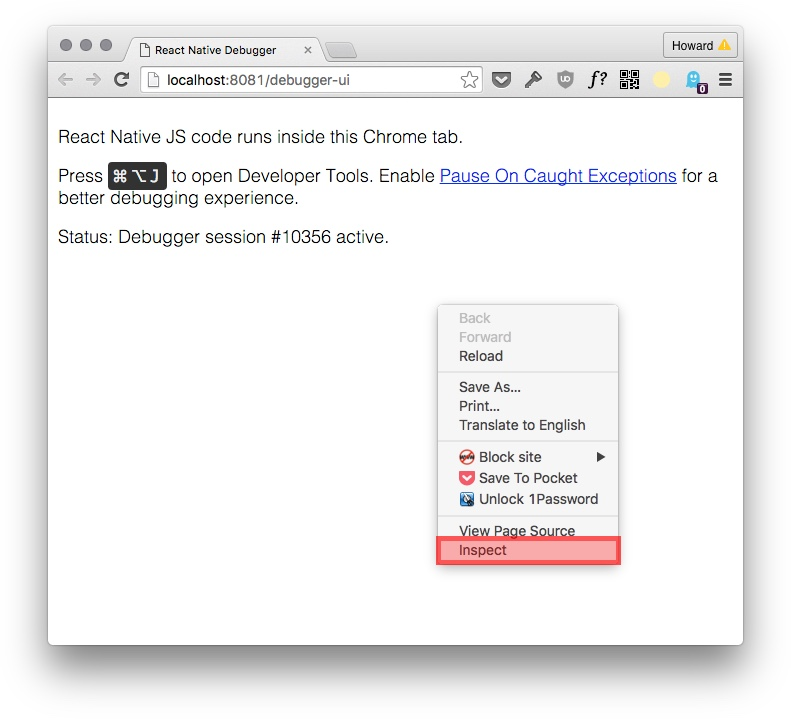

<Cn>

一个 Chrome 窗口会弹出。下一步，打开 Chrome 的调试器：


</Cn>

Let's try setting a breakpoint.

1. Go to the `Sources` tab.
2. Find `index.ios.js`.
3. Set a breakpoint at the `render` method.
4. `Cmd-R` to reload the app, so we trigger the breakpoint.
5. The app should pause.

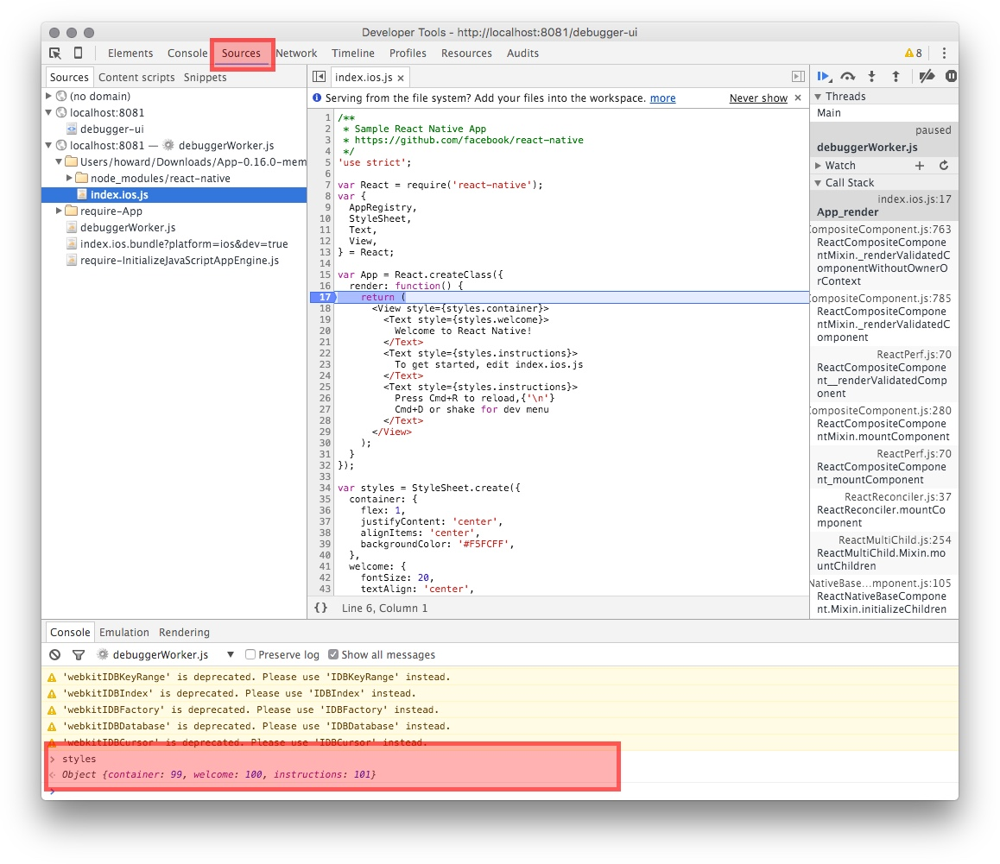

<Cn>

让我们尝试设置一个断点：

1. 打开 `Sources` 标签页；
2. 找到 `index.ios.js`；
3. 在 `render` 方法处设置一个断点；
4. 按 `Cmd-R` 来重载应用，以此来触发断点；
5. 应用应该会在断点处暂停。


</Cn>

You can examine the variables, or evaluating JavaScript. Evaluating `styles` should return:

```js
Object {container: 99, welcome: 100, instructions: 101}
```

<Cn>

你可以检查变量，或者对 JavaScript 表达式进行求值。对 `styles` 变量求值应该会返回：

```js
Object {container: 99, welcome: 100, instructions: 101}
```


</Cn>

So the `StyleSheet.create` method replaces the style objects with integer IDs!

<Cn>

所以 `StyleSheet.create` 方法用整数 ID 取代了 style 对象！

</Cn>

# Testing On Real Device

You should start testing on real devices as soon as possible, for two reasons:

<Cn>

# 在真机上测试

你应该尽快在真机上测试，因为：

</Cn>

1. To make sure that the app feels smooth.
2. Clicking buttons in the emulator dosen't give you an adequate sense of what the app feels like.

<Cn>

1. 保证应用感觉流畅；
2. 在模拟器里点击按钮不能让你真正体会应用的感觉。

</Cn>


And also, hardware features (e.g. camera) only work on a real device...

[Running on iPhone](https://facebook.github.io/react-native/docs/running-on-device-ios.html#content)

[Running on Android](https://facebook.github.io/react-native/docs/running-on-device-android.html#content)

<Cn>

而且，硬件特性（比如摄像头）只有在真机上才能使用。

参考：

+ [在 iPhone 上运行 React Native](https://facebook.github.io/react-native/docs/running-on-device-ios.html#content)

+ [在 Android 上运行 React Native](https://facebook.github.io/react-native/docs/running-on-device-android.html#content)

</Cn>

# Summary

We've got React Native running, yay! You should now be familiar with the development environment:

<Cn>

# 总结

耶，我们已经让 React Native 跑起来了！你现在应该对开发环境比较熟悉：

</Cn>


+ `react-native start` to start the project packager.
+ Enable live-reload to speed up development.
+ console.log goes to the system log (Xcode or `adb logcat`).

<Cn>

+ 用 `react-native start` 来启动项目的 packager ；
+ 启用 live-reload 来加速开发；
+ console.log 会打印到系统日志（Xcode 或者 `adb logcat`）。

</Cn>
