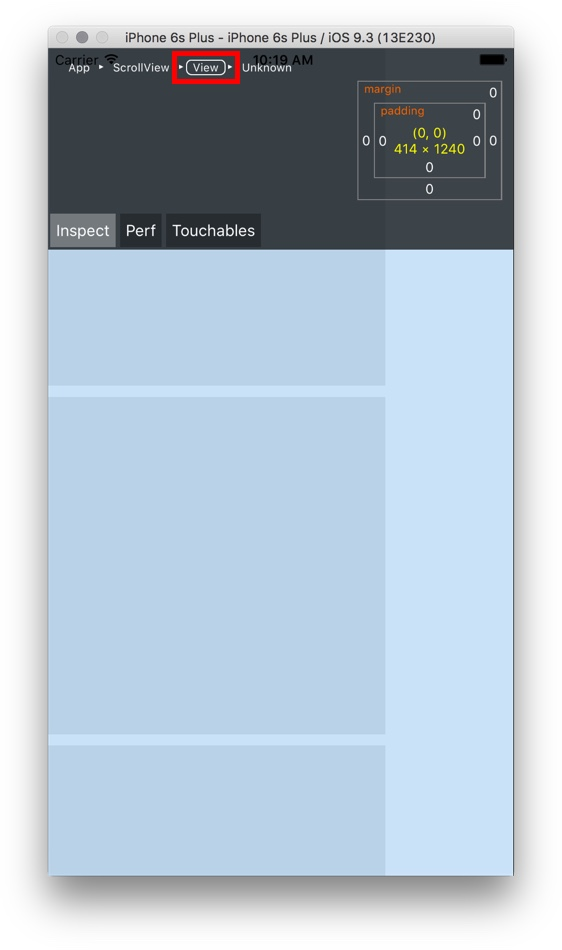
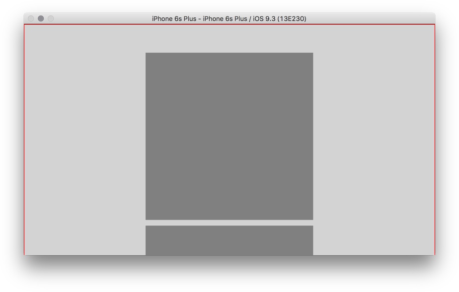
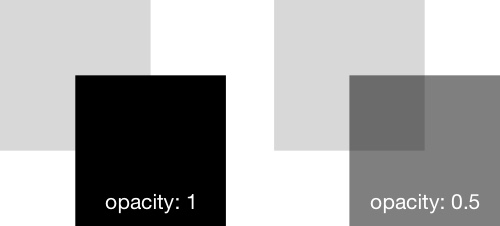
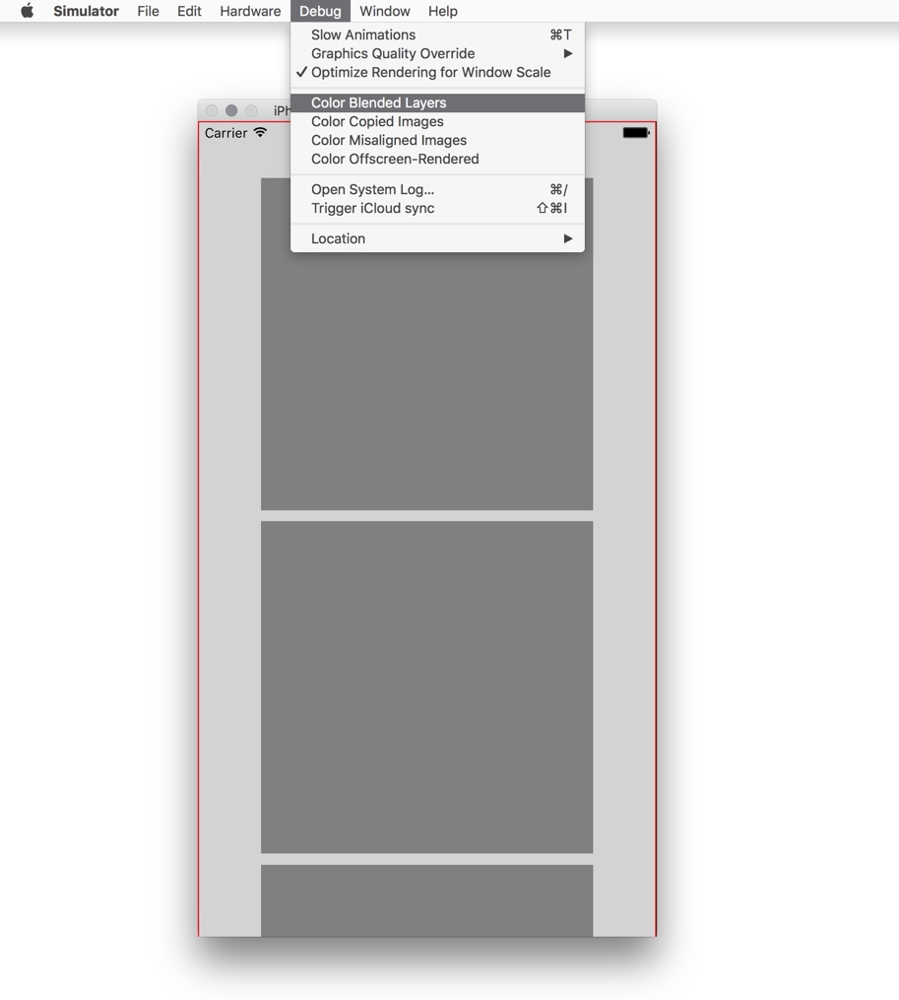
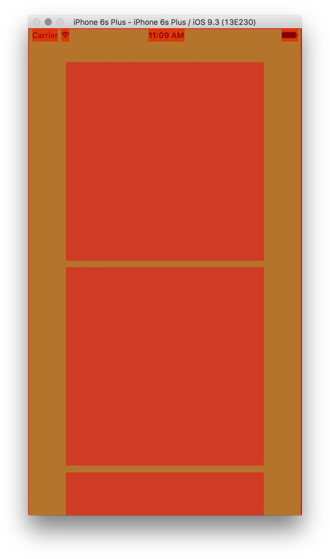
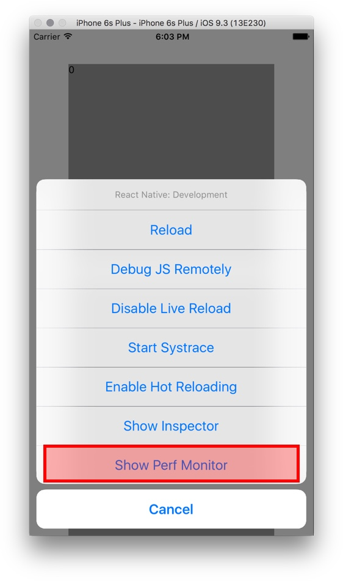
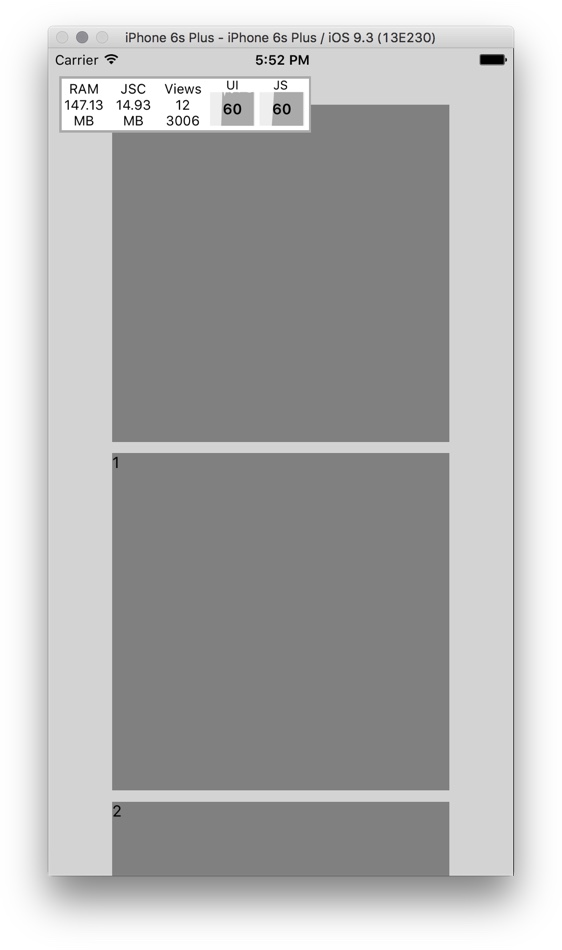

# ScrollView Basic

If your content is longer than the device screen, use a [ScrollView](https://facebook.github.io/react-native/docs/scrollview.html#content) to make the content scrollable.

On mobile, users use their fingers to interact with scrollable content as though it is a physical thing.

The ScrollView's content is like a sled sliding on ice, a finger flick gives it momentum to keep moving, and friction in the system decelerates it. If the finger is moving faster, the ScrollView should speeed up faster (because more mementum is added to it).

<Cn>

# ScrollView 基础

如果你的内容比设备屏幕要长，那么你就要用 [ScrollView](https://facebook.github.io/react-native/docs/scrollview.html#content) 来滚动内容。

在移动端，用户用手指来和可滚动内容交互，就好像这些内容是存在于真实世界的物件一样。

ScrollView 的内容就像雪橇在冰面滑行一样，手指一动就会给它一个动量持续运动，而系统产生的摩擦力会让它减速。如果手指动的快，那么 ScrollView 的速度就会快，因为手指给了它更多的动量。

</Cn>

While the scrollable content is moving, it should still respond to touches like a physical thing.

+ The finger can push the content in the same direction, to make it go faster.
+ The finger can push the content in the opposite direction, to reverse its direction.
+ The finger can pin the content, to stop the content abruptly.

The nuanced physical interaction with touches is what makes the ScrollView complicated.

<Cn>

当可滚动的内容正在移动时，它应该要能响应触摸，就像一个实际存在的东西一样。

+ 手指可以继续往相同方向划动，让内容滚动得更快；
+ 手指可以反方向划动，调转内容滚动的方向；
+ 手指可以点住内容，用来立刻终止内容的移动。

这些跟触摸相关的细微的物理交互，让 ScrollView 的实现变得很复杂。

</Cn>

Android and iOS have different physics for their versions of the ScrollView component. It'd be an immense effort to emulate the behaviour in HTML5 such that ScrollView **feels natural** to users on either platform. ReactNative simply uses the native ScrollView components, so you get exactly the right behaviour for each platform.

+ On iOS the underlying native component is the [UIScrollView](https://developer.apple.com/library/ios/documentation/UIKit/Reference/UIScrollView_Class/).
+ On Android the underlying native component is [ScrollView](http://developer.android.com/reference/android/widget/ScrollView.html)

<Cn>

Android 和 iOS 版本的 ScrollView 部件有着不同的物理属性设定。如果要在 HTML5 中模仿这两者的特性，让用户在两个平台上都感觉很自然，会需要非常大的精力投入。所以 React Native 使用了原生的 ScrollView 部件，这样你就可以在两个平台上都获得原生的体验。

+ 在 iOS 上，底层使用的原生部件是 [UIScrollView](https://developer.apple.com/library/ios/documentation/UIKit/Reference/UIScrollView_Class/)；
+ 在 Android 上，底层使用的原生部件是 [ScrollView](http://developer.android.com/reference/android/widget/ScrollView.html)。

</Cn>

# Running Examples

```sh
git clone https://github.com/hayeah/react-native-scrollview-experiments.git
```

+ run on rnplay
+ diff files

<Cn>

# 运行示例代码

```sh
git clone https://github.com/hayeah/react-native-scrollview-experiments.git
```

+ 在 rnplay 上运行；
+ 用 `diff` 命令来对比一下文件的差别。

</Cn>

# Default Layout of ScrollView

If you don't specify the layout of a ScrollView, then it defaults to:

```js
{
  flex: 1,
  alignSelf: 'stretch',
}
```

In other words, by default a `ScrollView` is as big as its container (if it is the only child view). In contrast, the standard `View` is only as big as necessary to wrap its content.

<Cn>

# ScrollView 的默认布局

如果你不给 ScrollView 指定一个布局，那么它默认就是：

```js
{
  flex: 1,
  alignSelf: 'stretch',
}
```

换句话说，`ScrollView` 默认地就是它父容器的大小（如果它是唯一的子视图的话）。相对的，标准的 `View` 部件的大小只会到足够包裹它的内容。

</Cn>

### Exercise: First ScrollView

Let's put four 300x300 boxes inside the ScrollView:

```js
// view
<ScrollView style={jss.scrollView}>
  <View style={jss.box}/>
  <View style={jss.box}/>
  <View style={jss.box}/>
  <View style={jss.box}/>
</ScrollView>

// style
const jss = StyleSheet.create({
  scrollView: {
    backgroundColor: 'lightgray'
  },
});
```

<Cn>

### 练习：第一个 ScrollView

让我们在 ScrollView 里面放4个 300x300 的盒子：

```js
// view
<ScrollView style={jss.scrollView}>
  <View style={jss.box}/>
  <View style={jss.box}/>
  <View style={jss.box}/>
  <View style={jss.box}/>
</ScrollView>

// style
const jss = StyleSheet.create({
  scrollView: {
    backgroundColor: 'lightgray'
  },
});
```

</Cn>

Notice that we don't need to tell the ScrollView to be as large as the screen.

See: [first-scrollview.js](https://github.com/hayeah/react-native-scrollview-experiments/blob/master/first-scrollview.js).

It looks like:

<video src="first-scrollview.mp4" controls/>

<Cn>

要注意，我们并不需要告诉 ScrollView 它要和屏幕一样大。

详看：[first-scrollview.js](https://github.com/hayeah/react-native-scrollview-experiments/blob/master/first-scrollview.js)。

效果会像这样：

<video src="first-scrollview.mp4" controls/>

</Cn>

### Exercise: Size of ScrollView

Unless specified, the default size of the ScrollView is the size of its container. In our example, we expect ScrollView to be the same size as the screen.

We can use ReactNative's inspector to see the size of the ScrollView:

<video src="inspect-scrollview.mp4" controls/>

As expected the ScrollView is 414x736, the size of the iPhone6 Plus screen.

<Cn>

### 练习：ScrollView 的尺寸

除非特别指定，ScrollView 的默认大小就是它的父容器的大小。在我们的例子中，我们假设 ScrollView 就是屏幕的大小。

我们可以使用 React Native 的检查器来看一下 ScrollView 的大小：

<video src="inspect-scrollview.mp4" controls/>

就像我们期待的那样，ScrollView 的大小是 414x736，也就是 iPhone6 Plus 的屏幕大小。

</Cn>

### Exercise: Centered ScrollView Content

Notice that the immediate child of the `ScrollView` is not a 300x300 box, but a 414x1240 container. The content of the ScrollView is wrapped in this `View` component.



<Cn>

### 练习：居中的 ScrollView 内容

注意到，ScrollView 的直接子元素并不是一个 300x300 的盒子，而是一个 414x1240 的容器。ScrollView 的内容是被包裹在这个 `View` 部件里面的。


</Cn>

We can style this content container using the `contentContainerStyle` property, like so:

```js
<ScrollView style={jss.scrollView}
  contentContainerStyle={jss.contentContainerStyle} >
```

<Cn>

我们可以使用 `contentContainerStyle` 属性来给这个内容容器添加样式，就像这样：

```js
<ScrollView style={jss.scrollView}
  contentContainerStyle={jss.contentContainerStyle} >
```


</Cn>

Let's make these changes:

1. Add border color so we can see it better.
2. Center the boxes using flex layout.
3. Add a top padding.

See: [centered-boxes-with-top-padding.js](https://github.com/hayeah/react-native-scrollview-experiments/blob/master/centered-boxes-with-top-padding.js)

<Cn>

让我们来做如下改动：

1. 添加边界的颜色，这样我们可以更好地看到它；
2. 用 flex 布局来让盒子居中；
3. 添加一个 top padding。

详看：[centered-boxes-with-top-padding.js](https://github.com/hayeah/react-native-scrollview-experiments/blob/master/centered-boxes-with-top-padding.js)

</Cn>

The result:

<video src="styling-content-container.mp4" controls/>

It should also work in landscape mode:



<Cn>

效果应该像这样：

<video src="styling-content-container.mp4" controls/>

在横屏模式下也应该没问题：


</Cn>

### Exercise: Two ScrollViews

The default layout of a ScrollView is:

```js
{
  flex: 1,
  alignSelf: 'stretch',
}
```

Please divide the screen into two ScrollViews.

<Cn>

### 练习：两个 ScrollView

ScrollView 的默认布局是：

```js
{
  flex: 1,
  alignSelf: 'stretch',
}
```

请将屏幕分成两个 ScrollView。

</Cn>

Your result:

<video src="two-scrollviews-ios.mp4" controls/>

Also test on Android:

<video src="two-scrollviews-android.mp4" controls/>

<Cn>

效果会像这样：

<video src="two-scrollviews-ios.mp4" controls/>

在 Android 上测试一下：

<video src="two-scrollviews-android.mp4" controls/>

</Cn>

### Exercise: Nesting ScrollViews

Create rows of horizontal scrollviews. The layout should look like:

<video src="nested-scrollviews.mp4" controls/>

<Cn>

### 练习：嵌套 ScrollView

创建几行行水平排列的 ScrollView。布局应该像这样：

<video src="nested-scrollviews.mp4" controls/>

</Cn>

Use the `horizontal` property to make a ScrollView scroll horizontally:

```js
<ScrollView horizontal={true} >
```

+ Change flex direction to 'row'.
+ The boxes are 80x80.

Check if Android works.

<video src="nested-scrollview-android.mp4" controls/>

<Cn>

使用 `horizontal` 属性来让 ScrollView 水平滚动：

```js
<ScrollView horizontal={true} >
```

+ 将 flex 方向改成 `row`；
+ 盒子的大小是 80x80。

看看在 Android 上是不是也没问题。

<video src="nested-scrollview-android.mp4" controls/>

</Cn>

# GPU Accelerated Scrolling

The ScrollView is the centerpiece of the mobile experience. It must be smooth!

Once rendered, the container view is essentially single [layer](https://developer.apple.com/library/mac/documentation/GraphicsImaging/Reference/CALayer_class/). The layer is sent to the GPU as a texture, so that when scrolling, it's very efficient for the GPU to move the layer up and down.

<Cn>

# GPU 加速的滑动

ScrollView 是移动体验最核心的一个部分。它必须要流畅！

渲染了之后，容器视图本质上是单 [layer](https://developer.apple.com/library/mac/documentation/GraphicsImaging/Reference/CALayer_class/) 的。 这个 layer 会作为纹理被送到 GPU，所以在滚动的时候，GPU 可以很有效率地将它向上或者向下移动。

</Cn>

A major performance killer is when the GPU needs to blend two layers together.



+ For solid colors, the top layer covers the bottom layer. Easy for GPU to do.
+ For transparent colors, GPU needs to blend two layers together.

See [Getting Pixels onto the Screen](https://www.objc.io/issues/3-views/moving-pixels-onto-the-screen/) for an overview of the iOS rendering pipeline.

<Cn>

但如果 GPU 需要将两个 layer 融合到一起的话，就会大大降低性能。


+ 对于非透明的颜色，上面的 layer 会覆盖掉下面的 layer。这对于 GPU 来说问题不大；
+ 而对于透明的颜色，GPU 需要将两个 layer 融合到一起。

看一下 [Getting Pixels onto the Screen](https://www.objc.io/issues/3-views/moving-pixels-onto-the-screen/) 这篇文章里面关于 iOS 渲染流程的介绍。

</Cn>

### Exercise: Layer Blending

Let's see an example of blending. Make the 400x400 boxes half tranparent:

```js
box: {
  ...
  opacity: 0.5,
  ...
}
```

<Cn>

### 练习：Layer 融合

让我们来看一个融合的例子。首先让一个 400x400 的盒子变成半透明：

```js
box: {
  ...
  opacity: 0.5,
  ...
}
```

</Cn>

See: [compositing-scrollview.js](https://github.com/hayeah/react-native-scrollview-experiments/blob/master/compositing-scrollview.js).

The iOS simulator can show you which areas on the screen are blended:

<Cover>

</Cover>

Everything is red, telling us that eveything on screen requires blending:



On your own, fix blending problem by removing transparent layers. You should turn almost everything to green:

<video src="scrollview-no-blended-area.mp4" controls/>

A few areas still require blending:

+ Status bar.
+ Scroll indicator.

<Cn>

详看：[compositing-scrollview.js](https://github.com/hayeah/react-native-scrollview-experiments/blob/master/compositing-scrollview.js)。

iOS 模拟器可以在屏幕上展示哪一些区域是融合的：

<Cover>

</Cover>

所有东西都是红色的，也就是说屏幕上的所有东西都需要融合：


在你的机器上，通过移除掉透明 layer 来解决融合的问题。你应该将几乎所有东西变成绿色：

<video src="scrollview-no-blended-area.mp4" controls/>

有几个区域仍然需要融合 ：

+ 状态条；
+ 滚动条。

</Cn>

# A Very Long ScrollView

> If a tree falls in a forest and no one is around to hear it, does it make a sound?

> If a view scrolls away and no one is around to see it, does it consume memory?

A ScrollView can contain hundreds of views, but only a handful of them are actually displayed on screen at one time.

<Cn>

# 一个非常长的 ScrollView

> 如果一棵树掉落到空无一人的森林里，它会发出声音吗？

> 如果一个视图被滚动到没有人能看得到的地方，那它是否还会占用内存呢？

一个 ScrollView 可以包含上百个视图，但是在同一时间只有其中的几个会在屏幕上显示。

</Cn>

The ScrollView component can optimize memory usage by removing views if they are far away from being seen. As views are scrolled into the screen, they are dynamically added back to the native UI tree.

However, the whole shadow view hierarchy is always kept in memory. It is needed to:

1. Calculate CSS layout.
2. Track which native views to add, remove, or modify.
3. Record all the property values of the views.

So for a large view hierarchy's layout will take longer to calculate, although memory usage is optimized.

<Cn>

ScrollView 部件会通过移除看不见的视图来优化内存使用。当视图被滚动进屏幕范围时，它们会被动态地添加到原生的 UI 树上。

然而，整个影子视图层级一直都会保持在内存里面。它会被用来：

1. 计算 CSS 布局；
2. 追踪确定哪一个原生视图要被添加，移除或者修改；
3. 记录视图的所有属性值。

所以对于一个很大的视图层级布局来说，依然需要大量的时间来计算，即使内存使用已经被优化。


</Cn>

### Exercise: Optimize Long ScrollView

Let's put 1000 boxes inside the ScrollView.

```js
const NUM_ITEMS = 1000;
const numbers = Array.from({length: NUM_ITEMS}, (_, i) => i);

const views = numbers.map(i => {
  return (
    <View key={i} style={jss.box} >
      <Text>{i}</Text>
    </View>
  );
});

<ScrollView style={jss.scrollView} >
  {views}
</ScrollView>
```

<Cn>

### 练习：优化长 ScrollView

让我们将 1000 个盒子放到 ScrollView 里面。

```js
const NUM_ITEMS = 1000;
const numbers = Array.from({length: NUM_ITEMS}, (_, i) => i);

const views = numbers.map(i => {
  return (
    <View key={i} style={jss.box} >
      <Text>{i}</Text>
    </View>
  );
});

<ScrollView style={jss.scrollView} >
  {views}
</ScrollView>
```

</Cn>

See: [very-long-scrollview-not-clipped.js
](https://github.com/hayeah/react-native-scrollview-experiments/blob/master/very-long-scrollview-not-clipped.js)

Enable the performance monitor:



You should see a few numbers:


+ RAM: 322.78MB
+ JSC: 14.93
  + Memory used by JavaScriptCore (the JS engine).
+ Views: 2006
  + This is the number of native views rendered.
+ Views: 3006
  + This is the number of shadow views.
  + 1000 View + 2000 Text (2 per Text)

<Cn>

详看：[very-long-scrollview-not-clipped.js
](https://github.com/hayeah/react-native-scrollview-experiments/blob/master/very-long-scrollview-not-clipped.js)

启用性能监视器：


你应该能看到一些数字：


+ RAM: 322.78MB
+ JSC: 14.93
  + JavaScriptCore （JS引擎）所占用的内存
+ Views: 2006
  + 这是被渲染的原生视图的树木
+ Views: 3006
  + 这是影子视图的数目
  + 1000个视图 + 2000个 `Text`

</Cn>

Now let's optimize memory usage. The `removeClippedSubviews` property tells the ScrollView to remove native views if they are not seen. (It defaults to true already, but let's add it anyway):

```js
<ScrollView style={jss.scrollView}
  removeClippedSubviews={true} >
```

<Cn>

现在让我们来优化内存使用。`removeClippedSubviews` 属性会告诉 ScrollView 来移除看不到的原生视图（这个属性已经默认是 `true` ，不过在这里我们还是先加上它)：

```js
<ScrollView style={jss.scrollView}
  removeClippedSubviews={true} >
```


</Cn>

Next, you need to tell the ScrollView that it can clip the boxes. The documentation says:

> When removeClippedSubviews is true, offscreen **child views (whose overflow value is hidden)** are removed from their native backing superview when offscreen.
>
> [removeclippedsubviews](https://facebook.github.io/react-native/docs/scrollview.html#removeclippedsubviews)

<Cn>

下一步，你需要告诉 ScrollView 它可以移除掉看不见的盒子。文档里是这样写的：

> When removeClippedSubviews is true, offscreen **child views (whose overflow value is hidden)** are removed from their native backing superview when offscreen.
>
> [removeclippedsubviews](https://facebook.github.io/react-native/docs/scrollview.html#removeclippedsubviews)

</Cn>

So...

```js
box: {
  ...
  overflow: 'hidden',
}
```

<Cn>

所以：

```js
box: {
  ...
  overflow: 'hidden',
}
```

</Cn>

And you should see that native views count and RAM usage decreases:



+ RAM: 147.13MB
  + Reduced from 322.78MB.
+ Views: 12
  + Reduced from 2006.
+ Views: 3006
  + Same as before. This is the ShadowView hierarchy.

Try to scroll the content, and you shouldn't see any difference from before.

<Cn>

然后你应该能看到原生视图的计数以及 RAM 使用量降低：


+ RAM: 147.13MB
  + 从 322.78 MB 降下来
+ Views: 12
  + 从 2006 降下来
+ Views: 3006
  + 跟之前一样。这是影子视图层级。

尝试滚动内容，你应该看不出跟之前有什么区别。

</Cn>
