# Cross-Platform Timer App

In this lesson we are going to build a timer app, and make it run on both iOS and Android.

<video src="timer-running-android.mp4" controls="true"></video>

By building this simple app, you will:

+ Learn the the fundamental building blocks of React Native: `View`, `Text`, and `Image`.
+ Learn the coding conventions of a ReactNative project.
+ Become familiar with the ReactNative development workflow.
+ Use flex to implement an adaptive layout that works for different screen sizes and orientations.

<Warning>
# ReactNative Android, The New IE6

Expect to encounter bugs.

If you run into weird problems, search [ReactNative Android Issues](https://github.com/facebook/react-native/labels/Android) to see if its a bug. In general, get iOS to work first, then pray that it works on Android.
</Warning>

<Note>
# Write 1.5 Times, Maybe Run Everywhere

Code sharing is definitely a great advantage, but a less obvious advantage of ReactNative is how easy it is to build _platform-specific_ apps!

Although it's possible to share 100% of the code between your iOS and Android apps, making them exactly the same is usually not the best way to optimize user experience for iOS or Android fans.

The goal is not "write once, run everywhere", but to build apps that feel native to users regardless of their preferred platforms.
</Note>

# Mobile-First Responsive Design

Transitioning from responsive design for the web to responsive design *for the mobile phone* takes a bit of mental adjustment.

Responsive design for the web typically optimizes for the desktop experience. While the page works for any screen size, the user experience can range from barely usable to hilarious:

<video src="web-first-responsive.mp4" controls="true"></video>

[@darylginn](https://twitter.com/darylginn)

On mobile, we only care about a limited range of rectangles that fit in the hand (10~15cm diagonally). To deliver the best mobile user experience, we should focus our design for this more limited canvas.

In fact, we often don't even care about supporting the landscape orientation. Most of the time your users hold the phone vertically, and that's the experience we should optimize for.

For example, Instagram uses square images, and Vine uses square videos. This design choice makes sense because a square fits in a vertical rectangle, yet still leaves plenty of space for other UI elements:


On mobile platforms, you'd often see apps that works great for the phone, but is crappy for tablets.

# App Layout With Flex

Our layout divides the vertical space into two boxes:


In landscape mode:

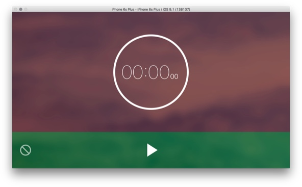

The UI elements should be centered in these two boxes. We could also try a different layout:

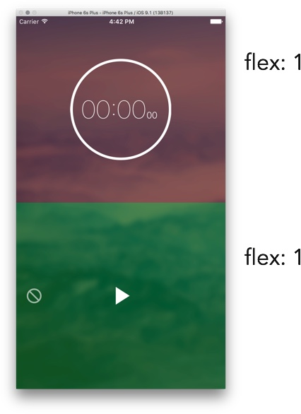

### Exercise: Implement The App Layout

We'll modify both `index.io.js` and `index.android.js` to import and use the same App component.

Create `App.js`:

```js
import {
  StyleSheet,
  View,
  Component,
} from "react-native";

export class App extends Component {
  render() {
    return (
      <View style={styles.container}>

        <View style={styles.timerDisplayLayout}>
        </View>

        <View style={styles.controlsLayout}>
        </View>
      </View>
    );
  },
};

const styles = StyleSheet.create({
  container: {
    flex: 1,
    alignSelf: 'stretch',
  },

  timerDisplayLayout: {
    ???
    backgroundColor: 'rgba(255,0,0,0.3)',
  },

  controlsLayout: {
    ???
    backgroundColor: 'rgba(0,255,0,0.3)',
  },
});
```

+ The extension must be `.js`, not `.jsx`.
  + See: [Issue #2303](https://github.com/facebook/react-native/issues/2303)

To make a container 100%, use the following two flexbox styles together:

```
/* Similar to width: 100%; height: 100% */
container: {
  flex: 1,
  alignSelf: 'stretch',
}
```

This is a layout trick we'll use a lot. It doesn't matter whether the `flex-direction` of the parent container is `row` or `column`, the container will be 100%.

Test different orientations by [rotating the iPhone emulator](http://stackoverflow.com/questions/9071316/iphone-simulator-screen-rotation) using `cmd-left-arrow` or `cmd-right-arrow`.

Your result:

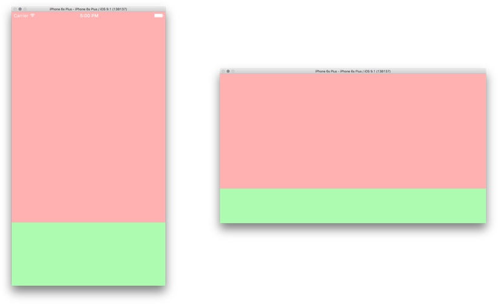

## The View Component

The `View` component like a `div`. There are no other semantic tags like p, section, table... so just use `View` everywhere.

The [Default CSS Styles](https://github.com/facebook/css-layout#default-values) for `View` is different from browser defaults:

```css
View {
  box-sizing: border-box;
  position: relative;

  display: flex;
  flex-direction: column;
  align-items: stretch;

  flex-shrink: 0;
  align-content: flex-start;

  border: 0 solid black;
  margin: 0;
  padding: 0;
}
```

See documentation:

+ [React Native View](https://facebook.github.io/react-native/docs/view.html#style)
+ [Flex Box Properties](https://facebook.github.io/react-native/docs/flexbox.html#proptypes)

# Responsive UI Components

Now we have the basic app layout, let's create UI components. We'll use this boilerplate template:

```js
import React from 'react';

import {
  StyleSheet,
  View,
  Component,
} from 'react-native';

export class Foo extends Component {
  render() {
    return (
      <View style={styles.container}>
      </View>
    );
  },
};

const styles = StyleSheet.create({
  container: {
    flex: 1,
    alignSelf: 'stretch',
  },
});
```

[Download FooComponent.js](FooComponent.js)

Our goal is to make our components "responsive", so that it can arrange its content reasonably well when given different amount of space by the layout.

Notice that the component is 100% of the size of its parent:

```js
/* Similar to width: 100%; height: 100% */
container: {
  flex: 1,
  alignSelf: 'stretch',
}
```

This makes it easy to plug the components into a layout:

```xml
<View style={styles.container}>

  <View style={styles.timerDisplayLayout}>
    <TimerDisplay/>
  </View>

  <View style={styles.controlsLayout}>
    <TimerControls/>
  </View>
</View>
```

If we decide to change the layout, the content inside a responsive component should adjust automatically. :

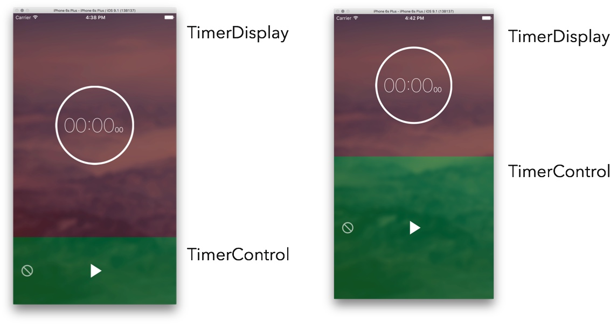

Again, we don't care about making our component reponsive for *every* possible sizes. We only need the component to work well for a limited range of rectangles that are similarly shaped:


### Exercise: Timer Circle

+ Create the `TimerDisplay` component.

The JSX:

```html
<View style={styles.container}>
  <View style={styles.timerCircle}>
  </View>
</View>
```

The circle's style:

```js
width: 200,
height: 200,
borderColor: '#fff',
borderWidth: 5,
borderRadius: 100,
```

Your result:

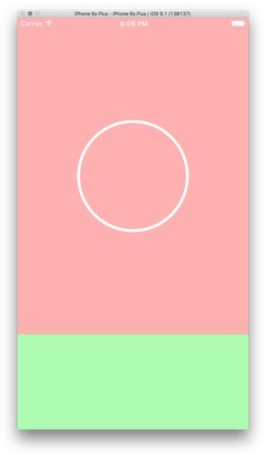

# The Text Component

Let's meet the native [Text](https://facebook.github.io/react-native/docs/text.html) component, which is the `span` of ReactNative. It's used to show text content, and it grows automatically to wrap the amount of text.

There are two big differences from HTML.

1. You can't have text without the `Text` component.

  ```html
  // Doesn't work!
  <View>
    Some Text Content
  </View>
  ```
2. View doesn't support [typography properties](https://facebook.github.io/react-native/docs/text.html#style). You can't set a container's typography.

  ```html
  // Doesn't work!
  <View style={{color: "#fff"}}>
    <Text>Some Text Content</Text>

    <View>
      <Text>Some Ohter Text Content</Text>
    <View>
  </View>
  ```

  Instead, you must set the style of each Text component individually:

  ```html
  <View>
    <Text style={{color: "#fff"}}>Some Text Content</Text>

    <View>
      <Text style={{color: "#fff"}}>Some Ohter Text Content</Text>
    <View>
  </View>
  ```

### Exercise: Timer Text Display


The JSX:

```js
<View style={styles.container}>
  <View style={styles.timerCircle}>
    <View style={styles.displayContainer}>
      <Text style={styles.mainLabel}>
        {minutes}:{seconds}
      </Text>

      <Text style={styles.subLabel}>
        {hundredth}
      </Text>

    </View>
  </View>
</View>
```

Your result:


Hint: You might need to use margin to tweak the labels so the text line up.

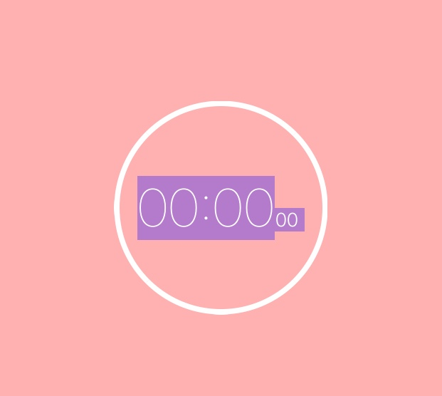

# Static Images

Next, we'll see how to use images as buttons. The assets we'll use:

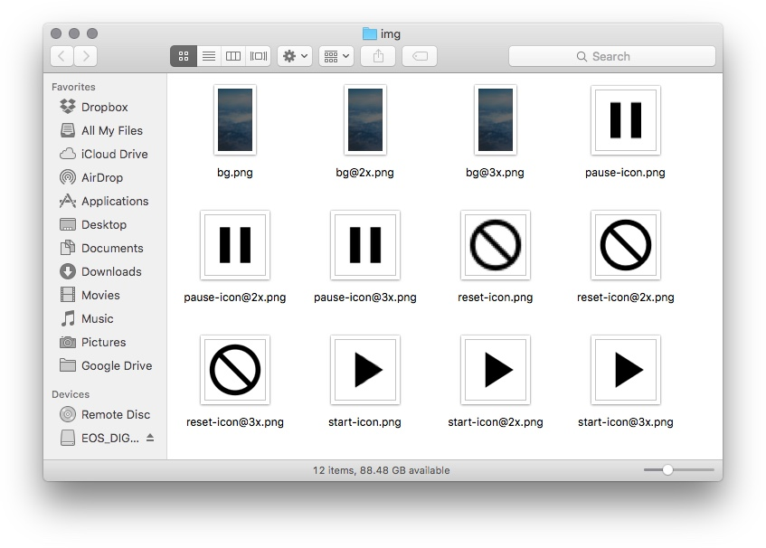

Clone the assets into your project:

```sh
git clone https://github.com/hayeah/react-native-Timer-assets.git img
```

Two things to notice.

1. Each asset has 3 different sizes, suitable for different screen pixel densities.

  ```
  pause-icon.png // older iPhones
  pause-icon@2x.png // iPhone4/iPhone5
  pause-icon@3x.png // iPhone6 Plus
  ```

  Although this naming scheme comes from iOS/Xcode, ReactNative uses it for Android as well. You don't have to create a separate set of images for Android.

2. All the icons are black with transparent background. We can adjust the actual color of these icons by changing the `tintColor` property.

See [React Native Images](https://facebook.github.io/react-native/docs/images.html).

### Exercise: Start Button

+ Create the `Controls` component.
+ Add the start icon inside the `Controls` component.
+ Change `tintColor` of the image so the icon becomes white.

You can use `require` to load the image as though it is a JavaScript module:

```js
<Image source={require("./img/start-icon.png")}/>
```

Instead of hardwiring the asset paths, it's better to create an dictionary of all the image assets:

```
// theme.js
export const icons = {
  background: require("./img/bg.png"),
  pause: require("./img/pause-icon.png"),
  reset: require("./img/reset-icon.png"),
  start: require("./img/start-icon.png"),
}
```

We can then write the Image tag this way:

```
import { icons } from "./theme";

<Image source={icons.start}/>
```

Your result:

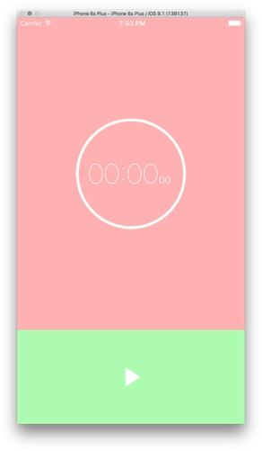

### Exercise: Reset Button

Your result:

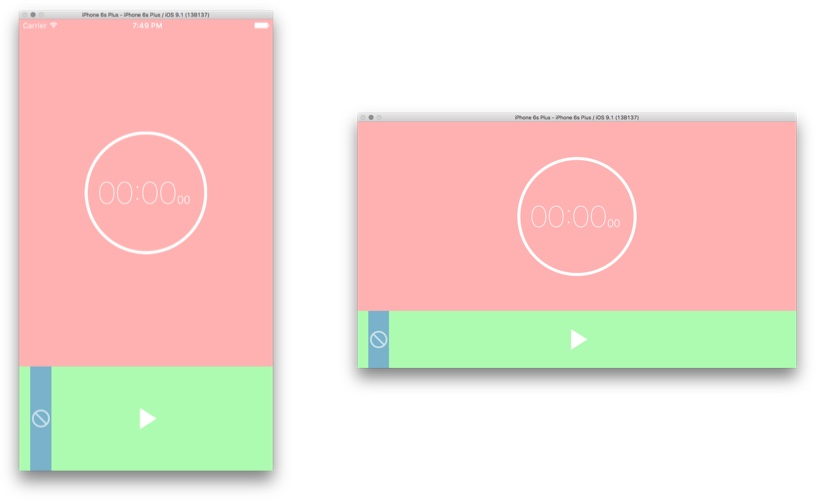

### Exercise: Test Android

Now it's a good time to check that our app works on Android as well.

Build and deploy the Android App:

```sh
react-native run-android
```

Your result:

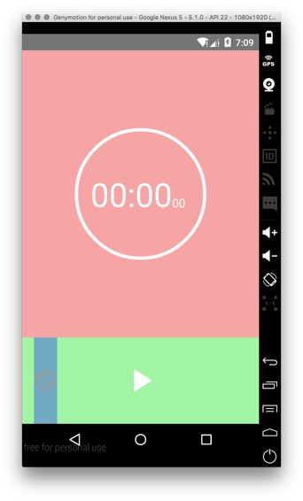

The timer display looks a little different because Android has a different system font..

# Background Image

We'll need to resize the background image to fill the entire screen. The [resizeMode](https://facebook.github.io/react-native/docs/image.html#style) property allows us to specify how the image should be resized. Let's look at the documentation:

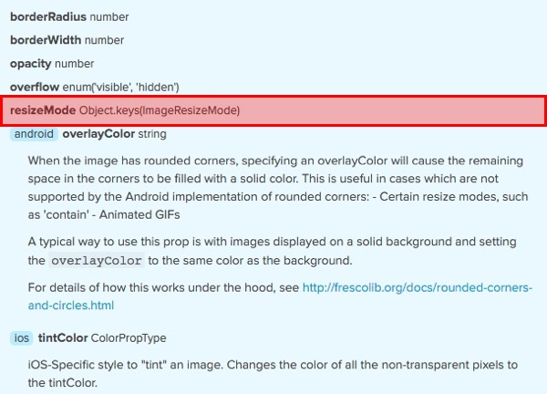

Huh? What is `Object.keys(ImageResizeMode)`? If the documentation doesn't give you enough information, you'd have to dig into the code.

The source code naming convention is straight forward. The `Image` component's file name is either `Image.ios.js` or `Image.android.js`.

Let's search for it on GitHub (press T to start searching):

<video src="search-for-image.ios.js.mp4" controls="true"></video>

And here we have it: [Image.ios.js L106-L121](https://github.com/facebook/react-native/blob/4511993ffaf503b902fb9741c396eaa090a5662e/Libraries/Image/Image.ios.js#L106-L121)

### Exercise: Set Background Image

The default background color of a view is `#fff`, if you don't change the container to a transparent background, its background color could obscure the background image.

Your result:

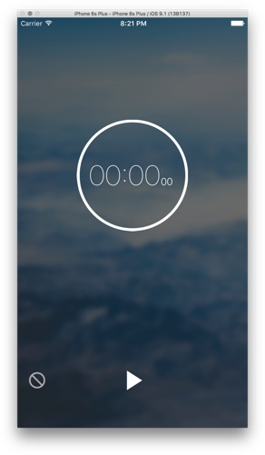

And if we rotate...

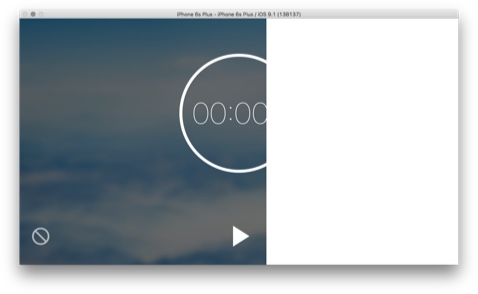

(╯°□°)╯︵ ┻━┻

# Bug Or Feature?

OK, it looks like that the background image doesn't automatically resize when we rotate. Whether this is a bug or a feature depends whether there's a [GitHub Issue for Image Resize](https://github.com/facebook/react-native/issues?utf8=%E2%9C%93&q=is%3Aissue+image+resize+).

Depending on what you see, you could:

1. Create an issue to report the bug, and see how the community responds.
2. Work around the problem.

In our case, we'll choose 2. We'll fix the problem by learning how to manually calculate simple layouts.

# Manual Layout

The [View onLayout](https://github.com/facebook/react-native/blob/4511993ffaf503b902fb9741c396eaa090a5662e/Libraries/Components/View/View.js#L204-L213) callback can give us the size and position of a `View` if its layout changes. Let's add an `onLayout` callback to the App container. Add to `App.js`:

```js
onLayout(e) {
  console.log("App rotated",e.nativeEvent.layout);
}
...

render() {
  <View onLayout={this.onLayout} style={styles.container}>
}
```

Try rotate (cmd-left or cmd-right) the screen, and you should see these logs in Xcode:

```
2016-01-28 21:14:29.710 [trace][tid:com.facebook.React.JavaScript] 'App rotated', { y: 0, x: 0, width: 736, height: 414 }
2016-01-28 21:14:30.995 [trace][tid:com.facebook.React.JavaScript] 'App rotated', { y: 0, x: 0, width: 414, height: 736 }
2016-01-28 21:14:32.312 [trace][tid:com.facebook.React.JavaScript] 'App rotated', { y: 0, x: 0, width: 736, height: 414 }
2016-01-28 21:14:33.318 [trace][tid:com.facebook.React.JavaScript] 'App rotated', { y: 0, x: 0, width: 414, height: 736 }
```
<video src="onLayout-events.mp4" controls="true"></video>

### Exercise: Use onLayout event to set background size.

+ Use `setState` to track App container's current width and height.
+ Merge style properties by using an array of style objects:

```js
<Image style={[
  styles.backgroundImage,
  {
    width: screenWidth,
    height: screenHeight
  }]}
  source={sources.background}/>
```

Your result:

<video src="result-background-rotate.mp4" controls="true"></video>

## MeasureLayoutContainer

It's often useful to know the dimensions of a View. Instead of hardwiring the onLayout event in the App component to detect layout changes, we could create `MeasureLayoutContainer` to do that.

The API:

```html
<MeasureLayoutContainer>
  {layout => {
    const {width,height} = layout;

    return (
      ...
    );
  }}
</MeasureLayoutContainer>
```

+ `this.props.children` is a render function.
+ MeasureLayoutContainer calls the render function once the layout is known.

### Exercise: Implement MeasureLayoutContainer

The MeasureLayoutContainer should be 100% of its parent.

```js
const styles = StyleSheet.create({
  container: {
    flex: 1,
    alignSelf: 'stretch',
    backgroundColor: 'transparent',
  },
});
```

# Touchable Components

The Touchable family of builtin components are like the `a` or `button` of HTML, but it is more sophisticated than 'click'. On the touch screen, what a "touch event" could mean is ambiguous.

+ Is it a tap?
+ Is it a swipe?
+ Is it a scroll?

The Touchable component needs to be able to reliably tell if a touch event is a tap, and not part of another gesture.

You can read about some of the subtlety of handling a tap in the [Touchable source code](https://github.com/facebook/react-native/blob/1bc03871f391d4df958dd8af97c6002cdef5f943/Libraries/Components/Touchable/Touchable.js#L247-L300).

An example button:

```html
<TouchableOpacity onPress={this.onPress}>
  <Text>Button</Text>
</TouchableOpacity>
```

What exactly is a `TouchableOpacity`? It turns out to be a component implemented entirely in JavaScript.

```html
// https://github.com/facebook/react-native/blob/1bc03871f391d4df958dd8af97c6002cdef5f943/Libraries/Components/Touchable/TouchableOpacity.js#L155-L169

<Animated.View
  accessible={true}
  accessibilityComponentType={this.props.accessibilityComponentType}
  accessibilityTraits={this.props.accessibilityTraits}
  style={[this.props.style, {opacity: this.state.anim}]}
  testID={this.props.testID}
  onLayout={this.props.onLayout}
  onStartShouldSetResponder={this.touchableHandleStartShouldSetResponder}
  onResponderTerminationRequest={this.touchableHandleResponderTerminationRequest}
  onResponderGrant={this.touchableHandleResponderGrant}
  onResponderMove={this.touchableHandleResponderMove}
  onResponderRelease={this.touchableHandleResponderRelease}
  onResponderTerminate={this.touchableHandleResponderTerminate}>
  {this.props.children}
</Animated.View>
```

It accepts a style object as property:

```
style={[this.props.style, {opacity: this.state.anim}]}
```

So you can style `TouchableOpacity` like an ordinary `View`:

```js
<TouchableOpacity
  style={{backgroundColor: 'red', flex: 1, ...}}
  onPress={this.onPress}>
  <Text>Button</Text>
</TouchableOpacity>
```

And because `TouchableOpacity` is itself a `View`, you can nest any view hierarchy within it:


```js
<TouchableOpacity
  style={{backgroundColor: 'red', flex: 1, ...}}
  onPress={this.onPress}>
  <View>
    <View>...</View>
    <Text>Button</Text>
  </View>
</TouchableOpacity>
```


## Making A View Touchable

You might start with a static view:

```js
<View style={style.hello}>
  <Text>Hello<Text>
</View>
```

When you want to turn the static view into a touchable view, don't use `TouchableOpacity` as a wrapper! This is bad:

```js
// Could break existing layout!
<TouchableOpacity>
  <View style={style.hello}>
    <Text>Hello<Text>
  </View>
</TouchableOpacity>
```

Remember, `TouchableOpacity` is a `View`, and using it as a wrapper introduces an extra container in the layout. Most of the time you can replace `View` with `TouchableOpacity`:

```js
// Good!
<TouchableOpacity style={style.hello}>
  <Text>Hello<Text>
</TouchableOpacity>
```

# Start Timing!

Let's get the Timer working. The timer itself is boring, so we've done it for you.

```js
var timer = new Timer(() => {
  // Get how much time has elapsed
  timer.duration(); // => { hundredth: 1, seconds: 2, minutes: 3 }
});

// Start timer
timer.start();

// Pause timer
timer.pause();

// Reset and pause timer
timer.reset();
```

Download [Timer.js](Timer.js).

You'll also need this helper function to format numbers for the timer display:

```js
function zeroPadding(n) {
  if (n == 0) {
    return "00";
  } else if(n < 10) {
    return "0" + n;
  } else {
    return n;
  }
}

// zeroPadding(0) => "00"
// zeroPadding(1) => "01"
// zeroPadding(10) => "10"
```

### Exercise: Integrate the Timer object

This is too simple to use Flux. Let's control the `Timer` with the `App` component. Add three methods:

```js
onTimerUpdate() {
}

toggleTimer() {
}

resetTimer() {
}
```

And pass these timer control methods to the `Controls` component as props:

```html
<Controls
  toggleTimer={this.toggleTimer}
  resetTimer={this.resetTimer}
  isRunning={isRunning}
  />
```

+ Display pause icon if timer is running.
+ Display play icon if timer is running.
+ Resetting the timer should also stop the timer.

Your result:

<video src="timer-running.mp4" controls="true"></video>

### Exercise: Tweak The Display

One last details to tweak. Your display may "vibrate" when the timer is running:

<video src="vibrating-timer-display.mp4" controls="true"></video>

This is because the iOS system font is not mono-spaced, different digits have different lengths. So 19 is slightly narrower than 29, changing the layout a tiny bit.


To fix this problem, give the subsecond label a somewhat wider width than it needs.

Your result:

<video src="vibrating-display-fixed.mp4" controls="true"></video>

### Exercise: Make sure that Android works

<video src="timer-running-android.mp4" controls="true"></video>

# Summary

+ Responve design for the mobile should optimize for the mobile experience.
+ `View` is sort of like `div`.
+ `Text` is sort of like `span`.
+ `Image` is sort of like `img`.
+ `TouchableOpacity` is sort of like `a`.
+ Use `onLayout` to detect changes to layout.
