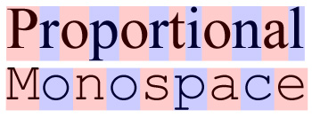

# Cross-Platform Timer App

In this lesson we are going to build a timer app, and make it run on both iOS and Android.

<video src="timer-running-android.mp4" controls="true"></video>

<Cn>

# 跨平台的计时器 App

在本课中，我们将构建一个计时器 app，让它可以同时在 iOS 和 Android 平台上运行。

<video src="timer-running-android.mp4" controls="true"></video>


</Cn>

By building this simple app, you will:

+ Learn the the fundamental building blocks of React Native: `View`, `Text`, and `Image`.
+ Learn the coding conventions of a React Native project.
+ Become familiar with the React Native development workflow.
+ Use flex to implement an adaptive layout that works for different screen sizes and orientations.

<Cn>

通过构建这个简单的 app， 你将：

+ 学习到 React Native 的基本建造模块：`View`，`Text` 和 `Image`；
+ 了解一个 React Native 项目的编码习惯；
+ 熟悉 React Native 的开发流程；
+ 使用 flex 来实现可以在不同的屏幕尺寸和方向上显示的自适应布局。

</Cn>

<Warning>
# React Native Android, The New IE6

Expect to encounter bugs.

If you run into weird problems, search [React Native Android Issues](https://github.com/facebook/react-native/labels/Android) to see if its a bug. In general, get iOS to work first, then pray that it works on Android.
</Warning>

<Cn>

<Warning>
# React Native Android，新的 IE6

请做好遇到 bug 的心理准备。

如果你遇到了奇怪的问题，到 [React Native Android Issues](https://github.com/facebook/react-native/labels/Android) 查找一下看它是不是一个 bug。一般来说，先让你的应用在 iOS 成功运行，然后祈祷同样的事情发生在 Android 上。
</Warning>

</Cn>

<Note>
# Write 1.5 Times, Maybe Run Everywhere

Code sharing is definitely a great advantage, but a less obvious advantage of React Native is how easy it is to build _platform-specific_ apps!

Although it's possible to share 100% of the code between your iOS and Android apps, making them exactly the same is usually not the best way to optimize user experience for iOS or Android fans.

The goal is not "write once, run everywhere", but to build apps that feel native to users regardless of their preferred platforms.
</Note>

<Cn>

<Note>
# 花 1.5 倍的开发时间，可能它就可以在所有平台运行

代码共享是 React Native 的一个非常大的优点。但另一个比较不明显的优点是构造 **特定平台的应用** 非常简单！

虽然理论上 iOS 和 Android 应用可以做到 100% 共享代码，但是对于你的 iOS 和 Android 用户来说，拥有一摸一样的两个 app 并不是优化用户体验的最好方式。

所以我们的目标不应该是“写一次，在所有平台运行”，而是构建出在不同平台上都感觉像是原生应用的应用。
</Note>

</Cn>

# Mobile-First Responsive Design

Transitioning from responsive design for the web to responsive design *for the mobile phone* takes a bit of mental adjustment.

Responsive design for the web typically optimizes for the desktop experience. While the page works for any screen size, the user experience can range from barely usable to hilarious:

<video src="web-first-responsive.mp4" controls="true"></video>

[@darylginn](https://twitter.com/darylginn)

<Cn>

# 移动为先的响应式设计

从网页端的响应式设计转换到移动端的响应式设计，会需要一点心理上的调整。

网页端的响应式设计通常是为了桌面体验而优化的。虽然页面可以在不同的屏幕尺寸上面显示，但用户体验的差别非常大：

<video src="web-first-responsive.mp4" controls="true"></video>

[@darylginn](https://twitter.com/darylginn)


</Cn>

On mobile, we only care about a limited range of rectangles that fit in the hand (10~15cm diagonally). To deliver the best mobile user experience, we should focus our design for this more limited canvas.

In fact, we often don't even care about supporting the landscape orientation. Most of the time your users hold the phone vertically, and that's the experience we should optimize for.

For example, Instagram uses square images, and Vine uses square videos. This design choice makes sense because a square fits in a vertical rectangle, yet still leaves plenty of space for other UI elements:


On mobile platforms, you'd often see apps that works great for the phone, but is crappy for tablets.

<Cn>

在移动端上，我们只需要关注有限的几种适合放在手上的屏幕尺寸（对角线为 10~15 厘米）。为了提供最佳的移动端用户体验，我们应该将心思集中在有限的这几个屏幕尺寸上。

实际上，我们通常不会关心要支持横版的屏幕。大部分情况下，用户都是竖着拿手机的，这才是我们最需要优化体验的地方。

例如，Instagram 使用的是方形的图片，而 Vine 使用的是方形的视频。这个设计选择的意义就在于，正方形可以放在竖直的长方形里，而且还留有足够的空间给其它的 UI 元素：


在移动平台上，你经常会看到一个应用在手机上体验很好，但在平板上就不给力。

</Cn>

# App Layout With Flex

Our layout divides the vertical space into two boxes:


In landscape mode:


The UI elements should be centered in these two boxes. We could also try a different layout:


<Cn>

# 用 flex 来设计应用布局

我们的布局将竖直的长方形空间分为两块：


横版模式：


UI 元素应该在这两块区域里居中。我们可以尝试一个不同的布局。


</Cn>

### Exercise: Implement The App Layout

We'll modify both `index.io.js` and `index.android.js` to import and use the same App component.

Create `App.js`:

<Cn>

### 练习：实现 App 部件的布局

我们会修改 `index.io.js` 和 `index.android.js` 来导入和使用同一个 App 部件。

创建 `App.js`：

</Cn>

```js
import {
  StyleSheet,
  View,
  Component,
} from "react-native";

export class App extends Component {
  render() {
    return (
      <View style={styles.container}>

        <View style={styles.timerDisplayLayout}>
        </View>

        <View style={styles.controlsLayout}>
        </View>
      </View>
    );
  },
};

const styles = StyleSheet.create({
  container: {
    flex: 1,
    alignSelf: 'stretch',
  },

  timerDisplayLayout: {
    ???
    backgroundColor: 'rgba(255,0,0,0.3)',
  },

  controlsLayout: {
    ???
    backgroundColor: 'rgba(0,255,0,0.3)',
  },
});
```

<Cn>

```js
import {
  StyleSheet,
  View,
  Component,
} from "react-native";

export class App extends Component {
  render() {
    return (
      <View style={styles.container}>

        <View style={styles.timerDisplayLayout}>
        </View>

        <View style={styles.controlsLayout}>
        </View>
      </View>
    );
  },
};

const styles = StyleSheet.create({
  container: {
    flex: 1,
    alignSelf: 'stretch',
  },

  timerDisplayLayout: {
    ???
    backgroundColor: 'rgba(255,0,0,0.3)',
  },

  controlsLayout: {
    ???
    backgroundColor: 'rgba(0,255,0,0.3)',
  },
});
```

</Cn>

+ The extension must be `.js`, not `.jsx`.
  + See: [Issue #2303](https://github.com/facebook/react-native/issues/2303)

To make a container 100%, use the following two flexbox styles together:

```css
/* Similar to width: 100%; height: 100% */
container: {
  flex: 1,
  alignSelf: 'stretch',
}
```

<Cn>

+ 文件扩展名必须是 `.js` 而不是 `.jsx`；
  + 详看：[Issue #2303](https://github.com/facebook/react-native/issues/2303)

要让一个容器占用 100% 的空间，你可以将下面两条 flexbox 语句组合使用：

```css
/* Similar to width: 100%; height: 100% */
container: {
  flex: 1,
  alignSelf: 'stretch',
}
```

</Cn>

This is a layout trick we'll use a lot. It doesn't matter whether the `flex-direction` of the parent container is `row` or `column`, the container will be 100%.

Test different orientations by [rotating the iPhone emulator](http://stackoverflow.com/questions/9071316/iphone-simulator-screen-rotation) using `cmd-left-arrow` or `cmd-right-arrow`.

Your result:


<Cn>

这是我们用的很多的一个布局的技巧。无论父容器的 `flex-direction` 是 `row` 还是 `column`，这个元素都会变成父容器的 100% 大小。

使用 `cmd-left-arrow` 或者 `cmd-right-arrow` 来 [旋转 iPhone 模拟器](http://stackoverflow.com/questions/9071316/iphone-simulator-screen-rotation)，测试不同的屏幕方向。

你的结果应该像这样：


</Cn>

## The View Component

The `View` component like a `div`. There are no other semantic tags like p, section, table... so just use `View` everywhere.

The [Default CSS Styles](https://github.com/facebook/css-layout#default-values) for `View` is different from browser defaults:

```css
View {
  box-sizing: border-box;
  position: relative;

  display: flex;
  flex-direction: column;
  align-items: stretch;

  flex-shrink: 0;
  align-content: flex-start;

  border: 0 solid black;
  margin: 0;
  padding: 0;
}
```

<Cn>

## View 部件

`View` 部件就像是 `div`。因为没有其它的像 `p`，`section` 和 `table` 这样的语义标签，所以只要全都用 `View` 就好了。

`View` 的 [默认 CSS Styles](https://github.com/facebook/css-layout#default-values) 跟浏览器端的有些不同：

```css
View {
  box-sizing: border-box;
  position: relative;

  display: flex;
  flex-direction: column;
  align-items: stretch;

  flex-shrink: 0;
  align-content: flex-start;

  border: 0 solid black;
  margin: 0;
  padding: 0;
}
```

</Cn>

See documentation:

+ [React Native View](https://facebook.github.io/react-native/docs/view.html#style)
+ [Flex Box Properties](https://facebook.github.io/react-native/docs/flexbox.html#proptypes)

<Cn>

详看文档：

+ [React Native View](https://facebook.github.io/react-native/docs/view.html#style)
+ [Flex Box Properties](https://facebook.github.io/react-native/docs/flexbox.html#proptypes)

</Cn>

# Responsive UI Components

Now we have the basic app layout, let's create UI components. We'll use this boilerplate template:

```js
import React from 'react';

import {
  StyleSheet,
  View,
  Component,
} from 'react-native';

export class Foo extends Component {
  render() {
    return (
      <View style={styles.container}>
      </View>
    );
  },
};

const styles = StyleSheet.create({
  container: {
    flex: 1,
    alignSelf: 'stretch',
  },
});
```

<Cn>

# 响应式的 UI 部件

我们已经有了一个基本的 app 布局，现在让我们来创建 UI 部件。我们可以使用下面这个模版：

```js
import React from 'react';

import {
  StyleSheet,
  View,
  Component,
} from 'react-native';

export class Foo extends Component {
  render() {
    return (
      <View style={styles.container}>
      </View>
    );
  },
};

const styles = StyleSheet.create({
  container: {
    flex: 1,
    alignSelf: 'stretch',
  },
});
```

</Cn>

[Download FooComponent.js](FooComponent.js)

Our goal is to make our components "responsive", so that it can arrange its content reasonably well when given different amount of space by the layout.

Notice that the component is 100% of the size of its parent:

```js
/* Similar to width: 100%; height: 100% */
container: {
  flex: 1,
  alignSelf: 'stretch',
}
```

<Cn>

[下载 FooComponent.js](FooComponent.js)

我们的目标是让部件变成响应式的，这样它们就可以合理地根据布局给予的不同空间来安排自己的内容。

要注意部件的尺寸是它的父容器的 100%：

```js
/* Similar to width: 100%; height: 100% */
container: {
  flex: 1,
  alignSelf: 'stretch',
}
```

</Cn>

This makes it easy to plug the components into a layout:

```xml
<View style={styles.container}>

  <View style={styles.timerDisplayLayout}>
    <TimerDisplay/>
  </View>

  <View style={styles.controlsLayout}>
    <TimerControls/>
  </View>
</View>
```

<Cn>

将一个部件嵌入到一个布局中是很简单的：

```xml
<View style={styles.container}>

  <View style={styles.timerDisplayLayout}>
    <TimerDisplay/>
  </View>

  <View style={styles.controlsLayout}>
    <TimerControls/>
  </View>
</View>
```

</Cn>

If we decide to change the layout, the content inside a responsive component should adjust automatically. :


Again, we don't care about making our component reponsive for *every* possible sizes. We only need the component to work well for a limited range of rectangles that are similarly shaped:


<Cn>

如果我们决定改变布局，那么一个响应式部件中的内容应该也会自动调整：


需要再次强调的是，我们不需要让部件适应*所有*可能的屏幕尺寸。我们只需要让部件可以在有限的具有相似尺寸的屏幕上可以很好地显示：


</Cn>

### Exercise: Timer Circle

+ Create the `TimerDisplay` component.

The JSX:

```html
<View style={styles.container}>
  <View style={styles.timerCircle}>
  </View>
</View>
```

<Cn>

### 练习：计时器的圆盘

+ 创建 `TimerDisplay` 部件。

JSX：

```html
<View style={styles.container}>
  <View style={styles.timerCircle}>
  </View>
</View>
```

</Cn>

The circle's style:

```js
width: 200,
height: 200,
borderColor: '#fff',
borderWidth: 5,
borderRadius: 100,
```

Your result:


<Cn>

圆盘的样式：

```js
width: 200,
height: 200,
borderColor: '#fff',
borderWidth: 5,
borderRadius: 100,
```

效果应该像这样：


</Cn>

# The Text Component

Let's meet the native [Text](https://facebook.github.io/react-native/docs/text.html) component, which is the `span` of React Native. It's used to show text content, and it grows automatically to wrap the amount of text.

There are two big differences from HTML.

<Cn>

# Text 部件

让我们看一下原生的 [Text](https://facebook.github.io/react-native/docs/text.html) 部件，它就是 React Native 的 `span`。它是用来显示文本内容的，而且它会自动扩展来包裹文本内容。

这跟 HTML 有两个很大的不同。

</Cn>

1. You can't have text without the `Text` component.

  ```html
  // Doesn't work!
  <View>
    Some Text Content
  </View>
  ```
2. View doesn't support [typography properties](https://facebook.github.io/react-native/docs/text.html#style). You can't set a container's typography.

  ```html
  // Doesn't work!
  <View style={{color: "#fff"}}>
    <Text>Some Text Content</Text>

    <View>
      <Text>Some Ohter Text Content</Text>
    <View>
  </View>
  ```

  Instead, you must set the style of each Text component individually:

  ```html
  <View>
    <Text style={{color: "#fff"}}>Some Text Content</Text>

    <View>
      <Text style={{color: "#fff"}}>Some Ohter Text Content</Text>
    <View>
  </View>
  ```

<Cn>

1. 你不能在没有 `Text` 部件的情况下显示文本。

  ```html
  // Doesn't work!
  <View>
    Some Text Content
  </View>
  ```
2. 视图不支持 [字体属性](https://facebook.github.io/react-native/docs/text.html#style)，所以你不能对容器设置字体。

  ```html
  // Doesn't work!
  <View style={{color: "#fff"}}>
    <Text>Some Text Content</Text>

    <View>
      <Text>Some Ohter Text Content</Text>
    <View>
  </View>
  ```

  但是，你可以分别设置每一个 `Text` 部件的样式：

  ```html
  <View>
    <Text style={{color: "#fff"}}>Some Text Content</Text>

    <View>
      <Text style={{color: "#fff"}}>Some Ohter Text Content</Text>
    <View>
  </View>
  ```


</Cn>

### Exercise: Timer Text Display

The JSX:

```js
<View style={styles.container}>
  <View style={styles.timerCircle}>
    <View style={styles.displayContainer}>
      <Text style={styles.mainLabel}>
        {minutes}:{seconds}
      </Text>

      <Text style={styles.subLabel}>
        {hundredth}
      </Text>

    </View>
  </View>
</View>
```

Your result:


Hint: You might need to use margin to tweak the labels so the text line up.


<Cn>

### 练习：计时器的文本显示

JSX：

```js
<View style={styles.container}>
  <View style={styles.timerCircle}>
    <View style={styles.displayContainer}>
      <Text style={styles.mainLabel}>
        {minutes}:{seconds}
      </Text>

      <Text style={styles.subLabel}>
        {hundredth}
      </Text>

    </View>
  </View>
</View>
```

效果应该像这样：


提示：你可能需要用 `margin` 来微调，这样才可以让文本对齐。


</Cn>

# Static Images

Next, we'll see how to use images as buttons. The assets we'll use:


Clone the assets into your project:

```sh
git clone https://github.com/hayeah/react-native-Timer-assets.git img
```

<Cn>

# 静态图片

接下来，我们会看看怎么使用图片来作为按钮。我们将要用到的素材：


将素材克隆到你的项目里：

```sh
git clone https://github.com/hayeah/react-native-Timer-assets.git img
```

</Cn>

Two things to notice.

1. Each asset has 3 different sizes, suitable for different screen pixel densities.

  ```
  pause-icon.png // older iPhones
  pause-icon@2x.png // iPhone4/iPhone5
  pause-icon@3x.png // iPhone6 Plus
  ```

  Although this naming scheme comes from iOS/Xcode, React Native uses it for Android as well. You don't have to create a separate set of images for Android.

2. All the icons are black with transparent background. We can adjust the actual color of these icons by changing the `tintColor` property.

See [React Native Images](https://facebook.github.io/react-native/docs/images.html).

<Cn>

有两个需要注意的地方。

1. 每一个素材都有三种不同的尺寸，适合不同的屏幕分辨率。

  ```
  pause-icon.png // older iPhones
  pause-icon@2x.png // iPhone4/iPhone5
  pause-icon@3x.png // iPhone6 Plus
  ```

  虽然这个命名规则来自于 iOS/Xcode，但是 React Native 也把它用在 Android 上。你不需要为 Android 创建另一套图片素材。

2. 所有的图标都是黑色透明底的。我们可以通过改变 `tintColor` 属性来调整这些图标的实际颜色。

详看 [React Native Images](https://facebook.github.io/react-native/docs/images.html)。

</Cn>

### Exercise: Start Button

+ Create the `Controls` component.
+ Add the start icon inside the `Controls` component.
+ Change `tintColor` of the image so the icon becomes white.

You can use `require` to load the image as though it is a JavaScript module:

```js
<Image source={require("./img/start-icon.png")}/>
```

<Cn>

### 练习：Start 按钮

+ 创建 `Controls` 部件；
+ 将 start 图标添加到 `Controls` 部件里；
+ 改变图片的 `tintColor` 让它变成白色。

你可以使用 `require` 来像加载一个 JavaScript 模块一样加载图片：

```js
<Image source={require("./img/start-icon.png")}/>
```

</Cn>

Instead of hardwiring the asset paths, it's better to create an dictionary of all the image assets:

```
// theme.js
export const icons = {
  background: require("./img/bg.png"),
  pause: require("./img/pause-icon.png"),
  reset: require("./img/reset-icon.png"),
  start: require("./img/start-icon.png"),
}
```

<Cn>

相比手写所有的素材路径，其实创建一个所有图片素材的字典会更好：

```
// theme.js
export const icons = {
  background: require("./img/bg.png"),
  pause: require("./img/pause-icon.png"),
  reset: require("./img/reset-icon.png"),
  start: require("./img/start-icon.png"),
}
```

</Cn>

We can then write the Image tag this way:

```
import { icons } from "./theme";

<Image source={icons.start}/>
```

Your result:


<Cn>

我们可以这样写 `Image` 标签：

```
import { icons } from "./theme";

<Image source={icons.start}/>
```

效果会像这样：


</Cn>

### Exercise: Reset Button

Your result:


<Cn>

### 练习：Reset 按钮

效果会像这样：


</Cn>

### Exercise: Test Android

Now it's a good time to check that our app works on Android as well.

Build and deploy the Android App:

```sh
react-native run-android
```

Your result:


The timer display looks a little different because Android has a different system font..

<Cn>

### 练习：测试 Android

现在，我们可以来测试一下我们的应用是不是在 Android 上也能很好地运行。

编译部署 Android app：

```sh
react-native run-android
```

效果会像这样：


计时器的文本显示会看起来有一些不一样，因为 Android 用了不一样的系统字体。

</Cn>

# Background Image

We'll need to resize the background image to fill the entire screen. The [resizeMode](https://facebook.github.io/react-native/docs/image.html#style) property allows us to specify how the image should be resized. Let's look at the documentation:


Huh? What is `Object.keys(ImageResizeMode)`? If the documentation doesn't give you enough information, you'd have to dig into the code.

The source code naming convention is straight forward. The `Image` component's file name is either `Image.ios.js` or `Image.android.js`.

<Cn>

# 背景图片

我们会需要调整背景图片来填满整个屏幕。[resizeMode](https://facebook.github.io/react-native/docs/image.html#style) 属性可以让我们指定图片要怎么样被 resize。让我们看一下文档：


哎？什么是 `Object.keys(ImageResizeMode)`？如果文档没有给你足够的信息，那么你就需要去看源代码了。

源代码的命名方式非常直白。`Image` 部件的文件名是 `Image.ios.js` 或者 `Image.android.js`。

</Cn>

Let's search for it on GitHub (press T to start searching):

<video src="search-for-image.ios.js.mp4" controls="true"></video>

And here we have it: [Image.ios.js L106-L121](https://github.com/facebook/react-native/blob/4511993ffaf503b902fb9741c396eaa090a5662e/Libraries/Image/Image.ios.js#L106-L121)

<Cn>

让我们在 Github 上搜一下（按 T 来开始搜索）：

<video src="search-for-image.ios.js.mp4" controls="true"></video>

找到了：[Image.ios.js L106-L121](https://github.com/facebook/react-native/blob/4511993ffaf503b902fb9741c396eaa090a5662e/Libraries/Image/Image.ios.js#L106-L121)


</Cn>

### Exercise: Set Background Image

The default background color of a view is `#fff`, if you don't change the container to a transparent background, its background color could obscure the background image.

Your result:


And if we rotate...


(╯°□°)╯︵ ┻━┻

<Cn>

### 练习：设置背景图片

一个视图的默认背景颜色是 `#fff`，如果你不把容器改成透明背景，那么它的背景色可能会模糊掉你的背景图片。

效果会像这样：


如果我们旋转一下的话。。。


(╯°□°)╯︵ ┻━┻


</Cn>

# Bug Or Feature?

OK, it looks like that the background image doesn't automatically resize when we rotate. Whether this is a bug or a feature depends whether there's a [GitHub Issue for Image Resize](https://github.com/facebook/react-native/issues?utf8=%E2%9C%93&q=is%3Aissue+image+resize+).

Depending on what you see, you could:

1. Create an issue to report the bug, and see how the community responds.
2. Work around the problem.

In our case, we'll choose 2. We'll fix the problem by learning how to manually calculate simple layouts.

<Cn>

# Bug 还是特性？

好了，看来背景图片在我们旋转时不会自动 resize。这到底是一个 bug 还是一个特性，这取决于 Github 上有没有这个 issue （[GitHub Issue for Image Resize](https://github.com/facebook/react-native/issues?utf8=%E2%9C%93&q=is%3Aissue+image+resize+)）。

根据你找到的信息，你可以：

1. 创建一个 issue 来报告这个 bug，然后看一下社区的反馈；
2. 想办法绕过这个问题。

在我们的例子里，我们选择了方案2。我们会通过学习手动计算简单的布局来解决这个问题。

</Cn>

# Manual Layout

The [View onLayout](https://github.com/facebook/react-native/blob/4511993ffaf503b902fb9741c396eaa090a5662e/Libraries/Components/View/View.js#L204-L213) callback can give us the size and position of a `View` if its layout changes. Let's add an `onLayout` callback to the App container. Add to `App.js`:

```js
onLayout(e) {
  console.log("App rotated",e.nativeEvent.layout);
}
...

render() {
  <View onLayout={this.onLayout} style={styles.container}>
}
```

Try rotate (cmd-left or cmd-right) the screen, and you should see these logs in Xcode:

```
2016-01-28 21:14:29.710 [trace][tid:com.facebook.React.JavaScript] 'App rotated', { y: 0, x: 0, width: 736, height: 414 }
2016-01-28 21:14:30.995 [trace][tid:com.facebook.React.JavaScript] 'App rotated', { y: 0, x: 0, width: 414, height: 736 }
2016-01-28 21:14:32.312 [trace][tid:com.facebook.React.JavaScript] 'App rotated', { y: 0, x: 0, width: 736, height: 414 }
2016-01-28 21:14:33.318 [trace][tid:com.facebook.React.JavaScript] 'App rotated', { y: 0, x: 0, width: 414, height: 736 }
```
<video src="onLayout-events.mp4" controls="true"></video>

<Cn>

# 手动布局

如果布局发生改变，视图的 [onLayout](https://github.com/facebook/react-native/blob/4511993ffaf503b902fb9741c396eaa090a5662e/Libraries/Components/View/View.js#L204-L213) 回调会告诉我们视图的尺寸和位置。把下面代码添加到 App 容器：

```js
onLayout(e) {
  console.log("App rotated",e.nativeEvent.layout);
}
...

render() {
  <View onLayout={this.onLayout} style={styles.container}>
}
```

尝试旋转屏幕（cmd-left 或者 cmd-right），你应该能在 Xcode 里面看到这些日志：

```
2016-01-28 21:14:29.710 [trace][tid:com.facebook.React.JavaScript] 'App rotated', { y: 0, x: 0, width: 736, height: 414 }
2016-01-28 21:14:30.995 [trace][tid:com.facebook.React.JavaScript] 'App rotated', { y: 0, x: 0, width: 414, height: 736 }
2016-01-28 21:14:32.312 [trace][tid:com.facebook.React.JavaScript] 'App rotated', { y: 0, x: 0, width: 736, height: 414 }
2016-01-28 21:14:33.318 [trace][tid:com.facebook.React.JavaScript] 'App rotated', { y: 0, x: 0, width: 414, height: 736 }
```
<video src="onLayout-events.mp4" controls="true"></video>

</Cn>

### Exercise: Use onLayout event to set background size.

+ Use `setState` to track App container's current width and height.
+ Merge style properties by using an array of style objects:

```js
<Image style={[
  styles.backgroundImage,
  {
    width: screenWidth,
    height: screenHeight
  }]}
  source={sources.background}/>
```

Your result:

<video src="result-background-rotate.mp4" controls="true"></video>

<Cn>

### 练习：用 onLayout 事件来设定背景尺寸

+ 使用 `setState` 来追踪 App 容器的即时宽度和高度；
+ 将 style 属性用 style 对象的数组组合到一起：

```js
<Image style={[
  styles.backgroundImage,
  {
    width: screenWidth,
    height: screenHeight
  }]}
  source={sources.background}/>
```

效果会像这样：

<video src="result-background-rotate.mp4" controls="true"></video>

</Cn>

## MeasureLayoutContainer

It's often useful to know the dimensions of a View. Instead of hardwiring the onLayout event in the App component to detect layout changes, we could create `MeasureLayoutContainer` to do that.

<Cn>

## MeasureLayoutContainer

知道一个视图的尺寸通常会很有用。与其在 App 部件里面手写 onLayout 事件，我们可以创建 `MeasureLayoutContainer` 来做这个事情。

</Cn>

The API:

```html
<MeasureLayoutContainer>
  {layout => {
    const {width,height} = layout;

    return (
      ...
    );
  }}
</MeasureLayoutContainer>
```

+ `this.props.children` is a render function.
+ MeasureLayoutContainer calls the render function once the layout is known.

<Cn>

API：

```html
<MeasureLayoutContainer>
  {layout => {
    const {width,height} = layout;

    return (
      ...
    );
  }}
</MeasureLayoutContainer>
```

+ `this.props.children` 是一个 render 函数；
+ `MeasureLayoutContainer` 会在知晓布局后调用 render 函数。

</Cn>

### Exercise: Implement MeasureLayoutContainer

The MeasureLayoutContainer should be 100% of its parent.

```js
const styles = StyleSheet.create({
  container: {
    flex: 1,
    alignSelf: 'stretch',
    backgroundColor: 'transparent',
  },
});
```

<Cn>

### 练习：实现 MeasureLayoutContainer

`MeasureLayoutContainer` 应该占据它父容器的 100%：

```js
const styles = StyleSheet.create({
  container: {
    flex: 1,
    alignSelf: 'stretch',
    backgroundColor: 'transparent',
  },
});
```

</Cn>

# Touchable Components

The Touchable family of builtin components are like the `a` or `button` of HTML, but it is more sophisticated than 'click'. On the touch screen, what a "touch event" could mean is ambiguous.

+ Is it a tap?
+ Is it a swipe?
+ Is it a scroll?

<Cn>

# 可触摸的部件

可触摸一族的内置组件有点像 HTML 里的 `a` 或者 `button`，不过要处理的交互比 `click` 更复杂。因为在触摸屏上，一个简单的触摸事件是会产生歧义的。它到底是：

+ 一个轻触？
+ 一个滑动？
+ 还是一个滚动？

</Cn>

The Touchable component needs to be able to reliably tell if a touch event is a tap, and not part of another gesture.

You can read about some of the subtlety of handling a tap in the [Touchable source code](https://github.com/facebook/react-native/blob/1bc03871f391d4df958dd8af97c6002cdef5f943/Libraries/Components/Touchable/Touchable.js#L247-L300).

An example button:

```html
<TouchableOpacity onPress={this.onPress}>
  <Text>Button</Text>
</TouchableOpacity>
```

<Cn>

一个可触摸的部件需要可靠地告诉我们一个触摸事件是一个轻触，而不是一个别的什么手势的一部分。

你可以读一下 [Touchable 源代码](https://github.com/facebook/react-native/blob/1bc03871f391d4df958dd8af97c6002cdef5f943/Libraries/Components/Touchable/Touchable.js#L247-L300) 来看一下其中处理触碰的精妙之处。

一个示例按钮：

```html
<TouchableOpacity onPress={this.onPress}>
  <Text>Button</Text>
</TouchableOpacity>
```

</Cn>

What exactly is a `TouchableOpacity`? It turns out to be a component implemented entirely in JavaScript.

```html
// https://github.com/facebook/react-native/blob/1bc03871f391d4df958dd8af97c6002cdef5f943/Libraries/Components/Touchable/TouchableOpacity.js#L155-L169

<Animated.View
  accessible={true}
  accessibilityComponentType={this.props.accessibilityComponentType}
  accessibilityTraits={this.props.accessibilityTraits}
  style={[this.props.style, {opacity: this.state.anim}]}
  testID={this.props.testID}
  onLayout={this.props.onLayout}
  onStartShouldSetResponder={this.touchableHandleStartShouldSetResponder}
  onResponderTerminationRequest={this.touchableHandleResponderTerminationRequest}
  onResponderGrant={this.touchableHandleResponderGrant}
  onResponderMove={this.touchableHandleResponderMove}
  onResponderRelease={this.touchableHandleResponderRelease}
  onResponderTerminate={this.touchableHandleResponderTerminate}>
  {this.props.children}
</Animated.View>
```

<Cn>

到底什么是 `TouchableOpacity`？我们会发现它其实是一个完全用 javascript 实现的部件。

```html
// https://github.com/facebook/react-native/blob/1bc03871f391d4df958dd8af97c6002cdef5f943/Libraries/Components/Touchable/TouchableOpacity.js#L155-L169

<Animated.View
  accessible={true}
  accessibilityComponentType={this.props.accessibilityComponentType}
  accessibilityTraits={this.props.accessibilityTraits}
  style={[this.props.style, {opacity: this.state.anim}]}
  testID={this.props.testID}
  onLayout={this.props.onLayout}
  onStartShouldSetResponder={this.touchableHandleStartShouldSetResponder}
  onResponderTerminationRequest={this.touchableHandleResponderTerminationRequest}
  onResponderGrant={this.touchableHandleResponderGrant}
  onResponderMove={this.touchableHandleResponderMove}
  onResponderRelease={this.touchableHandleResponderRelease}
  onResponderTerminate={this.touchableHandleResponderTerminate}>
  {this.props.children}
</Animated.View>
```

</Cn>

It accepts a style object as property:

```
style={[this.props.style, {opacity: this.state.anim}]}
```

<Cn>

它接受一个 style 对象作为属性：

```
style={[this.props.style, {opacity: this.state.anim}]}
```

</Cn>

So you can style `TouchableOpacity` like an ordinary `View`:

```js
<TouchableOpacity
  style={{backgroundColor: 'red', flex: 1, ...}}
  onPress={this.onPress}>
  <Text>Button</Text>
</TouchableOpacity>
```

<Cn>

所以你可以像对待一个普通 `View` 一样，给 `TouchableOpacity` 添加样式：

```js
<TouchableOpacity
  style={{backgroundColor: 'red', flex: 1, ...}}
  onPress={this.onPress}>
  <Text>Button</Text>
</TouchableOpacity>
```

</Cn>


And because `TouchableOpacity` is itself a `View`, you can nest any view hierarchy within it:


```js
<TouchableOpacity
  style={{backgroundColor: 'red', flex: 1, ...}}
  onPress={this.onPress}>
  <View>
    <View>...</View>
    <Text>Button</Text>
  </View>
</TouchableOpacity>
```

<Cn>

而且因为 `TouchableOpacity` 本身就是一个 `View`，你可以在其中嵌套任意的视图层级：


```js
<TouchableOpacity
  style={{backgroundColor: 'red', flex: 1, ...}}
  onPress={this.onPress}>
  <View>
    <View>...</View>
    <Text>Button</Text>
  </View>
</TouchableOpacity>
```

</Cn>


## Making A View Touchable

You might start with a static view:

```js
<View style={style.hello}>
  <Text>Hello<Text>
</View>
```

<Cn>

## 让一个视图变成可触摸的

你可以先添加一个静态视图：

```js
<View style={style.hello}>
  <Text>Hello<Text>
</View>
```

</Cn>

When you want to turn the static view into a touchable view, don't use `TouchableOpacity` as a wrapper! This is bad:

```js
// Could break existing layout!
<TouchableOpacity>
  <View style={style.hello}>
    <Text>Hello<Text>
  </View>
</TouchableOpacity>
```

<Cn>

当你想将一个静态视图转换成一个可触摸的视图时，不要用 `TouchableOpacity` 去封装！这样做非常不好：

```js
// Could break existing layout!
<TouchableOpacity>
  <View style={style.hello}>
    <Text>Hello<Text>
  </View>
</TouchableOpacity>
```

</Cn>

Remember, `TouchableOpacity` is a `View`, and using it as a wrapper introduces an extra container in the layout. Most of the time you can replace `View` with `TouchableOpacity`:

```js
// Good!
<TouchableOpacity style={style.hello}>
  <Text>Hello<Text>
</TouchableOpacity>
```

<Cn>

记住，`TouchableOpacity` 是一个 `View`，用它来封装会在布局中引入一个额外的容器。大多数情况下你可以用 `TouchableOpacity` 取代 `View`：

```js
// Good!
<TouchableOpacity style={style.hello}>
  <Text>Hello<Text>
</TouchableOpacity>
```

</Cn>

# Start Timing!

Let's get the Timer working. The timer itself is boring, so we've done it for you.

```js
var timer = new Timer(() => {
  // Get how much time has elapsed
  timer.duration(); // => { hundredth: 1, seconds: 2, minutes: 3 }
});

// Start timer
timer.start();

// Pause timer
timer.pause();

// Reset and pause timer
timer.reset();
```

<Cn>

# 开始计时！

让我们的计时器动起来！因为操作计时器的这段代码本身太无聊了，所以我们已经帮你写好了。

```js
var timer = new Timer(() => {
  // Get how much time has elapsed
  timer.duration(); // => { hundredth: 1, seconds: 2, minutes: 3 }
});

// Start timer
timer.start();

// Pause timer
timer.pause();

// Reset and pause timer
timer.reset();
```

</Cn>

Download [Timer.js](Timer.js).

You'll also need this helper function to format numbers for the timer display:

```js
function zeroPadding(n) {
  if (n == 0) {
    return "00";
  } else if(n < 10) {
    return "0" + n;
  } else {
    return n;
  }
}

// zeroPadding(0) => "00"
// zeroPadding(1) => "01"
// zeroPadding(10) => "10"
```

<Cn>

下载 [Timer.js](Timer.js)。

你还需要下面这个辅助函数来格式化计时器所显示的数字：

```js
function zeroPadding(n) {
  if (n == 0) {
    return "00";
  } else if(n < 10) {
    return "0" + n;
  } else {
    return n;
  }
}

// zeroPadding(0) => "00"
// zeroPadding(1) => "01"
// zeroPadding(10) => "10"
```

</Cn>

### Exercise: Integrate the Timer object

This is too simple to use Flux. Let's control the `Timer` with the `App` component. Add three methods:

```js
onTimerUpdate() {
}

toggleTimer() {
}

resetTimer() {
}
```

<Cn>

### 练习：整合 Timer 对象

这个例子如果要用 Flux 好像有点牛刀杀鸡了。让我们通过 `App` 部件来控制 `Timer`。添加下面三个方法：

```js
onTimerUpdate() {
}

toggleTimer() {
}

resetTimer() {
}
```


</Cn>

And pass these timer control methods to the `Controls` component as props:

```html
<Controls
  toggleTimer={this.toggleTimer}
  resetTimer={this.resetTimer}
  isRunning={isRunning}
  />
```

+ Display pause icon if timer is running.
+ Display play icon if timer is running.
+ Resetting the timer should also stop the timer.

Your result:

<video src="timer-running.mp4" controls="true"></video>

<Cn>

将这些计时器控制方法，作为属性，传递给 `Controls`部件：

```html
<Controls
  toggleTimer={this.toggleTimer}
  resetTimer={this.resetTimer}
  isRunning={isRunning}
  />
```

+ 如果计时器在运行，显示暂停图标；
+ 如果计时器不在运行，显示开始图标；
+ 重置计时器的同时也应该停止计时。

效果应该像这样：

<video src="timer-running.mp4" controls="true"></video>


</Cn>

### Exercise: Tweak The Display

One last details to tweak. Your display may "vibrate" when the timer is running:

<video src="vibrating-timer-display.mp4" controls="true"></video>

This is because the iOS system font is not mono-spaced, different digits have different lengths. So 19 is slightly narrower than 29, changing the layout a tiny bit.



To fix this problem, give the subsecond label a somewhat wider width than it needs.

Your result:

<video src="vibrating-display-fixed.mp4" controls="true"></video>

<Cn>

### 练习：微调计时器的显示

让我们来最后微调一个细节，让你的计时器在运行时可以震动：

<video src="vibrating-timer-display.mp4" controls="true"></video>

这是因为 iOS 的系统字体不是等宽字体，不同的数字有不同的宽度。所以 19 会比 29 要窄一些，让布局发生了一点改变。


要解决这个问题，我们要给小数点后的秒标签一个稍大一点的宽度。

效果应该像这样：

<video src="vibrating-display-fixed.mp4" controls="true"></video>

</Cn>

### Exercise: Make sure that Android works

<video src="timer-running-android.mp4" controls="true"></video>

# Summary

+ Responve design for the mobile should optimize for the mobile experience.
+ `View` is sort of like `div`.
+ `Text` is sort of like `span`.
+ `Image` is sort of like `img`.
+ `TouchableOpacity` is sort of like `a`.
+ Use `onLayout` to detect changes to layout.

<Cn>

### 练习：确保 Android 也没问题

<video src="timer-running-android.mp4" controls="true"></video>

# 总结

+ 移动端的响应式设计应该对移动端体验进行优化；
+ `View` 有点像 `div`；
+ `Text` 有点像 `span`；
+ `Image` 有点像 `img`；
+ `TouchableOpacity` 有点像 `a`；
+ 使用 `onLayout` 来探测布局的改变。

</Cn>
