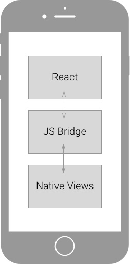
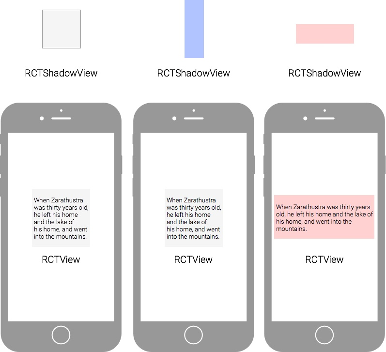
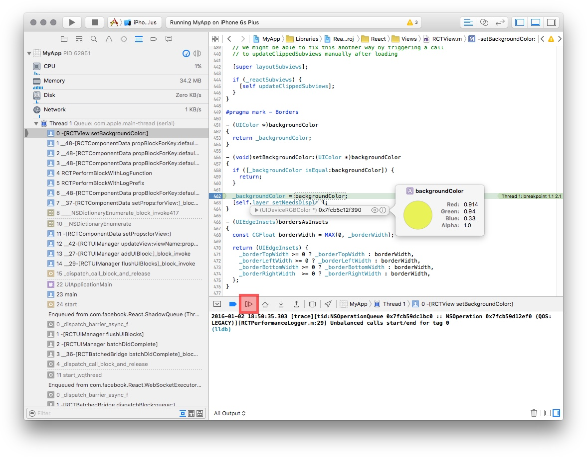
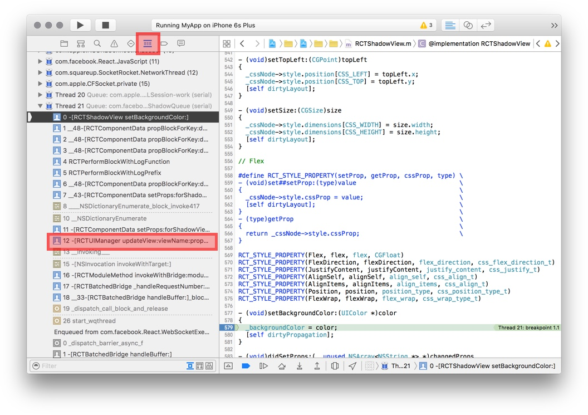
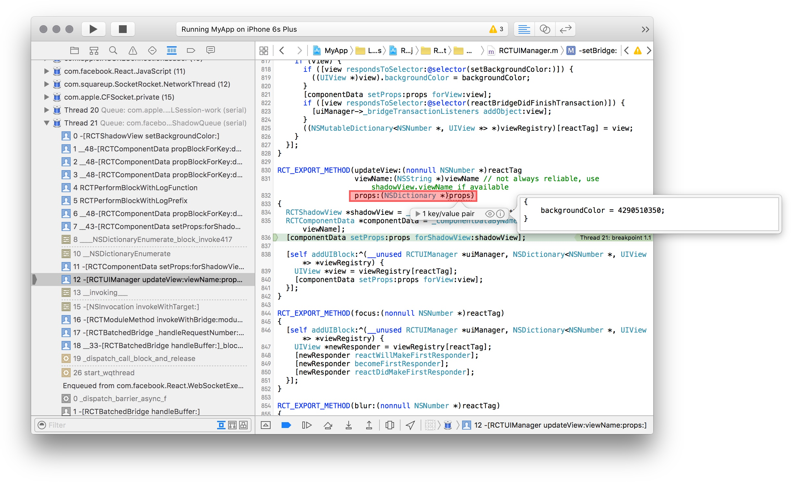
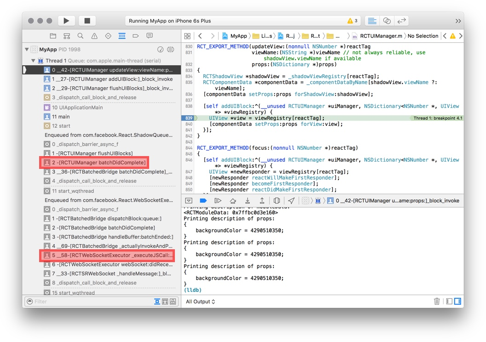
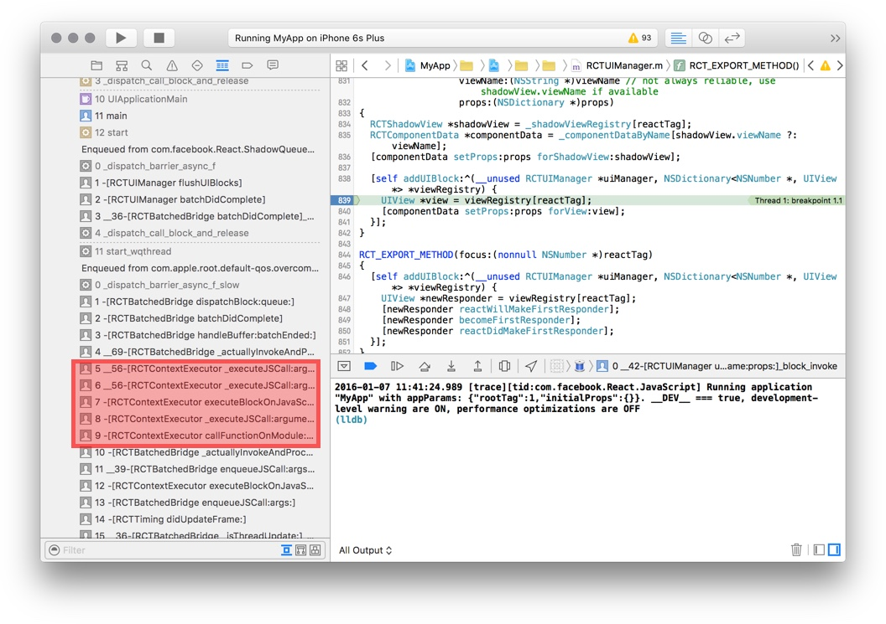
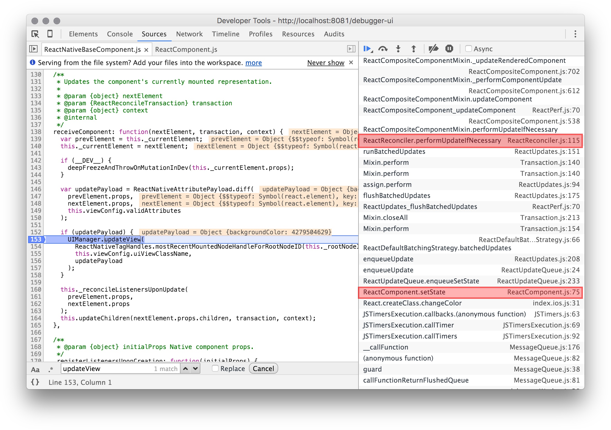

# The ReactNative Update Cycle

ReactNative really is native! There is no browser/webview and there is no DOM.

When you set the properties of a View component in React, the values go to the native side through a bridge, and update the associated native view.



<Cn>

# React Native 的更新循环

React Native 真的是原生的！它既没有用到浏览器或者 webview ，也没有用到 DOM。

当你在 React 里设置一个视图的属性时，它的数值会通过 React Native 的桥接器传递给原生的代码，最后更新相应的原生组件。


</Cn>

In order to keep the UI smooth, it's important to avoid doing too much work on the UI thread. Otherwise the UI could stutter. For this reason, the bridge processes UI changes asynchronously in its own thread to avoid slowing down the UI thread.

Careful coordination of the UI thread with worker threads is a difficult problem, but is essential for building a performant app. With ReactNative, the bridge does the hard work, and you get smooth UI updates for free!

The update cycle goes roughly as follows.

<Cn>

要让 UI 流畅，很重要的一点就是避免 UI 线程里过多的工作，否则 UI 就会卡顿。出于这个原因，桥接器会在自己的线程里异步地处理 UI 的变动，避免拖慢 UI 线程。

UI 线程和工作线程之间的协调是很困难的，不过这对于构建一个性能优秀的应用非常重要。有了 React Native 之后，桥接器会帮你处理这个困难的部分，而你就可以轻松获得流畅的 UI 体验了！

更新循环大致如下：

</Cn>

**JavaScript Side:**

1. Component setState triggers update.
2. React reconciliation to figure out what changed.
3. Sends updates to the Native side by calling `UIManager.updateView`.
  + React web would update the DOM instead.

**JS-Native Bridge:**

1. The bridge processes the native call asynchronously.
2. The bridge converts JSON to native data type.

<Cn>

**JavaScript 部分：**

1. 部件的 `setState` 触发更新；
2. React 协调所有更新，找出改动的部分；
3. 通过调用 `UIManager.updateView` 把更新发送到原生的部分。
  + 网页端的 React 在这里会更新 DOM。

**JS-原生 桥接器部分：**

1. 桥接器会异步地处理原生调用；
2. 桥接器会将 JSON 转换成原生的数据类型。

</Cn>

**Native Side:**

1. The shadow views are updated first, to avoiding changing the views.
2. At the end of an update cycle, just before the screen refreshes, the actual views are updated.

And after all this, the screen finally changes!

<Cn>

**原生的部分：**

1. 影子视图会先更新，避免改变真正的视图；
2. 在更新循环的最后，屏幕刷新之前，真正的视图会被更新。

在这些全部结束后，屏幕会最终发生改变！

</Cn>

### Why Shadow View?

Shadow views are used to avoid unnecessary calculation of layout.

Because updates are processed in batches by the bridge, in one update cycle there could be more than one updates to the same view. For example, in one update cycle, we could:

1. Set a textbox to be a vertical rectangle (blue background).
2. Set a textbox to be a horizontal rectangle (red background).

<Cn>

### 为什么要使用影子视图？

影子视图避免了布局的很多不必要的计算。

因为更新是通过桥接器分批处理的，在一个更新循环里，同一个视图可能有多个改动。比如在一个更新循环里，我们可以：

1. 将一个 textbox 设置成竖直的长方形（蓝色背景）；
2. 将一个 textbox 设置成水平的长方形（红色背景）；


</Cn>

Both of these updates changes the shadow view, which are simple data object holding the properties of the view. It is cheap to change them.

Only the last update changes the actual view view, and the text would reflow only once (not twice):



<Cn>

这两个更新都会对影子视图做出改动。但因为视图只是简单的保存视图属性的数据对象，所以改变它们的开销很低。

但是对于真正的视图，只有最终的更新会生效，文本只会被重排一次而不是两次：


</Cn>

In this example the updates are made to the same view. But layout may depends on many views, we'd want to wait until all the updates have been made to the shadow views, and calculate layout **once** at the very end.

This mechanism is similar to a DOM performance optimization technique to avoid redundant layout. See [Preventing 'layout thrashing'](http://wilsonpage.co.uk/preventing-layout-thrashing/).

<Cn>

在这个例子里，更新都是对于同一个视图的。但是整个布局可能有多个视图，所以我们会希望，等所有更新都在影子视图上生效后，在最后**一次**计算整个布局。

这种机制和一种 DOM 性能优化技巧类似。详看 [Preventing 'layout thrashing'](http://wilsonpage.co.uk/preventing-layout-thrashing/)。

</Cn>

The three native classes that are reponsible for this mechanism are:

1. `RCTView` - It is a subclass of the [iOS UIView](https://developer.apple.com/library/ios/documentation/WindowsViews/Conceptual/ViewPG_iPhoneOS/WindowsandViews/WindowsandViews.html). Changing its property changes the UI.
2. `RCTShadowView` - Every `RCTView` has a shadow view.
3. `RCTUIManager` - Manages the view hierarchy by adding and removing children. Calculates layout. Keeping shadow view hierarchy and the actual view hierarchy in sync. This is the UI engine of ReactNative.

<Cn>

这种机制所用到的三个原生的类是：

1. `RCTView` - 这是一个 [iOS UIView](https://developer.apple.com/library/ios/documentation/WindowsViews/Conceptual/ViewPG_iPhoneOS/WindowsandViews/WindowsandViews.html)的子类。改变它的属性就会改变 UI；
2. `RCTShadowView` - 每一个 `RCTView` 都有一个影子视图；
3. `RCTUIManager` - 通过添加和移除子部件来管理视图层级；计算布局；保证影子视图层级和真正的视图层级同步。这就是 React Native 的 UI 引擎。

</Cn>

# Tracing The Update Cycle

Now let's use the debugger to trace through an update cycle to see how a change you make eventually updates a native view.

Don't worry if how the code works seems a bit hazy. The goal is to make you comfortable with digging through native code.

We'll go through the update cycle backward, from the native view back to the JavaScript React component.

<Cn>

# 追踪更新循环

现在让我们用调试器来追踪整个更新循环，来看看一个改动如何最终更新一个原生视图。

如果代码让你赶到有些困惑，请不要担心。我们的目标是让你熟悉如何深入原生代码。

我们会逆向地经历整个更新循环，从原生的视图到 JavaScript 的 React 部件。

</Cn>

The simple demo we will trace changes the background to a random color every second:

<video src="demo-background-disco.mp4" controls='true'></video>

<Cn>

我们的这个简单 demo 会每一秒将背景改成一个随机颜色：

<video src="demo-background-disco.mp4" controls='true'></video>


</Cn>

Paste the following code into your project:

```js
function randomColor() {
  return '#'+Math.random().toString(16).substr(-6);
}

var MyApp = React.createClass({
  componentDidMount() {
    setInterval(this.changeColor,1000);
  },

  getInitialState() {
    return {
      backgroundColor: randomColor(),
    };
  },

  changeColor() {
    this.setState({backgroundColor: randomColor()});
  },

  render: function() {
    const {backgroundColor} = this.state;

    return (
      <View style={[styles.container,{backgroundColor}]}>
        <Text>Hello React</Text>
      </View>
    );
  }
});
```

<Cn>

将下面的代码粘贴到你的项目里：

```js
function randomColor() {
  return '#'+Math.random().toString(16).substr(-6);
}

var MyApp = React.createClass({
  componentDidMount() {
    setInterval(this.changeColor,1000);
  },

  getInitialState() {
    return {
      backgroundColor: randomColor(),
    };
  },

  changeColor() {
    this.setState({backgroundColor: randomColor()});
  },

  render: function() {
    const {backgroundColor} = this.state;

    return (
      <View style={[styles.container,{backgroundColor}]}>
        <Text>Hello React</Text>
      </View>
    );
  }
});
```

</Cn>

### Exercise: Tracing RCTView in Xcode

First we pause at RCTView, the end of the update cycle.

Set a breakpoint at `setBackgroundColor` method in `RCTView.m`. Use the `cmd-shift-o` keyboard shortcut.

<video src="finding-file-setting-breakpoing.mp4" controls="true"></video>

+ Hover over the `backgroundColor` variable, you should see an UIColor object.



Disable the breakpoint and continue execution.

<Cn>

### 练习：在 Xcode 里面追踪 RCTView：

第一步我们会在  RCTView 里面暂停，就在更新循环的最后。

在 `RCTView.m` 的 `setBackgroundColor` 方法里面设置一个断点。使用快捷方式 `cmd-shift-o`。

<video src="finding-file-setting-breakpoing.mp4" controls="true"></video>

+ 鼠标移动 `backgroundColor` 变量，你应该能看到一个 UIColor 对象。


禁用断点，然后继续执行。

</Cn>

### Exercise: Tracing RCTShadowView

+ Set a breakpoint at `-[RCTShadowView setBackgroundColor:(UIColor *)color]`. `
 + Hint: `cmd-shift-o`.

Since RCTShadowView is a simple data object, there is just a write to the property `_backgroundColor`. Nothing much to see.

The stacktrace, however, gives you a list of possibly interesting classes. It's useful to click through each method call in the stacktrace to discover important classes. Digging through the code this way is much more efficient than randomly opening source files.

<Cn>

### 练习：追踪 RCTShadowView

+ 在 `-[RCTShadowView setBackgroundColor:(UIColor *)color]` 处设置一个断点。
 + 提示：`cmd-shift-o`

因为 RCTShadowView 是一个简单的数据对象，只会有一个对于 `_backgroundColor` 属性的写入操作。并没有什么东西可以看。

不过堆栈追踪信息会让你发现一些有意思的类。点击堆栈追踪信息中的每一个方法调用，你就可以发现重要的类。用这样的方式去深挖代码，比随意打开源文件要高效的多。

</Cn>

At 12, we see RCTUIManager:



Question: Take a look at the method `dirtyPropogation`. `cmd-click` on the method name to jump to it. What does it do?

<Cn>

在 12 行，我们看到 `RCTUIManager`：


问题：看一下 `dirtyPropogation` 方法。按住 `cmd` 然后左键点击方法名，就会跳到对应的代码。它是做什么用的呢？

</Cn>

### Exercise: Tracing RCTUIManager

So we've seen RCTUIManager in the stacktrace  (this is how I discovered RCTUIManager). There is where the magic comes together.

<Cn>

### 练习：追踪 RCTUIManager

所以我们已经在堆栈追踪信息里面看到 RCTUIManager 了。见证奇迹的时刻吧！

</Cn>


The method we are interested in is:


```objc
RCT_EXPORT_METHOD(updateView:(nonnull NSNumber *)reactTag
                  viewName:(NSString *)viewName
                  props:(NSDictionary *)props)
```

The `RCT_EXPORT_METHOD` macro allows JavaScript to call this method through the bridge.

<Cn>

我们感兴趣的方法是：


```objc
RCT_EXPORT_METHOD(updateView:(nonnull NSNumber *)reactTag
                  viewName:(NSString *)viewName
                  props:(NSDictionary *)props)
```

`RCT_EXPORT_METHOD` 宏让 JavaScript 可以通过桥接器来调用这个方法。

</Cn>

1. Set a breakpoint. It's just a normal Objective-C method, so in Xcode you can still use `cmd-shift-o` to find it by name. See [Native Modules iOS](https://facebook.github.io/react-native/docs/native-modules-ios.html).
2. Inspect the `props` argument.



<Cn>

1. 设置一个断点。这只是一个普通的 Objective-C 方法，所以在 Xcode 里面你可以继续用 `cmd-shift-o` 来按名字查找。详看 [Native Modules iOS](https://facebook.github.io/react-native/docs/native-modules-ios.html)；
2. 检查 `props` 参数。


</Cn>

The code is as follows:

```objc
// Sets RCTShadowView
RCTShadowView *shadowView = _shadowViewRegistry[reactTag];
RCTComponentData *componentData = _componentDataByName[shadowView.viewName ?: viewName];
[componentData setProps:props forShadowView:shadowView];

[self addUIBlock:^(__unused RCTUIManager *uiManager, NSDictionary<NSNumber *, UIView *> *viewRegistry) {
  // Sets RCTView. Later.
  UIView *view = viewRegistry[reactTag];
  [componentData setProps:props forView:view];
}];
```

<Cn>

代码会像这样：

```objc
// Sets RCTShadowView
RCTShadowView *shadowView = _shadowViewRegistry[reactTag];
RCTComponentData *componentData = _componentDataByName[shadowView.viewName ?: viewName];
[componentData setProps:props forShadowView:shadowView];

[self addUIBlock:^(__unused RCTUIManager *uiManager, NSDictionary<NSNumber *, UIView *> *viewRegistry) {
  // Sets RCTView. Later.
  UIView *view = viewRegistry[reactTag];
  [componentData setProps:props forView:view];
}];
```

</Cn>

If ObjectiveC looks like gibberish to you... here's pseudo code in JS:

```
/**
  @param reactTag (number) Each React component has a unique ID.
  @param viewName (string) The name of a component. e.g. "ScrollView".
  @param props (JSON) Properties to set.
*/
function updateview(reactTag,viewName,props) {
  // This object converts JSON to native types. One per component class.
  let componentData = this.dataConverterForComponent(viewName);

  let shadowView = this.findShadowView(reactTag);
  componentData.setProps(props,shadowView);

  this.addUIBlock(() => {
    let view = this.findNativeView(reactTag);
    componentData.setProps(props,view);
  });
}
```

So this method updates the shadow view, then adds a callback to update the native view some time later.

<Cn>

如果 Objective-C 对你来说就像天书一样晦涩，那么你可以看看下面这段用 JS 写的伪代码：

```
/**
  @param reactTag (number) Each React component has a unique ID.
  @param viewName (string) The name of a component. e.g. "ScrollView".
  @param props (JSON) Properties to set.
*/
function updateview(reactTag,viewName,props) {
  // This object converts JSON to native types. One per component class.
  let componentData = this.dataConverterForComponent(viewName);

  let shadowView = this.findShadowView(reactTag);
  componentData.setProps(props,shadowView);

  this.addUIBlock(() => {
    let view = this.findNativeView(reactTag);
    componentData.setProps(props,view);
  });
}
```

所以这个方法会更新影子视图，然后添加一个回调函数，这个回调函数会在之后更新原生视图。

</Cn>

### Exercise: Tracing JS-Native Bridge

Let's see when exactly the addUIBlock callback gets called.

+ Set a breakpoint inside the UI block.

<Cn>

### 练习：追踪 JS-原生 桥接器

让我们看一下 `addUIBlock` 回调是怎么样被调用的。

+ 在 UI 代码里面设置一个断点

</Cn>

You should see:



At the end of the update cycle, `batchDidComplete` is called:


```
- (void)batchDidComplete
{
  // Set up next layout animation
  ...
  // Perform layout
  ...
  // Clear layout animation
  ...
  // Update native views
  [self flushUIBlocks];
}
```

<Cn>

你应该能看到：


在更新循环的最后，`batchDidComplete` 被调用：


```
- (void)batchDidComplete
{
  // 设置下一个布局动效
  ...
  // 应用布局
  ...
  // 清除布局动效
  ...
  // 更新原生视图
  [self flushUIBlocks];
}
```


</Cn>

Further up the stack trace, we see the JS call!

```
[RCTWebSocketExecutor _executeJSCall:
        (NSString *) method
        arguments:(NSArray *) arguments
        callback:(RCTJavaScriptCallback) onComplete]
```

WebSocket? That's strange.

<Cn>

在堆栈追踪信息的更深处，我们看到了 JS 调用！

```
[RCTWebSocketExecutor _executeJSCall:
        (NSString *) method
        arguments:(NSArray *) arguments
        callback:(RCTJavaScriptCallback) onComplete]
```

WebSocket？这还真是奇怪。

</Cn>

Normally JavaScript runs inside the app. Because we've opened the debugger, the JavaScript actually runs in the browser, communicating with the native side through a web socket.

With the JavaScript debugger disabled, you should see RCTContextExecutor instead. This uses the native JavaScript engine.



Pretty cool right?

<Cn>

通常 JavaScript 会在应用内运行。因为我们打开了调试器，所以 Javascript 实际上运行在浏览器中，用 websocket 来跟原生的部分通信。

一旦禁用了 JavaScript 调试器，你应该能看到 RCTContextExecutor 而不是 websocket。这时会使用原生的 JavaScript 引擎。


很酷吧？

</Cn>

### Exercise: Search Code With Ack

Another useful trick to find interesting classes is to use the `ack` command to search through the code.

Reading [Native Modules iOS](https://facebook.github.io/react-native/docs/native-modules-ios.html), we know that the JavaScript side calls RCTUIManager like this:

```js
UIManager.updateView(...)
```

<Cn>

### 练习：用 Ack 来查找代码

要找到有意思的类，还有很有用的技巧，就是通过使用 `ack` 命令来查找代码。

读一下 [Native Modules iOS](https://facebook.github.io/react-native/docs/native-modules-ios.html)，我们可以知道 JavaScript 端是像这样调用 `RCTUIManager` 的：

```js
UIManager.updateView(...)
```

</Cn>

Knowing what to search for is the hard part.

+ Use `ack` to find everywhere the method call appears. It may take ~10 seconds to finish.

```
$ ack 'UIManager\.updateView' node_modules/react-native
node_modules/react-native/Libraries/ReactIOS/NativeMethodsMixin.js
123:    UIManager.updateView(

node_modules/react-native/Libraries/ReactNative/ReactNativeBaseComponent.js
153:      UIManager.updateView(

node_modules/react-native/Libraries/ReactNative/ReactNativeTextComponent.js
60:        UIManager.updateView(

node_modules/react-native/Libraries/ReactNative/UIManagerStatTracker.js
41:    var updateViewOrig = UIManager.updateView;
42:    UIManager.updateView = function(tag, className, props) {
```

<Cn>

知道*搜索什么*才是最难的部分。

+ 使用 `ack` 来查找所有该方法被调用的地方。这大概要花大约10秒。

```
$ ack 'UIManager\.updateView' node_modules/react-native
node_modules/react-native/Libraries/ReactIOS/NativeMethodsMixin.js
123:    UIManager.updateView(

node_modules/react-native/Libraries/ReactNative/ReactNativeBaseComponent.js
153:      UIManager.updateView(

node_modules/react-native/Libraries/ReactNative/ReactNativeTextComponent.js
60:        UIManager.updateView(

node_modules/react-native/Libraries/ReactNative/UIManagerStatTracker.js
41:    var updateViewOrig = UIManager.updateView;
42:    UIManager.updateView = function(tag, className, props) {
```

</Cn>

At this point, you'd simply look at each one of these files. It turns out that `ReactNativeBaseComponent` is the one we are interested in.

<video src="ReactNativeBaseComponent-breakpoint.mp4" controls="true"></video>

You can see that the `updatePayload` variable is the `props` argument being sent to RCTUIManager.

<Cn>

现在，你只需要简单地看一下每一个文件。你会发现 `ReactNativeBaseComponent` 是我们感兴趣的那一个。

<video src="ReactNativeBaseComponent-breakpoint.mp4" controls="true"></video>

你可以看到 `updatePayload` 就是传递给 RCTUIManager  的 `props` 参数。

</Cn>

Again, we can look at the stack trace to find interesting stuff.



These calls seem interesting...

+ ReactReconciler.performUpdateIfNecessary
+ ReactUpdateQueue.enqueueSetState
+ ReactComponent.setState

<Cn>

我们再一次来看看堆栈追踪信息，来找一下有趣的东西。


这些调用看起来有点意思：

+ ReactReconciler.performUpdateIfNecessary
+ ReactUpdateQueue.enqueueSetState
+ ReactComponent.setState


</Cn>

The class name `ReactUpdateQueue` suggest that there's a queue in the system. Like the native side, updates at JavaScript side are also processed in batches.

And look, we are back at setState!

<Cn>

类名 `ReactUpdateQueue` 暗示了在系统里面有一个队列。像原生的代码一样，JavaScript 这边的更新也是批量处理的。

看，我们又回到了 `setState`！

</Cn>

## Bonus: Tracing Android

If you feel adventurous, you could try to trace the update cycle in Android Studio (or in your favourite IDE).

You can start by finding the `updateView` method of `com.facebook.react.uimanager.UIImplementation`:

<video src="AndroidStudio-find-updateView.mp4" controls="true"></video>

<Cn>

## 附加题：追踪 Android

如果你是有冒险精神的人，你可以试着在 Android Studio （或者你喜欢的 IDE）里面追踪一下更新循环。

你可以从查找 `com.facebook.react.uimanager.UIImplementation` 的 `updateView` 方法开始：

<video src="AndroidStudio-find-updateView.mp4" controls="true"></video>

</Cn>

# Summary

You should know how the update cycle works:

+ Be familiar with both the Xcode debugger and Chrome debugger.
+ RCTShadowView helps to prevent unnecessary layout.
+ Component updates are queued, and processed asynchronously in batches.
+ The JavaScript debugger runs in the browser, and communicates with the native side through websocket.


<Cn>

# 总结

你应该了解更新循环是怎么工作的：

+ 熟悉 Xcode 和 Chrome 调试器；
+ RCTShadowView 帮助避免不必要的布局；
+ 部件更新会被放进队列，然后批量地被异步处理；
+ JavaScript 调试器是运行在浏览器里的，它通过 websocket 和原生代码通信。

</Cn>
