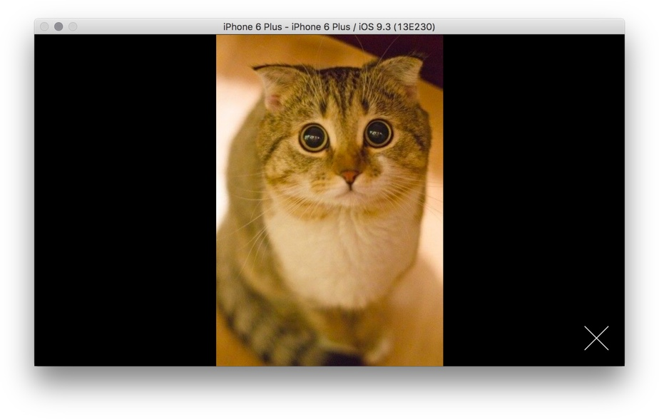

# Image Modal

TODO: completed demo

# Static Layout

+ don't use the builtin `Modal` component.

Modify the app to not render posts:

```js
export class App extends React.Component<Props, State> {
  renderModalPhotos = (layout: LayoutRectangle) => {
    return (
      <PhotosModal/>
    );
  }

  render() {
    return <MeasureContainer>{this.renderModalPhotos}</MeasureContainer>
  }
}
```

### Exercise: Modal Overlay

Create the `PhotosModal` overlay. It should cover the entire screen.

The close button should,

+ Be positioned at the bottom right corner.
+ Be white, using `tintColor: #fff`.
+ Respond to taps by using `TouchableOpacity`.

For layout, the `TouchableOpacity` component behaves exactly like a `View`.

The add the icon image to `theme.ts`:

```js
export const icons = {
  // ...
  closeModal: require("../assets/icon-close.png"),
};
```

Your result:

<video src="modal-overlay.mp4" controls/>

### Exercise: Display Image In Modal

+ The image should be centered.
+ The image should fit inside the modal exactly.

This task is slightly tricky because you can't easily say "width: 100%", and have the image resize automatically to fit its parent container.

You'll need to pass the window layout down to PhotosModal as a prop.

```js
import {
  LayoutRectangle,
} from "react-native";

interface Props {
  // ...
  windowLayout: LayoutRectangle;
}
```

Your result:


In landscape:



### Exercise: Display Multiple Images

Finally, let's use the cross-platform `Pager` component to display multiple images.

Download [Pager.tsx](Pager.tsx).


Your result:

<video src="photos-modal-pager.mp4" controls/>


Unfortunately, rotation in iOS is buggy:

<video src="ios-pager-rotate-bug.mp4" controls/>

Android's Pager handles rotation properly:

<video src="pager-rotation-android-ok.mp4" controls/>

# Toggle Modal

Becaues our app is simple, we'll keep the implementation simple by using the uppermost `App` component to maintain state. Although we won't be using Flux, we'll still preserve much of Flux's philosophy.

In other words, the "global store" is the App's state, the "actions" are the App's methods that manipulate the state. There is one-way dataflow from the App to its child components.

### Exercise:

Let's add `modalPost` to the `App` state, and two methods to manipulate it:

```js

import { PhotoPost } from "./types";

interface State {
  /**
   * The photo post currently being displayed.
   *
   * @initialValue null
   */
  modalPost?: PhotoPost;
}

export class App extends Component<Props, State> {
  showModalPhotos: ShowPhotoModalFunction = (post: PhotoPost) => {
    // ...
  }

  hideModalPhotos: HideModalFunction = () => {
    // ...
  }
}
```

Because we are using these two functions as values, passed down the hierarchy tree, it'd be a good idea to declare their types in `types.ts`:

```js
export type ShowPhotoModalFunction = (post: PhotoPost) => void;
export type HideModalFunction = () => void;
```

The child component should also declare that it requires a function value for a property:

```js
interface Props {
  // ...
  showModalPhotos: ShowPhotoModalFunction;
}
```

Add two triggers to show and close the modal:

+ `TouchableWithoutFeedback` to show modal when the cover photo of a post is tapped.
+ `TouchableOpacity` to hide modal when the modal close icon is taped.
+ The scroll position of the photos list should be preserved.


Your result:

<video src="toggle-and-dismiss-modal.mp4" controls/>


### Exercise: Android Backbutton

Android has a hardware back button. We should implement the back behaviour to meet an Android user's expectation.

+ If user is seeing a modal, "back" should go to the list view.
+ If user is already seeing the list, "back" should exit the app.

Use the [BackAndroid](https://facebook.github.io/react-native/docs/backandroid.html#content) module to listen to back button presses. Like this:

Question: What does BackAndroid do in iOS? Find out by looking at the source code!

```js
export class App extends Component<Props, State> {
  componentDidMount() {
    // What does this do in iOS?
    BackAndroid.addEventListener("hardwareBackPress", this.goback)
  }

  componentWillUnmount() {
    BackAndroid.removeEventListener("hardwareBackPress", this.goback)
  }

  goback: () => {
    // ...
  }
}
```

Your result:

<video src="android-back-button.mp4" controls/>

