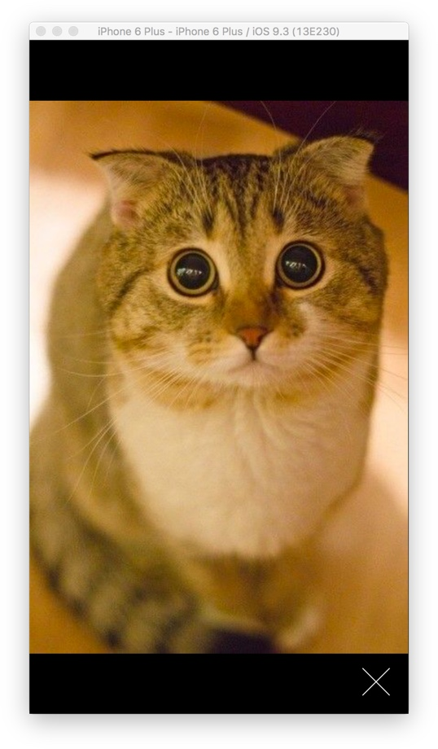

# Image Modal

TODO: completed demo

<Cn>

# 图片模型

TODO: 完成 demo

</Cn>

# Static Layout

+ don't use the builtin `Modal` component.

Modify the app to not render posts:

```js
export class App extends React.Component<Props, State> {
  renderModalPhotos = (layout: LayoutRectangle) => {
    return (
      <PhotosModal/>
    );
  }

  render() {
    return <MeasureContainer>{this.renderModalPhotos}</MeasureContainer>
  }
}
```

<Cn>

# 静态布局

+ 不要使用内置的 `Modal` 部件。

修改应用，让它不要渲染博文：

```js
export class App extends React.Component<Props, State> {
  renderModalPhotos = (layout: LayoutRectangle) => {
    return (
      <PhotosModal/>
    );
  }

  render() {
    return <MeasureContainer>{this.renderModalPhotos}</MeasureContainer>
  }
}
```

</Cn>

### Exercise: Modal Overlay

Create the `PhotosModal` overlay. It should cover the entire screen.

The close button should,

+ Be positioned at the bottom right corner.
+ Be white, using `tintColor: #fff`.
+ Respond to taps by using `TouchableOpacity`.

For layout, the `TouchableOpacity` component behaves exactly like a `View`.

The add the icon image to `theme.ts`:

```js
export const icons = {
  // ...
  closeModal: require("../assets/icon-close.png"),
};
```

Your result:

<video src="modal-overlay.mp4" controls/>

<Cn>

### 练习：模型的覆盖层

创建 `PhotosModal` 的覆盖层。它应该覆盖整个屏幕。

关闭按钮应该

+ 处在右下方角落；
+ 是白色，使用 `tintColor: #fff`；
+ 使用 `TouchableOpacity` 来对轻触做出响应。

对于布局来说，`TouchableOpacity` 部件的行为就像 `View` 一样。

添加图标图片到 `theme.ts`：

```js
export const icons = {
  // ...
  closeModal: require("../assets/icon-close.png"),
};
```

效果应该像这样：

<video src="modal-overlay.mp4" controls/>

</Cn>

### Exercise: Display Image In Modal

+ The image should be centered.
+ The image should fit inside the modal exactly.

This task is slightly tricky because you can't easily say "width: 100%", and have the image resize automatically to fit its parent container.

You'll need to pass the window layout down to PhotosModal as a prop.

```js
import {
  LayoutRectangle,
} from "react-native";

interface Props {
  // ...
  windowLayout: LayoutRectangle;
}
```

Your result:



In landscape:


<Cn>

### 练习：在模型中显示图片

+ 图片应该是居中的；
+ 图片应该刚刚好能放进模型。

这个任务稍稍有点棘手，因为你不能简单地说 "width: 100%"，然后就让图片自动调整尺寸来放进父容器。

你会需要将视窗布局作为属性传递给 PhotosModal。

```js
import {
  LayoutRectangle,
} from "react-native";

interface Props {
  // ...
  windowLayout: LayoutRectangle;
}
```

效果会像这样：


在横屏模式下：


</Cn>

### Exercise: Display Multiple Images

Finally, let's use the cross-platform `Pager` component to display multiple images.

Download [Pager.tsx](Pager.tsx).


Your result:

<video src="photos-modal-pager.mp4" controls/>


Unfortunately, rotation in iOS is buggy:

<video src="ios-pager-rotate-bug.mp4" controls/>

Android's Pager handles rotation properly:

<video src="pager-rotation-android-ok.mp4" controls/>

<Cn>

### 练习：显示多个图片

最后，让我们使用跨平台的 `Pager` 部件来显示多个图片。

下载 [Pager.tsx](Pager.tsx)。

效果应该像这样：

<video src="photos-modal-pager.mp4" controls/>


不幸的是，iOS 中的旋转是有 bug 的：

<video src="ios-pager-rotate-bug.mp4" controls/>

Android 的 `Pager` 能很好地处理旋转：

<video src="pager-rotation-android-ok.mp4" controls/>

</Cn>

# Toggle Modal

Becaues our app is simple, we'll keep the implementation simple by using the uppermost `App` component to maintain state. Although we won't be using Flux, we'll still preserve much of Flux's philosophy.

In other words, the "global store" is the App's state, the "actions" are the App's methods that manipulate the state. There is one-way dataflow from the App to its child components.

<Cn>

# 显示／隐藏模型

因为我们的应用比较简单，我们会使用最上层的 `App` 部件来维护状态，以此保持实现的简单。即使我们不会用到 Flux，我们依然保持了一些 Flux 的哲学。

另一句话说，"global store" 就是 `App` 的状态，"actions" 就是 `App` 的修改状态的方法。这是一个从 `App` 到它的子部件的单向数据流。

</Cn>

### Exercise:

Let's add `modalPost` to the `App` state, and two methods to manipulate it:

```js

import { PhotoPost } from "./types";

interface State {
  /**
   * The photo post currently being displayed.
   *
   * @initialValue null
   */
  modalPost?: PhotoPost;
}

export class App extends Component<Props, State> {
  showModalPhotos: ShowPhotoModalFunction = (post: PhotoPost) => {
    // ...
  }

  hideModalPhotos: HideModalFunction = () => {
    // ...
  }
}
```

<Cn>

### 练习：

让我们添加 `modalPost` 以及两个修改它的方法到 `App` 状态：

```js

import { PhotoPost } from "./types";

interface State {
  /**
   * The photo post currently being displayed.
   *
   * @initialValue null
   */
  modalPost?: PhotoPost;
}

export class App extends Component<Props, State> {
  showModalPhotos: ShowPhotoModalFunction = (post: PhotoPost) => {
    // ...
  }

  hideModalPhotos: HideModalFunction = () => {
    // ...
  }
}
```

</Cn>

Because we are using these two functions as values, passed down the hierarchy tree, it'd be a good idea to declare their types in `types.ts`:

```js
export type ShowPhotoModalFunction = (post: PhotoPost) => void;
export type HideModalFunction = () => void;
```

The child component should also declare that it requires a function value for a property:

```js
interface Props {
  // ...
  showModalPhotos: ShowPhotoModalFunction;
}
```

Add two triggers to show and close the modal:

+ `TouchableWithoutFeedback` to show modal when the cover photo of a post is tapped.
+ `TouchableOpacity` to hide modal when the modal close icon is taped.
+ The scroll position of the photos list should be preserved.


Your result:

<video src="toggle-and-dismiss-modal.mp4" controls/>

<Cn>

因为我们正在将两个函数作为值，传递给视图层级树，所以在 `types.ts` 里面声明他们的类型是一个很好的做法：

```js
export type ShowPhotoModalFunction = (post: PhotoPost) => void;
export type HideModalFunction = () => void;
```

子部件也应该声明它会使用一个函数作为属性：

```js
interface Props {
  // ...
  showModalPhotos: ShowPhotoModalFunction;
}
```

添加两个开关来显示和隐藏模型：

+ 当一个博文的封面图被轻触时，用 `TouchableWithoutFeedback` 来显示模型；
+ 当关闭图标被轻触时，用 `TouchableOpacity` 来隐藏模型；
+ 照片列表的滚动位置应该被保存。


效果应该像这样：

<video src="toggle-and-dismiss-modal.mp4" controls/>

</Cn>


### Exercise: Android Backbutton

Android has a hardware back button. We should implement the back behaviour to meet an Android user's expectation.

+ If user is seeing a modal, "back" should go to the list view.
+ If user is already seeing the list, "back" should exit the app.

Use the [BackAndroid](https://facebook.github.io/react-native/docs/backandroid.html#content) module to listen to back button presses. Like this:

Question: What does BackAndroid do in iOS? Find out by looking at the source code!

```js
export class App extends Component<Props, State> {
  componentDidMount() {
    // What does this do in iOS?
    BackAndroid.addEventListener("hardwareBackPress", this.goback)
  }

  componentWillUnmount() {
    BackAndroid.removeEventListener("hardwareBackPress", this.goback)
  }

  goback: () => {
    // ...
  }
}
```

Your result:

<video src="android-back-button.mp4" controls/>

<Cn>

### 练习：Android 的返回按钮

Android 有一个硬件的返回按钮。我们应该实现返回行为来满足 Android 用户的期望。

+ 如果一个用户正在看一个模型，"back" 应该回到列表视图；
+ 如果一个用户已经看过了列表，那么 "back" 应该退出应用。

使用 [BackAndroid](https://facebook.github.io/react-native/docs/backandroid.html#content) 模块来监听返回按钮的惦记。就像这样：

问题：iOS 中的 BackAndroid 有什么用呢？看一下源代码吧！

```js
export class App extends Component<Props, State> {
  componentDidMount() {
    // What does this do in iOS?
    BackAndroid.addEventListener("hardwareBackPress", this.goback)
  }

  componentWillUnmount() {
    BackAndroid.removeEventListener("hardwareBackPress", this.goback)
  }

  goback: () => {
    // ...
  }
}
```

效果应该像这样：

<video src="android-back-button.mp4" controls/>

</Cn>
