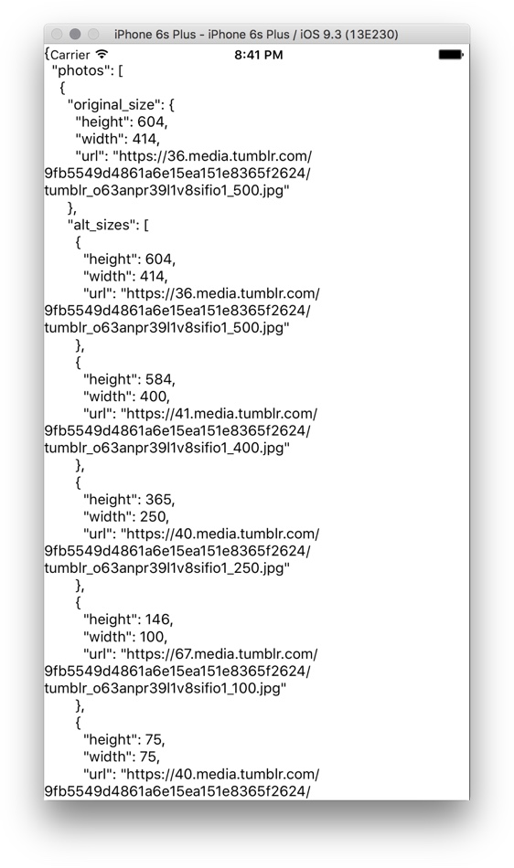
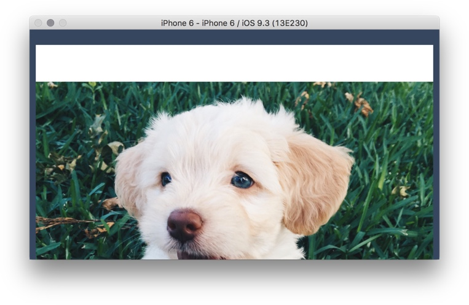
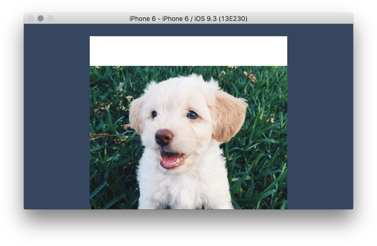
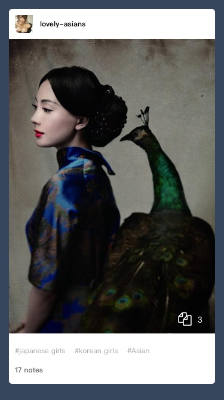
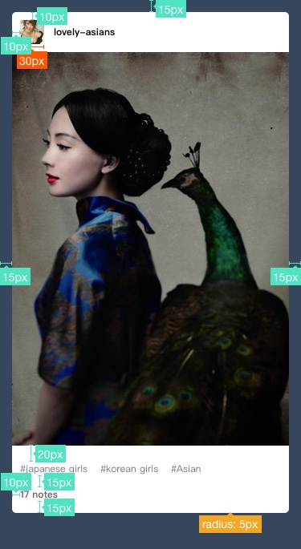
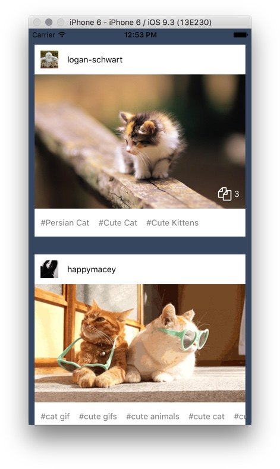
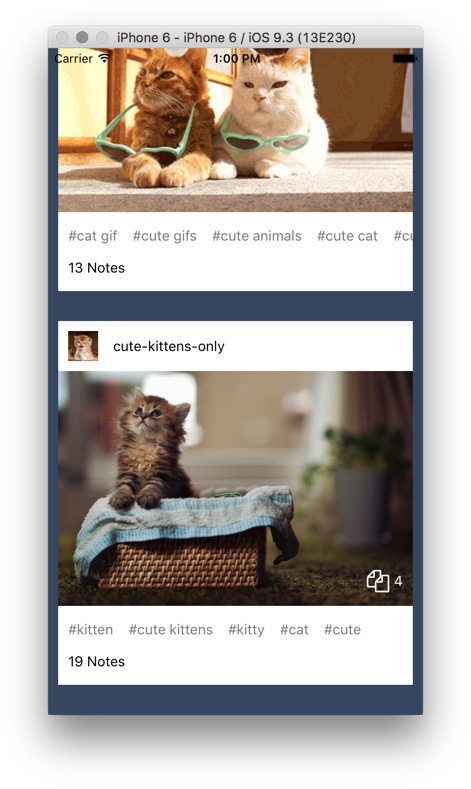

# Tumblr App Layout

<Note>
# Type Annotations

The application we are working on will get complex enough that it's worth considering using a JavaScript dialect with static typing. There are two choices:

+ [FlowType](http://flowtype.org/)
  + Facebook project, adopted by ReactNative.
+ [TypeScript](https://www.typescriptlang.org/)
  + MicroSoft project, adopted by Angular. Created by the Father of C# Anders Hejlsberg.

Although ReactNative has builtin support for [FlowType](http://flowtype.org/), I've had bad experience with it. Our sample code will use the [TypeScript](https://www.typescriptlang.org/docs/handbook/basic-types.html) syntax. The two are very similar, so it's not hard switch between them.

Another advantage of using TypeScript is excellent editor support in the form of [Visual Studio Code](https://code.visualstudio.com/). You get:

+ Type checking. Red underlines for type errors.
+ Auto complete with IntelliSense.
+ Type hinting when hovering over a variable.

TypeScript's type system is lightweight, easy to understand. It doesn't force you to do type acrobatics to get a program to compile. When static typing is inconvenient or convoluted, you can easily escape the type system.

In short, TypeScript feels exactly like JavaScript, but with the best tooling support, unmatched by any other dynamic language.
</Note>

<Cn>

# Tumblr App 布局

<Note>
# 类型注解

我们正在开发的应用会变的足够复杂，以至于值得考虑使用一个带有静态类型的 JavaScript 方言。我们有两个选择：

+ [FlowType](http://flowtype.org/)
  + Facebook 的项目，被 React Native 所采用。
+ [TypeScript](https://www.typescriptlang.org/)
  + MicroSoft 的项目，被 Angular 所采用。由 C# 之父 Anders Hejlsberg 创造。

虽然 ReactNative 对 [FlowType](http://flowtype.org/) 提供了内置支持，但我使用它的经历非常恶心。所以我们的示例代码使用了 [TypeScript](https://www.typescriptlang.org/docs/handbook/basic-types.html) 语法。它们两个很相似，所以在两者之间转换不会特别困难。

另一个使用 TypeScript 的优势是 [Visual Studio Code](https://code.visualstudio.com/) 对于它的支持。你会得到：

+ 类型检查。会有红色下划线来标记类型错误；
+ IntelliSense 的自动补全；
+ 当鼠标浮动在一个变量上时的类型提醒。

TypeScript 的类型系统是轻量且易懂的。它不会强迫你做类型转换才能让一个程序编译。当静态类型非常不方便或者复杂时，你可以轻松地跳出类型系统。

简单来说，TypeScript 感觉就像 JavaScript，只不过相比其它动态语言，多了最好的工具支持。
</Note>


</Cn>

## Setup TypeScript Project

Clone `rnplay-typescript-starter` to jump start our project:

```sh
git clone https://github.com/hayeah/rnplay-typescript-starter.git Tumblr
```

Follow the instructions at [rnplay-typescript-starter](https://github.com/hayeah/rnplay-typescript-starter) to get the app running.

## Download Assets

Replace the starter project's `assets` directory with this repo:

```sh
rm -r ./assets
git clone https://github.com/hayeah/tumblr-exercise-assets.git assets
```

<Cn>

## 配置 TypeScript 项目

克隆 `rnplay-typescript-starter` 来开始我们的项目：

```sh
git clone https://github.com/hayeah/rnplay-typescript-starter.git Tumblr
```

按照 [rnplay-typescript-starter](https://github.com/hayeah/rnplay-typescript-starter) 的指引来让应用运行。

## 下载素材

将这个 repo 替代掉 starter 项目的 `assets` 目录：

```sh
rm -r ./assets
git clone https://github.com/hayeah/tumblr-exercise-assets.git assets
```

</Cn>

# Using Test Data

Instead of interacting with the actual Tumblr API, we'll read data directly from JSON files. We can load the JSON data as a CommonJS module using `require`:


```js
import { ListJSON } from "./types";
const jsonPosts: ListJSON = require("path/to/data/puppies.json");
```

<Cn>

# 使用测试数据

我们会从 JSON 文件直接读取数据，而不是和 Tumblr API 进行真正的交互。我们可以用 `require` 来像加载一个 CommonJS 模块一样加载 JSON 数据：


```js
import { ListJSON } from "./types";
const jsonPosts: ListJSON = require("path/to/data/puppies.json");
```

</Cn>

The type `ListJSON` is an array of Tumblr posts, exported from the `types.ts` module:

```js
// types.ts
export interface ListJSON {
  response: Post[],
}

export interface Post {
  id: number,
  timestamp: number,
  type: string,
  tags: string[],
  note_count: number,
  blog_name: string,
}

export interface PhotoPost extends Post {
  photos: Photo[],
  caption: string,
  type: "photo",
}

export interface Photo {
  original_size: PhotoSize,
  alt_sizes: PhotoSize[],
  caption: string,
}

export interface PhotoSize {
  url: string,
  height: number,
  width: number,
}
```

<Cn>

`ListJSON` 类型是一个 Tumblr 博文的数组，从 `types.ts` 模块导出：

```js
// types.ts
export interface ListJSON {
  response: Post[],
}

export interface Post {
  id: number,
  timestamp: number,
  type: string,
  tags: string[],
  note_count: number,
  blog_name: string,
}

export interface PhotoPost extends Post {
  photos: Photo[],
  caption: string,
  type: "photo",
}

export interface Photo {
  original_size: PhotoSize,
  alt_sizes: PhotoSize[],
  caption: string,
}

export interface PhotoSize {
  url: string,
  height: number,
  width: number,
}
```

</Cn>

### Exercise: Displaying Test Data

Create `data.ts` to export the list of Tumblr posts as `posts`.

There are many different kinds of Tumblr posts. We'll only support photo posts, so let's filter out other kinds of posts:

```js
// Filter out posts that aren't photos
export const posts = jsonPosts.response.filter((post: any) => {
  return post.photos !== undefined
}) as PhotoPost[];```

Display the formatted JSON data for the first post:

```js
import { posts } from "./data";

<Text>{JSON.stringify(posts[0], null, 2)}</Text>
```

Your result:



<Cn>

### 练习：显示测试数据

创建 `data.ts` 来导出 Tumblr 博文的列表到 `posts` 变量。

Tumblr 博文的种类由很多。我们将只支持图片博文，所以让我们把其它类型的博文过滤掉：

```js
// Filter out posts that aren't photos
export const posts = jsonPosts.response.filter((post: any) => {
  return post.photos !== undefined
}) as PhotoPost[];```

Display the formatted JSON data for the first post:

```js
import { posts } from "./data";

<Text>{JSON.stringify(posts[0], null, 2)}</Text>
```

效果会像这样：


</Cn>

# ReactNative Component Boilerplate

Use this boilerplate to kickstart new components:

```js
import React from "react";

import {
  StyleSheet,
  Component,

  View,
  Text,
} from "react-native";

interface Props {
}

interface State {
}

export class Foo extends Component<Props, State> {
  render() {
    return (
      <View style={jss.container}>
      </View>
    );
  }
}

const jss = StyleSheet.create({
  container: {
    flex: 1,
    alignSelf: "stretch",
  }
});
```

<Cn>

# React Native 部件模版

用这个模版来帮助创建你的新部件：

```js
import React from "react";

import {
  StyleSheet,
  Component,

  View,
  Text,
} from "react-native";

interface Props {
}

interface State {
}

export class Foo extends Component<Props, State> {
  render() {
    return (
      <View style={jss.container}>
      </View>
    );
  }
}

const jss = StyleSheet.create({
  container: {
    flex: 1,
    alignSelf: "stretch",
  }
});
```

</Cn>

# The Root MeasureContainer

In this app we'll have to go beyond flexbox, and manually calculate layout and coordinates. Let's add a single MeasureContainer at the very top of the app to get the window size. We'll pass the window size down to child components as property values.

When the device rotate, MeasureContainer will invoke `renderWithLayout` to rebuild the UI.

Edit `App.tsx` to incorporate the `MeasureContainer`:

```js
import {
  LayoutRectangle,
} from "react-native";

export class App extends React.Component<Props, State> {
  renderWithLayout = (layout: LayoutRectangle) => {
    // <ChildView1 windowLayout={layout}>
    // <ChildView2 windowLayout={layout}>
  }

  render() {
    return <MeasureContainer>{this.renderPosts}</MeasureContainer>
  }
}
```

+ Download `MeasureContainer.tsx`.

<Cn>

# 根部的 MeasureContainer

在这个应用里，我们会超出 flexbox 的范畴，而且手动计算布局和坐标。让我们在应用最上层添加一个单独的 MeasureContainer 来得到视窗尺寸。我们会将视窗尺寸作为属性传递给子部件。

当设备旋转时，MeasureContainer 会调用 `renderWithLayout` 来重构 UI。

编辑 `App.tsx` 来使用 `MeasureContainer`：

```js
import {
  LayoutRectangle,
} from "react-native";

export class App extends React.Component<Props, State> {
  renderWithLayout = (layout: LayoutRectangle) => {
    // <ChildView1 windowLayout={layout}>
    // <ChildView2 windowLayout={layout}>
  }

  render() {
    return <MeasureContainer>{this.renderPosts}</MeasureContainer>
  }
}
```

+ 下载 `MeasureContainer.tsx`.

</Cn>

### Exercise: Display A Square Image

As the first step, we'll display square images in the `PhotoPostView` component.

+ Use a ScrollView even though we are displaying only the first photo post.
+ Create the `PhotoPostView` component

```js
interface Props {
  maxWidth: number;
  post: PhotoPost;
}

interface State {
}

export class PhotoPostView extends Component<Props, State> {
  render() {
    const { maxWidth, post } = this.props;

    const photoSize = post.photos[0].original_size;

    return (
      ???
    );
  }
}
```

<Cn>

### 练习：显示一个方形图片

作为第一步，我们会需要在 `PhotoPostView` 部件中显示方形图片。

+ 使用 ScrollView，虽然我们只展示第一个图片博文；
+ 创建 `PhotoPostView` 部件。

```js
interface Props {
  maxWidth: number;
  post: PhotoPost;
}

interface State {
}

export class PhotoPostView extends Component<Props, State> {
  render() {
    const { maxWidth, post } = this.props;

    const photoSize = post.photos[0].original_size;

    return (
      ???
    );
  }
}
```

</Cn>

+ The `Image` component requires an explicit size when loading a remote image from url:

```js
<Image style={[
    { width: maxWidth, height: maxWidth },
  ]}
    source={{ uri: photoSize.url }}/>
```

+ The dark blue background color is `#36465D`.

Your result should be:

<video src="display-single-square-image.mp4" controls/>

<Cn>

+ 在从一个远程 url 加载图片时，`Image` 部件需要一个显式的尺寸：

```js
<Image style={[
    { width: maxWidth, height: maxWidth },
  ]}
    source={{ uri: photoSize.url }}/>
```

+ 深蓝背景色是 `#36465D`。

效果应该像这样：

<video src="display-single-square-image.mp4" controls/>

</Cn>

### Exercise: Limit Width in Landscape

When rotated, the PhotoPost occupies the whole horizontal width, which is too wide:



+ Limit the width of `PhotoPostView` to 420 points.

You result:



<Cn>

### 练习：在横屏模式中限制宽度

在旋转后，PhotoPost 会占据整个水平宽度，这有点太宽了：


+ 将 `PhotoPostView` 的宽度限制到 420 points。

效果应该像这样：


</Cn>

### Exercise: Display All Posts

Your result:

<video src="show-list-of-photoposts.mp4" controls/>

Check result in Android.

<Cn>

### 练习：显示所有的博文

效果应该像这样：

<video src="show-list-of-photoposts.mp4" controls/>

在 Android 上检查你的结果。

</Cn>

### Exercise: Scaling Image

Instead of displaying square images, let's scale the images proportionally to preserve their original aspect ratio.

+ Use the `fitInRect` function for rescaling.

```js
interface Size {
  width: number;
  height: number;
}

/**
 * Scale a rectangle so it fits within the bound of a maximum rectangle.
 *
 * @param maxRect The limiting boundary.
 * @param inputRect The rectangle to fit.
 * @return The fitted rectangle.
 */
export function fitInRect(maxRect: Size, inputRect: Size): Size {
  // ...
}
```

<Cn>

### 练习：缩放图片

让我们保持原有的比率，按比例缩放图片，而不是单纯显示成方形。

+ 使用 `fitInRect` 函数来重新缩放。

```js
interface Size {
  width: number;
  height: number;
}

/**
 * Scale a rectangle so it fits within the bound of a maximum rectangle.
 *
 * @param maxRect The limiting boundary.
 * @param inputRect The rectangle to fit.
 * @return The fitted rectangle.
 */
export function fitInRect(maxRect: Size, inputRect: Size): Size {
  // ...
}
```

</Cn>

Download [fitInRect.ts](fitInRect.ts).

+ Test image scaling using [kittens.json](https://github.com/hayeah/tumblr-exercise-assets/blob/master/data/kittens.json).

In portrait:

<video src="scaled-images.mp4" controls/>

In landscape:

<video src="scaled-images-landscape.mp4" controls/>

In Android:

<video src="scaled-images-android.mp4" controls/>

<Cn>

下载 [fitInRect.ts](fitInRect.ts)。

+ 用 [kittens.json](https://github.com/hayeah/tumblr-exercise-assets/blob/master/data/kittens.json) 来测试图片缩放。

在竖屏模式中：

<video src="scaled-images.mp4" controls/>

在横屏模式中：

<video src="scaled-images-landscape.mp4" controls/>

在 Android 上：

<video src="scaled-images-android.mp4" controls/>


</Cn>

# Finishing Touches

The hard stuff is already done. The rest of it is straightforward flexbox layout.



The measurements:



Colors for text:

```js
// theme.ts
export const colors = {
  text: {
    lightGray: "#7A7A7A",
    darkGray: "#676767",
    black: "#000000",
  }
};
```

<Cn>

#  完成触摸处理

难的部分已经搞定了。剩下的就是直白的 flexbox 布局。


尺寸：


文本的颜色：

```js
// theme.ts
export const colors = {
  text: {
    lightGray: "#7A7A7A",
    darkGray: "#676767",
    black: "#000000",
  }
};
```

</Cn>

Icons:

```js
// theme.ts
export const icons = {
  files: require("../assets/fa-files-o.png"),
};
```

<Cn>

图标：

```js
// theme.ts
export const icons = {
  files: require("../assets/fa-files-o.png"),
};
```

</Cn>

### Exercise: Post Header

The avatar image should be 30x30 points. For different devices 1 point could be 1, 2, or 3 pixels, so the actual avatar image we should fetch is 30x30, 60x90, or 90x90 depending on the actual device.

The following chunk of code builds the correct avatar image url for you:


```js
const AVATAR_IMAGE_SIZE = 30;

const pixelDensity = PixelRatio.get();
let avatarImageURL = `http://api.tumblr.com/v2/blog/${post.blog_name}.tumblr.com/avatar/${AVATAR_IMAGE_SIZE * pixelDensity}`;

// ReactNative's iOS ImageLoader doesn't handle 301/302 caching correctly.
// See: https://github.com/facebook/react-native/pull/7262
if (isIOS) {
  // Add a random query parameter to cause caching to fail.
  avatarImageURL += `?rand=${Math.random()}`;
}
```

<Cn>

### 练习：博文 header

头像图片应该是 30x30 pt。对于不同的设备 1pt 可以是 1px, 2px 或者 3px，所以最终的头像图片会根据实际设备的不同显示成 30x30，60x60 或者 90x90。

下面的代码为你构建了正确的头像图片 url：


```js
const AVATAR_IMAGE_SIZE = 30;

const pixelDensity = PixelRatio.get();
let avatarImageURL = `http://api.tumblr.com/v2/blog/${post.blog_name}.tumblr.com/avatar/${AVATAR_IMAGE_SIZE * pixelDensity}`;

// ReactNative's iOS ImageLoader doesn't handle 301/302 caching correctly.
// See: https://github.com/facebook/react-native/pull/7262
if (isIOS) {
  // Add a random query parameter to cause caching to fail.
  avatarImageURL += `?rand=${Math.random()}`;
}
```


</Cn>

<Warning>
# ReactNative Bug

`Math.random()` is a workaround for the caching bug. We'll remove this when the fix is released.
</Warning>

+ Create the stateless component `PostHeader`:

```js
function PostHeader(props: { post: PhotoPost }) {
  return (
    <View>
    </View>
  );
}
```

Your result:

<video src="photopost-header.mp4" controls/>

<Cn>

<Warning>
# ReactNative Bug

`Math.random()` 是一个缓存 bug 的暂时性解决方法。之后这个 bug 的修复出来之后我们会移除掉这个部分。
</Warning>

+ 创建无状态的部件 `PostHeader`：

```js
function PostHeader(props: { post: PhotoPost }) {
  return (
    <View>
    </View>
  );
}
```

效果应该像这样：

<video src="photopost-header.mp4" controls/>

</Cn>

### Exercise: Post Tags

Create the `PostTags` component:

```js
function PostTags(props: { post: Post }) {
  // ...
}
```

Tweak ScrollView behaviour so it's horizontal and without bounces:

```js
<ScrollView
  horizontal={true}
  showsHorizontalScrollIndicator={false}
  bounces={false}
  >
```

Your result:

<video src="scrollable-tags.mp4" controls/>

<Cn>

### 练习：Post Tags

创建 `PostTags` 部件：

```js
function PostTags(props: { post: Post }) {
  // ...
}
```

我们要 tweak 一下 ScrollView 的 behaviour，让它变成水平的而且没有 bounces：

```js
<ScrollView
  horizontal={true}
  showsHorizontalScrollIndicator={false}
  bounces={false}
  >
```

效果应该像这样：

<video src="scrollable-tags.mp4" controls/>

</Cn>

### Exercise: Number of Photos

+ Show the `fa-files-o.png` icon if number of photos is more than 1.
+ Don't show the icon if there is just one photo.

Your result:



<Cn>

### 练习：图片的数量

+ 如果图片数量大于1，显示 `fa-files-o.png` 图标；
+ 如果只有一张图片则不显示图标。

效果应该像这样：


</Cn>

### Exercise: Post Notes Count

Show number of notes:



<Cn>

### 博文的注释计数

显示注释的数目：


</Cn>

### Exercise: Final Android Result

Check your app in Android:

<video src="final-result-android.mp4" controls/>

# Summary

Developing for ReactNative is more difficult than developing for modern web browsers. Native components like 'Image' and 'ScrollView' have quirks that takes time to get used to. And because ReactNative is still a young project, it's almost certain that you'll run into bugs and strange inconsistencies between Android and iOS.

But it's still amazing how little work it takes to build a sophisticated app. The app now has:

+ Native scrolling, with variable sized items.
+ Sophisticated adaptive layout that supports landscape mode.
+ Off-thread Image download and resizing.
+ "Native experience" in both iOS and Android.

<Cn>

### 练习：最终的 Android 成品

在 Android 里面看一下你的应用：

<video src="final-result-android.mp4" controls/>

# 总结

开发 React Native 会比在现代浏览器里面开发要更难。像 `Image` 和 `ScrollView` 这种原生部件有很多需要时间适应的坑。而且因为 React Native 是一个相对年轻的项目，所以几乎可以保证你会遇到 bug ，以及奇怪的在 Android 和 iOS 之间不一致的地方。

不过，只需要一点工作就可以构建一个复杂的应用依然是一件令人惊讶的事情。这个应用现在已经有了：

+ 原生滚动，还有列表中可变尺寸的项目；
+ 复杂的，支持横屏模式的响应式布局；
+ 线程外的图片下载和尺寸重调；
+ 在 iOS 和 Android 上的“原生体验”。

</Cn>

